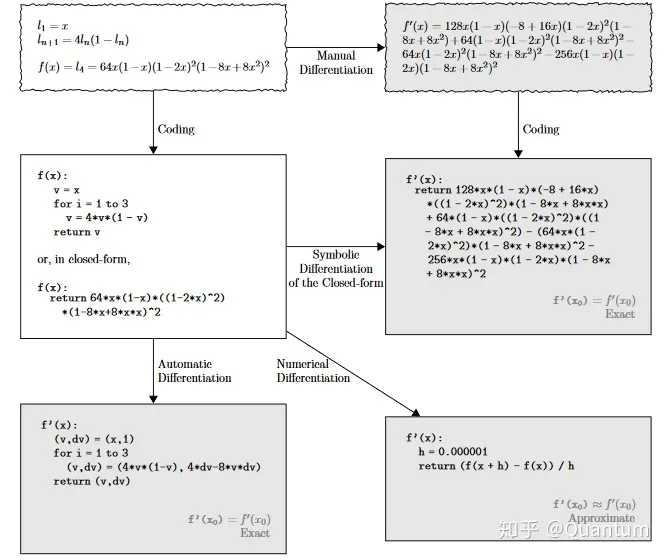
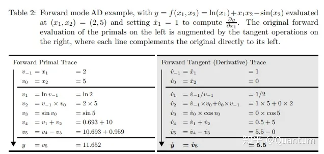
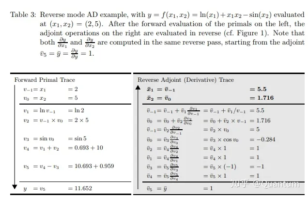
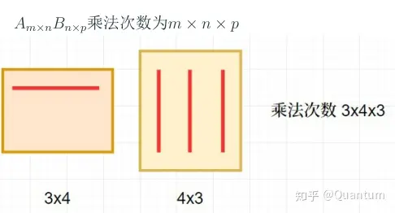

# Chapter2 Preliminaries
## 2.1 Automatic Differentiation
让计算机实现微分功能， 有以下四种方式：
    - 手工计算出微分， 然后编码进代码
    - 数值微分 (numerical differentiation)
    - 符号微分 (symbolic differentiation)
    - 自动微分（automatic differentiation）

深度学习框架通过*自动微分*来加快求导。
实际中，根据设计好的模型，系统会构建一个*计算图*（computational graph），来跟踪计算是哪些数据通过哪些操作组合起来产生输出。自动微分使系统能够随后反向传播梯度。这里，*反向传播*（backpropagate）意味着跟踪整个计算图，填充关于每个参数的偏导数。自动微分以链式法则为基础，将一个复杂的数学运算过程分解为一系列简单的基本运算，把公式中一些部分整理出来成为一些新变量，然后用这些新变量整体替换这个公式，而且每一项基本运算都可以通过查表得出来。自动微分有两种形式

    - 前向模式 (forward mode)
    - 反向模式 (reverse mode)
前向模式是在计算图前向传播的同时计算微分。下面的前向模式微分中，$\dot{v_i}=\frac{\partial v_i}{\partial x_1}$ 。

反向模式需要对计算图进行一次正向计算， 得出输出值，再进行反向传播， 其中 $\bar{v_i}=\frac{\partial y_j}{\partial v_i}$ 。

前向模式的一次正向传播能够计算出输出值以及导数值， 而反向模式需要先进行正向传播计算出输出值， 然后进行反向传播计算导数值，所以反向模式的内存开销要大一点， 因为它需要保存正向传播中的中间变量值，这些变量值用于反向传播的时候计算导数。当输出的维度大于输入的时候，适宜使用前向模式微分；当输出维度远远小于输入的时候，适宜使用反向模式微分。

从矩阵乘法次数的角度来看，前向模式和反向模式的不同之处在于矩阵相乘的起始之处不同。当输出维度小于输入维度，反向模式的乘法次数要小于前向模式。

### 2.1.1 一个简单的例子

假设我们想对函数$y=2\mathbf{x}^{\top}\mathbf{x}$关于列向量$\mathbf{x}$求导。首先，我们创建变量`x`并为其分配一个初始值。

    import torch
    x = torch.arange(4.0)
    x
结果：

    tensor([0., 1., 2., 3.])
在我们计算$y$关于$\mathbf{x}$的梯度之前，需要一个地方来存储梯度。重要的是，我们不会在每次对一个参数求导时都分配新的内存。因为我们经常会成千上万次地更新相同的参数，每次都分配新的内存可能很快就会将内存耗尽。注意，一个标量函数关于向量$\mathbf{x}$的梯度是向量，并且与$\mathbf{x}$具有相同的形状。

    x.requires_grad_(True)  # 等价于x=torch.arange(4.0,requires_grad=True)
    x.grad  # 
    y = 2 * torch.dot(x, x)
    y
结果：

    tensor(28., grad_fn=<MulBackward0>)
$\mathbf{x}$是一个长度为4的向量，计算$\mathbf{x}$和$\mathbf{x}$的点积，得到了我们赋值给`y`的标量输出。
接下来，通过调用反向传播函数来自动计算`y`关于`x`每个分量的梯度，并打印这些梯度。
    
    y.backward()
    x.grad
结果：
    
    tensor([ 0.,  4.,  8., 12.])
函数$y=2\mathbf{x}^{\top}\mathbf{x}$关于$\mathbf{x}$的梯度应为$4\mathbf{x}$，显然计算结果正确。
现在计算$\mathbf{x}$的另一个函数。

    # 在默认情况下，PyTorch会累积梯度，我们需要清除之前的值
    x.grad.zero_() #将张量x的梯度清零
    y = x.sum()
    y.backward()
    x.grad
结果：
    
    tensor([1., 1., 1., 1.])
### 2.1.2 非标量变量的反向传播

当`y`不是标量时，向量$\mathbf{y}$关于向量$\mathbf{x}$的导数的最自然解释是一个矩阵。
对于高阶和高维的`y`和$\mathbf{x}$，求导的结果可以是一个高阶张量。

然而，虽然这些更奇特的对象确实出现在高级机器学习中，但当调用向量的反向计算时，我们通常会试图计算一批训练样本中每个组成部分的损失函数的导数。这里我们的目的不是计算微分矩阵，而是单独计算批量中每个样本的偏导数之和。

    # 对非标量调用backward需要传入一个gradient参数，该参数指定微分函数关于self的梯度。
    # 本例只想求偏导数的和，所以传递一个1的梯度是合适的
    x.grad.zero_()
    y = x * x
    y.sum().backward()#等价于y.backward(torch.ones(len(x)))
    x.grad

结果：
    
    tensor([0., 2., 4., 6.])
### 2.1.3 分离计算
有时，我们希望将某些计算移动到记录的计算图之外。例如，假设`y`是作为`x`的函数计算的，而`z`则是作为`y`和`x`的函数计算的。想象一下，我们想计算`z`关于`x`的梯度，但由于某种原因，希望将`y`视为一个常数，并且只考虑到`x`在`y`被计算后发挥的作用。这里可以分离`y`来返回一个新变量`u`，该变量与`y`具有相同的值，但丢弃计算图中如何计算`y`的任何信息。换句话说，梯度不会向后流经`u`到`x`。因此，下面的反向传播函数计算`z=u*x`关于`x`的偏导数，同时将`u`作为常数处理，而不是`z=x*x*x`关于`x`的偏导数。

    x.grad.zero_()
    y = x * x
    u = y.detach()
    z = u * x
    z.sum().backward()
    x.grad == u
结果：
    
    tensor([True, True, True, True])
由于记录了`y`的计算结果，我们可以随后在`y`上调用反向传播，
得到`y=x*x`关于的`x`的导数，即`2*x`。

    x.grad.zero_()
    y.sum().backward()
    x.grad == 2 * x
结果：
    
    tensor([True, True, True, True])
### 2.1.4 Python控制流的梯度计算

使用自动微分的一个好处是：
即使构建函数的计算图需要通过Python控制流（例如，条件、循环或任意函数调用），我们仍然可以计算得到的变量的梯度。
在下面的代码中，`while`循环的迭代次数和`if`语句的结果都取决于输入`a`的值。
    
    def f(a):
        b = a * 2
        while b.norm() < 1000:
            b = b * 2
        if b.sum() > 0:
            c = b
        else:
            c = 100 * b
        return c

    a = torch.randn(size=(), requires_grad=True)
    d = f(a)
    d.backward()
    a.grad == d / a
我们现在可以分析上面定义的`f`函数。
请注意，它在其输入`a`中是分段线性的。
换言之，对于任何`a`，存在某个常量标量`k`，使得`f(a)=k*a`，其中`k`的值取决于输入`a`，因此可以用`d/a`验证梯度是否正确。

结果：

        tensor(True)
### 2.1.5 小结

* 深度学习框架可以自动计算导数：我们首先将梯度附加到想要对其计算偏导数的变量上，然后记录目标值的计算，执行它的反向传播函数，并访问得到的梯度。
### 2.1.6 参考文献
    
   - [一文看懂AD原理](https://zhuanlan.zhihu.com/p/518198564)
   - [AD的正反向模式](https://zhuanlan.zhihu.com/p/518296942)
   - [AD的常用实现方案](https://zhuanlan.zhihu.com/p/520065656)
  - [反向OO实现自动微分（Pytroch核心机制）](https://zhuanlan.zhihu.com/p/547865589/)
   - [Automatic differentiation in machine learning: a survey](https://arxiv.org/abs/1502.05767)

    