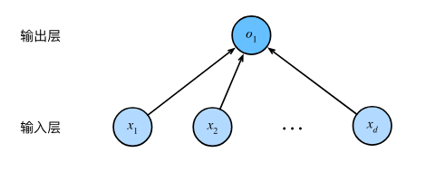
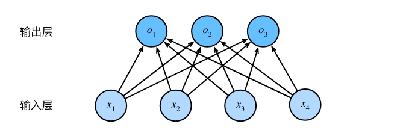

# Chapter3 Linear Neural Networks
## 3.1 Linear Regression
### 3.1.1 Basic Concepts
我们通常使用$n$来表示数据集中的样本数。对索引为$i$的样本，其输入表示为$\mathbf{x}^{(i)} = [x_1^{(i)}, x_2^{(i)},...,x_n^{(i)}]^\top$，其对应的标签是$y^{(i)}$。
#### 3.1.1.1 Linear Model
在机器学习领域，我们通常使用的是高维数据集，建模时采用线性代数表示法会比较方便。当我们的输入包含$d$个特征时，我们将预测结果$\hat{y}$（通常使用“尖角”符号表示$y$的估计值）表示为：

$$\hat{y} = w_1  x_1 + ... + w_d  x_d + b.$$

将所有特征放到向量$\mathbf{x} \in \mathbb{R}^d$中，并将所有权重放到向量$\mathbf{w} \in \mathbb{R}^d$中，我们可以用点积形式来简洁地表达模型：

$$\hat{y} = \mathbf{w}^\top \mathbf{x} + b \tag{1}$$

在式(1)中，向量$\mathbf{x}$对应于单个数据样本的特征。用符号表示的矩阵$\mathbf{X} \in \mathbb{R}^{n \times d}$可以很方便地引用我们整个数据集的$n$个样本。其中，$\mathbf{X}$的每一行是一个样本，每一列是一种特征。对于特征集合$\mathbf{X}$，预测值$\hat{\mathbf{y}} \in \mathbb{R}^n$可以通过矩阵-向量乘法表示为：

$${\hat{\mathbf{y}}} = \mathbf{X} \mathbf{w} + b $$

给定训练数据特征$\mathbf{X}$和对应的已知标签$\mathbf{y}$，线性回归的目标是找到一组权重向量$\mathbf{w}$和偏置$b$：当给定从$\mathbf{X}$的同分布中取样的新样本特征时，这组权重向量和偏置能够使得新样本预测标签的误差尽可能小。

虽然我们相信给定$\mathbf{x}$预测$y$的最佳模型会是线性的，但我们很难找到一个有$n$个样本的真实数据集，其中对于所有的$1 \leq i \leq n$，$y^{(i)}$完全等于$\mathbf{w}^\top \mathbf{x}^{(i)}+b$。无论我们使用什么手段来观察特征$\mathbf{X}$和标签$\mathbf{y}$，都可能会出现少量的观测误差。因此，即使确信特征与标签的潜在关系是线性的，我们也会加入一个噪声项来考虑观测误差带来的影响。

在开始寻找最好的*模型参数*（model parameters$\mathbf{w}$和$b$之前，
我们还需要两个东西：
- 一种模型质量的度量方式；
- 一种能够更新模型以提高模型预测质量的方法。

#### 3.1.1.2 Loss Function

在我们开始考虑如何用模型*拟合*（fit）数据之前，我们需要确定一个拟合程度的度量。
*损失函数*（loss function）能够量化目标的*实际*值与*预测*值之间的差距。通常我们会选择非负数作为损失，且数值越小表示损失越小，完美预测时的损失为0。回归问题中最常用的损失函数是平方误差函数。当样本$i$的预测值为$\hat{y}^{(i)}$，其相应的真实标签为$y^{(i)}$时，
平方误差可以定义为以下公式：

$$l^{(i)}(\mathbf{w}, b) = \frac{1}{2} \left(\hat{y}^{(i)} - y^{(i)}\right)^2.$$

常数$\frac{1}{2}$不会带来本质的差别，但这样在形式上稍微简单一些（因为当我们对损失函数求导后常数系数为1）。由于训练数据集并不受我们控制，所以经验误差只是关于模型参数的函数。由于平方误差函数中的二次方项，估计值$\hat{y}^{(i)}$和观测值$y^{(i)}$之间较大的差异将导致更大的损失。为了度量模型在整个数据集上的质量，我们需计算在训练集$n$个样本上的损失均值（也等价于求和）。

$$L(\mathbf{w}, b) =\frac{1}{n}\sum_{i=1}^n l^{(i)}(\mathbf{w}, b) =\frac{1}{n} \sum_{i=1}^n \frac{1}{2}\left(\mathbf{w}^\top \mathbf{x}^{(i)} + b - y^{(i)}\right)^2.$$

在训练模型时，我们希望寻找一组参数（$\mathbf{w}^*, b^*$），这组参数能最小化在所有训练样本上的总损失。如下式：

$$\mathbf{w}^*, b^* = \operatorname*{argmin}_{\mathbf{w}, b}\  L(\mathbf{w}, b).$$

#### 3.1.1.3 Analytical Solution

线性回归有解析解（analytical solution）。首先，我们将偏置$b$合并到参数$\mathbf{w}$中，合并方法是在包含所有参数的矩阵中附加一列。我们的预测问题是最小化$\|\mathbf{y} - \mathbf{X}\mathbf{w}\|^2$。这在损失平面上只有一个临界点，这个临界点对应于整个区域的损失极小点。将损失关于$\mathbf{w}$的导数设为0，即
$$ \mathbf X^\top \mathbf{X}\mathbf{w}=\mathbf X^\top \mathbf{y}$$
得到解析解：

$$\mathbf{w}^* = (\mathbf X^\top \mathbf X)^{-1}\mathbf X^\top \mathbf{y}$$

像线性回归这样的简单问题存在解析解，但并不是所有的问题都存在解析解。

#### 3.1.1.4 Stochastic Gradient Descent

我们用到一种名为*梯度下降*（gradient descent）的方法，几乎可以优化所有深度学习模型。它通过不断地在损失函数递减的方向上更新参数来降低误差。

梯度下降最简单的用法是计算损失函数（数据集中所有样本的损失均值）关于模型参数的导数（在这里也可以称为梯度）。但实际中的执行可能会非常慢：因为在每一次更新参数之前，我们必须遍历整个数据集。因此，我们通常会在每次需要计算更新的时候随机抽取一小批样本，这种变体叫做*小批量随机梯度下降*（minibatch stochastic gradient descent）。

在每次迭代中，我们首先随机抽样一个小批量$\mathcal{B}$，它是由固定数量的训练样本组成的。然后，我们计算小批量的平均损失关于模型参数的导数（也可以称为梯度）。最后，我们将梯度乘以一个预先确定的正数$\eta$，并从当前参数的值中减掉。

我们用下面的数学公式来表示这一更新过程，其中$\mathbf{w}$和$\mathbf{x}$都是向量,$|\mathcal{B}|$表示每个小批量中的样本数，称为*批量大小*（batch size）。
$\eta$表示*学习率*（learning rate）。

$$(\mathbf{w},b) \leftarrow (\mathbf{w},b) - \frac{\eta}{|\mathcal{B}|} \sum_{i \in \mathcal{B}} \partial_{(\mathbf{w},b)} l^{(i)}(\mathbf{w},b).$$

总结算法的步骤如下：
（1）初始化模型参数的值，如随机初始化；
（2）从数据集中随机抽取小批量样本且在负梯度的方向上更新参数，并不断迭代这一步骤。
对于平方损失和仿射变换，可以写成如下形式:

$$\begin{aligned} 
\mathbf{w} &\leftarrow \mathbf{w} -   \frac{\eta}{|\mathcal{B}|} \sum_{i \in \mathcal{B}} \partial_{\mathbf{w}} l^{(i)}(\mathbf{w}, b) = \mathbf{w} - \frac{\eta}{|\mathcal{B}|} \sum_{i \in \mathcal{B}} \mathbf{x}^{(i)} \left(\mathbf{w}^\top \mathbf{x}^{(i)} + b - y^{(i)}\right) \text{ (关于$\mathbf{w}$的偏导)}\\ 
b &\leftarrow b -  \frac{\eta}{|\mathcal{B}|} \sum_{i \in \mathcal{B}} \partial_b l^{(i)}(\mathbf{w}, b)  = b - \frac{\eta}{|\mathcal{B}|} \sum_{i \in \mathcal{B}} \left(\mathbf{w}^\top \mathbf{x}^{(i)} + b - y^{(i)}\right) \text{ (关于$b$的偏导)}
\end{aligned} $$

批量大小和学习率的值通常是手动预先指定，而不是通过模型训练得到的。这些可以调整但不在训练过程中更新的参数称为*超参数*（hyperparameter）。*调参*（hyperparameter tuning）是选择超参数的过程。超参数通常是我们根据训练迭代结果来调整的，而训练迭代结果是在独立的*验证数据集*（validation dataset）上评估得到的。

在训练了预先确定的若干迭代次数后（或者直到满足某些其他停止条件后），我们记录下模型参数的估计值，表示为$\hat{\mathbf{w}}, \hat{b}$。但是，即使我们的函数确实是线性的且无噪声，这些估计值也不会使损失函数真正地达到最小值。因为算法会使得损失向最小值缓慢收敛，但却不能在有限的步数内非常精确地达到最小值。
线性回归恰好是一个在整个域中只有一个最小值的学习问题,但是对像深度神经网络这样复杂的模型来说，损失平面上通常包含多个最小值。深度学习实践者很少会去花费大力气寻找这样一组参数，使得在*训练集*上的损失达到最小。事实上，更难做到的是找到一组参数，这组参数能够在我们从未见过的数据上实现较低的损失,这一挑战被称为*泛化*（generalization）。

#### 3.1.1.5 Using Models for Prediction

给定特征估计目标的过程通常称为*预测*（prediction）或*推断*（inference）。但在统计学中，*推断*更多地表示基于数据集估计参数。

### 3.1.2 Vectorization Acceleration

在训练我们的模型时，我们经常希望能够同时处理整个小批量的样本。为了实现这一点，需要我们对计算进行矢量化，从而利用线性代数库，而不是在Python中编写开销高昂的for循环，即使用：

    n = 10000
    a = torch.ones([n])
    b = torch.ones([n])
    c=a+b
而不是：

    c = torch.zeros(n)
    for i in range(n):
        c[i] = a[i] + b[i]
### 3.1.3 Normal Distribution and Squared Loss
噪声正态分布如下式:

$$y = \mathbf{w}^\top \mathbf{x} + b + \epsilon,$$

其中，$\epsilon \sim \mathcal{N}(0, \sigma^2)$。

因此，我们现在可以写出通过给定的$\mathbf{x}$观测到特定$y$的*似然*（likelihood）：

$$P(y \mid \mathbf{x}) = \frac{1}{\sqrt{2 \pi \sigma^2}} \exp\left(-\frac{1}{2 \sigma^2} (y - \mathbf{w}^\top \mathbf{x} - b)^2\right).$$

现在，根据极大似然估计法，参数$\mathbf{w}$和$b$的最优值是使整个数据集的*似然*最大的值：

$$P(\mathbf y \mid \mathbf X) = \prod_{i=1}^{n} p(y^{(i)}|\mathbf{x}^{(i)}).$$

根据极大似然估计法选择的估计量称为*极大似然估计量*。虽然使许多指数函数的乘积最大化看起来很困难，但是我们可以在不改变目标的前提下，通过最大化似然对数来简化。由于历史原因，优化通常是说最小化而不是最大化。我们可以改为*最小化负对数似然*$-\log P(\mathbf y \mid \mathbf X)$。由此可以得到的数学公式是：

$$-\log P(\mathbf y \mid \mathbf X) = \sum_{i=1}^n \frac{1}{2} \log(2 \pi \sigma^2) + \frac{1}{2 \sigma^2} \left(y^{(i)} - \mathbf{w}^\top \mathbf{x}^{(i)} - b\right)^2.$$

现在我们只需要假设$\sigma$是某个固定常数就可以忽略第一项，现在第二项除了常数$\frac{1}{\sigma^2}$外，其余部分和前面介绍的均方误差是一样的。因此，在高斯噪声的假设下，最小化均方误差等价于对线性模型的极大似然估计。
### 3.1.4 From Linear Regression to Deep Networks
我们可以用描述神经网络的方式来描述线性模型，从而把线性模型看作一个神经网络。

首先，我们用“层”符号来重写这个模型。深度学习从业者喜欢绘制图表来可视化模型中正在发生的事情。我们将线性回归模型描述为一个神经网络。需要注意的是，该图只显示连接模式，即只显示每个输入如何连接到输出，隐去了权重和偏置的值。
在图中所示的神经网络中，输入为$x_1, \ldots, x_d$，因此输入层中的*输入数*（或称为*特征维度*，feature dimensionality）为$d$。网络的输出为$o_1$，因此输出层中的*输出数*是1。需要注意的是，输入值都是已经给定的，并且只有一个*计算*神经元。由于模型重点在发生计算的地方，所以通常我们在计算层数时不考虑输入层。也就是说，图中神经网络的*层数*为1。我们可以将线性回归模型视为仅由单个人工神经元组成的神经网络，或称为单层神经网络。对于线性回归，每个输入都与每个输出（在本例中只有一个输出）相连，我们将这种变换（ 图中的输出层）称为*全连接层*（fully-connected layer）或称为*稠密层*（dense layer）。
## 3.2 Implementations of Linear Regression from Scratch

    import numpy as np
    import matplotlib.pyplot as plt
    import pandas as pd
    import random
    import torch
    from d2l import torch as d2l

    def synthetic_data(w, b, num_examples):  #@save
        """Generate y = Xw + b + noise."""
        #generates a random matrix X with dimensions (num_examples, len(w)) using a normal distribution with a mean of 0 and standard deviation of 1.
        X = torch.normal(0, 1, (num_examples, len(w)),dtype=torch.float32) 
        #calculates the target values y by multiplying the input matrix X with the weight vector w and adding the bias term b. 
        y = torch.matmul(X, w) + b  
        #And then adds some random noise to the target values y. The noise is generated from a normal distribution with mean 0 and standard deviation 0.01.                    
        y += torch.normal(0, 0.01, y.shape)             
        return X, y.reshape((-1, 1)) #The -1 in the first dimension means that PyTorch should automatically infer the size of that dimension based on the total number of elements. In other words, it is used to ensure that the reshaped tensor has the same total number of elements as the original tensor.

    true_w=torch.tensor([2,-3.4],dtype=torch.float32)
    true_b=4.2
    features,labels=synthetic_data(true_w,true_b,1000)
    print('features:',features[0],'\nlabel:',labels[0])

    d2l.set_figsize()
    d2l.plt.scatter(features[:,(1)].detach().numpy(),labels.detach().numpy(),1)
    #plt.show()#显示散点图
    #"features[:, 1]" selects the second column of the features tensor. 
    #The detach() method is used to create a new tensor that shares no memory with the original tensor, and numpy() is then called to convert it to a NumPy array.
    #"1" is the size of the markers in the scatter plot.

    def data_iter(batch_size,features,labels):
        num_examples=len(features)
        indices=list(range(num_examples))
        #随机读取文本
        random.shuffle(indices)#"Shuffle the indices"意为打乱索引 
        for i in range(0,num_examples,batch_size):
            batch_indices=torch.tensor(indices[i:min(i+batch_size,num_examples)])#"min(i + batch_size, num_examples)" is used to handle the last batch, which might have fewer examples than batch_size.
            yield features[batch_indices],labels[batch_indices]

    #初始化参数。从均值为0，标准差为0.01的正态分布中抽取随机数来初始化权重，并将偏置量置为0       
    w=torch.normal(0,0.01,size=(2,1),requires_grad=True)
    b=torch.zeros(1,requires_grad=True)

    #定义线性回归模型
    def linreg(X,w,b): #@save
        return torch.matmul(X,w)+b #广播机制：用一个向量加一个标量时，标量会加到向量的每一个分量上

    #定义均方损失函数
    def squared_loss(y_hat,y): #@save
        return (y_hat-y.reshape(y_hat.shape))**2/2

    #定义优化算法：小批量随机梯度下降
    def sgd(params,lr,batch_size): #@save
        with torch.no_grad():
            for param in params:
                param-=lr*param.grad/batch_size
                param.grad.zero_()

    #轮数num_epochs和学习率lr都是超参数，先分别设为3和0.03，具体方法后续讲解
    lr=0.03
    num_epochs=3
    batch_size=10

    for epoch in range(num_epochs):
        for X,y in data_iter(batch_size,features,labels):
            l=squared_loss(linreg(X,w,b),y)
            l.sum().backward()#因为l是一个向量而不是标量，因此需要把l的所有元素加到一起来计算关于(w,b)的梯度
            sgd([w,b],lr,batch_size)
        with torch.no_grad():
            train_l=squared_loss(linreg(features,w,b),labels)
            print(f'epoch {epoch+1}:squared_loss {float(train_l.mean()):f}')
    print(f'w的估计误差:{true_w-w.reshape(true_w.shape)}')
    #结果中的grad_fn=<SubBackward0>表示这个tensor是由一个正向减法操作生成的
    print(f'b的估计误差:{true_b-b}')#<RsubBackward1>表示由一个反向减法操作生成
## 3.3 Concise Implementations of Linear Regression

    import numpy as np
    import torch
    from torch.utils import data
    from d2l import torch as d2l

    true_w=torch.tensor([2,-3.4])
    true_b=4.2
    features,labels=d2l.synthetic_data(true_w,true_b,1000)

    #构造一个pytorch数据迭代器
    def load_array(data_arrays,batch_size,is_train=True): #@save
        dataset=data.TensorDataset(*data_arrays)
        #"TensorDataset" is a class provided by the torch.utils.data module which is a dataset wrapper that allows you to create a dataset from a sequence of tensors. 
        #"*data_arrays" is used to unpack the tuple into individual tensors.
        #The '*' operator is used for iterable unpacking.
        #Here, data_arrays is expected to be a tuple containing the input features and corresponding labels. The "*data_arrays" syntax is used to unpack the elements of the tuple and pass them as separate arguments.
        return data.DataLoader(dataset,batch_size,shuffle=is_train)
        #Constructs a PyTorch DataLoader object which is an iterator that provides batches of data during training or testing.
    batch_size=10
    data_iter=load_array([features,labels],batch_size)
    print(next(iter(data_iter)))#调用next()函数时会返回迭代器的下一个项目，并更新迭代器的内部状态以便下次调用

    #定义模型变量，nn是神经网络的缩写
    from torch import nn
    net=nn.Sequential(nn.Linear(2,1))
    #Creates a sequential neural network with one linear layer.
    #Input size (in_features) is 2, indicating the network expects input with 2 features.
    #Output size (out_features) is 1, indicating the network produces 1 output.

    #初始化模型参数
    net[0].weight.data.normal_(0,0.01)#The underscore at the end (normal_) indicates that this operation is performed in-place, modifying the existing tensor in memory.
    net[0].bias.data.fill_(0)

    #定义均方误差损失函数，也称平方L2范数，返回所有样本损失的平均值
    loss=nn.MSELoss()#MSE:mean squared error 

    #定义优化算法（仍是小批量随机梯度下降）
    #update the parameters of the neural network (net.parameters()) using gradients computed during backpropagation. 
    trainer=torch.optim.SGD(net.parameters(),lr=0.03)#SGD:stochastic gradient descent(随机梯度下降)

    #训练
    num_epochs=3
    for epoch in range(num_epochs):
        for X,y in data_iter:
            l=loss(net(X),y)
            trainer.zero_grad()
            l.backward()
            trainer.step()#Updates the model parameters using the computed gradients and the optimization algorithm.
        l=loss(net(features),labels)
        print(f'epoch {epoch+1},loss {l:.6f}')#{l:.f}表示将变量l格式化为小数点后有6位的浮点数。
        
    w=net[0].weight.data
    print('w的估计误差：',true_w-w.reshape(true_w.shape))
    b=net[0].bias.data
    print('b的估计误差：',true_b-b)
## 3.4 Softmax Regression
### 3.4.1 Classification Problems

一般的分类问题并不与类别之间的自然顺序有关，统计学家发明了一种表示分类数据的简单方法：*独热编码*（one-hot encoding）。独热编码是一个向量，它的分量和类别一样多。类别对应的分量设置为1，其他所有分量设置为0。在我们的例子中，标签$y$将是一个三维向量，其中$(1, 0, 0)$对应于“猫”、$(0, 1, 0)$对应于“鸡”、$(0, 0, 1)$对应于“狗”：
$$y \in \{(1, 0, 0), (0, 1, 0), (0, 0, 1)\}.$$

### 3.4.2 Network Architecture

为了估计所有可能类别的条件概率，我们需要一个有多个输出的模型，每个类别对应一个输出。为了解决线性模型的分类问题，我们需要和输出一样多的*仿射函数*（affine function）。每个输出对应于它自己的仿射函数。在我们的例子中，由于我们有4个特征和3个可能的输出类别，我们将需要12个标量来表示权重（带下标的$w$），3个标量来表示偏置（带下标的$b$）。下面我们为每个输入计算三个*未规范化的预测*（logit）：$o_1$、$o_2$和$o_3$。

$$
\begin{aligned}
o_1 &= x_1 w_{11} + x_2 w_{12} + x_3 w_{13} + x_4 w_{14} + b_1,\\
o_2 &= x_1 w_{21} + x_2 w_{22} + x_3 w_{23} + x_4 w_{24} + b_2,\\
o_3 &= x_1 w_{31} + x_2 w_{32} + x_3 w_{33} + x_4 w_{34} + b_3.
\end{aligned}
$$
上式通过向量形式表达为$\mathbf{o} = \mathbf{W} \mathbf{x} + \mathbf{b}$。
我们可以用神经网络图来描述这个计算过程，如下图所示。与线性回归一样，softmax回归也是一个单层神经网络。由于计算每个输出$o_1$、$o_2$和$o_3$取决于所有输入$x_1$、$x_2$、$x_3$和$x_4$，所以softmax回归的输出层也是全连接层。

### 3.4.3 Parameterization Cost of Fully-Connected Layers(此段书上内容较少，有待详细补充)

在深度学习中，全连接层无处不在。然而，全连接层是“完全”连接的，可能有很多可学习的参数。具体来说，对于任何具有$d$个输入和$q$个输出的全连接层，参数开销(在传递函数或方法参数时引入的额外开销)为$\mathcal{O}(dq)$，这个数字在实践中可能高得令人望而却步。幸运的是，将$d$个输入转换为$q$个输出的成本可以减少到$\mathcal{O}(\frac{dq}{n})$，其中超参数$n$可以由我们灵活指定，以在实际应用中平衡参数节约和模型有效性。

## 3.4.4 Softmax Operation

现在我们将优化参数，以最大化预测结果符合实际情况的概率。为了得到预测结果，我们将设置一个阈值，如选择具有最大概率的标签。我们希望模型的输出$\hat{y}_j$可以视为属于类$j$的概率，然后选择具有最大输出值的类别$\operatorname*{argmax}_j y_j$作为我们的预测。例如，如果$\hat{y}_1$、$\hat{y}_2$和$\hat{y}_3$分别为0.1、0.8和0.1，那么我们预测的类别是2，在我们的例子中代表“鸡”。但我们不能将未规范化的预测$o$直接视作我们感兴趣的输出，因为将线性层的输出直接视为概率时存在一些问题：一方面，我们没有限制这些输出数字的总和为1；另一方面，根据输入的不同，它们可以为负值。

要将输出视为概率，我们必须保证在任何数据上的输出都是非负的且总和为1。此外，我们需要一个训练的目标函数，来激励模型精准地估计概率。例如，在分类器输出0.5的所有样本中，我们希望这些样本是刚好有一半实际上属于预测的类别。这个属性叫做*校准*（calibration）。

社会科学家邓肯·卢斯于1959年在*选择模型*（choice model）的理论基础上发明的*softmax函数*正是这样做的：softmax函数能够将未规范化的预测变换为非负数并且总和为1，同时让模型保持可导的性质。为了完成这一目标，我们首先对每个未规范化的预测求幂，这样可以确保输出非负。为了确保最终输出的概率值总和为1，我们再让每个求幂后的结果除以它们的总和。如下式：

$$\hat{\mathbf{y}} = \mathrm{softmax}(\mathbf{o})\quad \text{其中}\quad \hat{y}_j = \frac{\exp(o_j)}{\sum_k \exp(o_k)}$$

这里，对于所有的$j$总有$0 \leq \hat{y}_j \leq 1$。因此，$\hat{\mathbf{y}}$可以视为一个正确的概率分布。softmax运算不会改变未规范化的预测$\mathbf{o}$之间的大小次序，只会确定分配给每个类别的概率。因此，在预测过程中，我们仍然可以用下式来选择最有可能的类别。

$$
\operatorname*{argmax}_j \hat y_j = \operatorname*{argmax}_j o_j.
$$

尽管softmax是一个非线性函数，但softmax回归的输出仍然由输入特征的仿射变换决定。因此，softmax回归是一个*线性模型*。

### 3.4.5 Softmax Vectorization

为了提高计算效率并且充分利用GPU，我们通常会对小批量样本的数据执行矢量计算。假设我们读取了一个批量的样本$\mathbf{X}$，其中特征维度（输入数量）为$d$，批量大小为$n$。此外，假设我们在输出中有$q$个类别。那么小批量样本的特征为$\mathbf{X} \in \mathbb{R}^{n \times d}$，权重为$\mathbf{W} \in \mathbb{R}^{d \times q}$，偏置为$\mathbf{b} \in \mathbb{R}^{1\times q}$。softmax回归的矢量计算表达式为：

$$ \begin{aligned} \mathbf{O} &= \mathbf{X} \mathbf{W} + \mathbf{b}, \\ \hat{\mathbf{Y}} & = \mathrm{softmax}(\mathbf{O}). \end{aligned} $$

相对于一次处理一个样本，小批量样本的矢量化加快了$\mathbf{X}和\mathbf{W}$的矩阵-向量乘法。由于$\mathbf{X}$中的每一行代表一个数据样本，那么softmax运算可以*按行*（rowwise）执行：对于$\mathbf{O}$的每一行，我们先对所有项进行幂运算，然后通过求和对它们进行标准化。在上式中，$\mathbf{X} \mathbf{W} + \mathbf{b}$的求和会使用广播机制，小批量的未规范化预测$\mathbf{O}$和输出概率$\hat{\mathbf{Y}}$都是形状为$n \times q$的矩阵。

### 3.4.6 Loss Function

接下来，我们将使用最大似然估计来度量预测的效果,这与在线性回归中的方法相同。

#### 3.4.6.1 Log Likelihood

softmax函数给出了一个向量$\hat{\mathbf{y}}$，我们可以将其视为“对给定任意输入$\mathbf{x}$的每个类的条件概率”。例如，$\hat{y}_1$=$P(y=\text{猫} \mid \mathbf{x})$。假设整个数据集$\{\mathbf{X}, \mathbf{Y}\}$具有$n$个样本，其中索引$i$的样本由特征向量$\mathbf{x}^{(i)}$和独热标签向量$\mathbf{y}^{(i)}$组成。我们可以将估计值与实际值进行比较：

$$
P(\mathbf{Y} \mid \mathbf{X}) = \prod_{i=1}^n P(\mathbf{y}^{(i)} \mid \mathbf{x}^{(i)}).
$$

根据最大似然估计，我们最大化$P(\mathbf{Y} \mid \mathbf{X})$，相当于最小化负对数似然：

$$
-\log P(\mathbf{Y} \mid \mathbf{X}) = \sum_{i=1}^n -\log P(\mathbf{y}^{(i)} \mid \mathbf{x}^{(i)})
= \sum_{i=1}^n l(\mathbf{y}^{(i)}, \hat{\mathbf{y}}^{(i)})\text{(对数似然损失等于交叉熵损失的总和,后续补充)}
$$

其中，对于任何标签$\mathbf{y}$和模型预测$\hat{\mathbf{y}}$，损失函数为：

$$ l(\mathbf{y}, \hat{\mathbf{y}}) = - \sum_{j=1}^q y_j \log \hat{y}_j. $$

上式中的损失函数通常被称为*交叉熵损失*（cross-entropy loss）。由于$\mathbf{y}$是一个长度为$q$的独热编码向量，所以除了一个项以外的所有项$j$都消失了。由于所有$\hat{y}_j$都是预测的概率，所以它们的对数永远不会大于$0$。因此，如果正确地预测实际标签，即如果实际标签$P(\mathbf{y} \mid \mathbf{x})=1$，则损失函数不能进一步最小化。注意，这往往是不可能的。例如，数据集中可能存在标签噪声（比如某些样本可能被误标），或输入特征没有足够的信息来完美地对每一个样本分类。
由对数似然损失等于交叉熵损失的总和(后续补充),有
$$\sum_{i=1}^n -\log P(\mathbf{y}^{(i)} \mid \mathbf{x}^{(i)})
= \sum_{i=1}^n l(\mathbf{y}^{(i)}, \hat{\mathbf{y}}^{(i)})$$
现在让我们考虑整个结果分布的情况，即观察到的不仅仅是一个结果。对于标签$\mathbf{y}$，我们可以使用与以前相同的表示形式。唯一的区别是，我们现在用一个概率向量表示，如$(0.1, 0.2, 0.7)$，而不是仅包含二元项的向量$(0, 0, 1)$。我们使用交叉熵损失来定义所有标签分布的预期损失值，它是分类问题最常用的损失之一。
#### 3.4.6.2 Softmax and Derivatives

由于softmax和相关的损失函数很常见，因此我们需要更好地理解它的计算方式。利用softmax的定义，我们得到：

$$
\begin{aligned}
l(\mathbf{y}, \hat{\mathbf{y}}) &=  - \sum_{j=1}^q y_j \log \frac{\exp(o_j)}{\sum_{k=1}^q \exp(o_k)} \\
&= \sum_{j=1}^q y_j \log \sum_{k=1}^q \exp(o_k) - \sum_{j=1}^q y_j o_j\\
&= \log \sum_{k=1}^q \exp(o_k) - \sum_{j=1}^q y_j o_j
\end{aligned}
$$
关于最后一行，由于$\mathbf{y}$是一个长度为$q$的独热编码向量，所以除了一个项以外的所有项$j$都消失了。
考虑相对于任何未规范化的预测$o_j$的导数，我们得到：

$$
\partial_{o_j} l(\mathbf{y}, \hat{\mathbf{y}}) = \frac{\exp(o_j)}{\sum_{k=1}^q \exp(o_k)} - y_j = \mathrm{softmax}(\mathbf{o})_j - y_j.
$$

换句话说，导数是我们softmax模型分配的概率与实际发生的情况（由独热标签向量表示）之间的差异。从这个意义上讲，这与我们在回归中看到的非常相似，其中梯度是观测值$y$和估计值$\hat{y}$之间的差异。这不是巧合，在任何指数族分布模型中（参见[本书附录中关于数学分布的一节](https://d2l.ai/chapter_appendix-mathematics-for-deep-learning/distributions.html)），对数似然的梯度正是由此得出的。这使梯度计算在实践中变得容易很多。

### 3.4.7 Basics of Information Theory

*信息论*（information theory）涉及编码、解码、发送以及尽可能简洁地处理信息或数据。

#### 3.4.7.1 Entropy

信息论的核心思想是量化数据中的信息内容，该数值被称为分布$P$的*熵*（entropy），可以通过以下方程得到：

$$H[P] = \sum_j - P(j) \log P(j).$$

信息论的基本定理之一指出，为了对从分布$p$中随机抽取的数据进行编码，我们至少需要$H[P]$“纳特（nat）”对其进行编码。“纳特”相当于*比特*（bit），但是对数底为$e$而不是2。因此，一个纳特是$\frac{1}{\log(2)} \approx 1.44$比特。

#### 3.4.7.2 Amount of Information

压缩与预测有什么关系呢？想象一下，我们有一个要压缩的数据流，如果我们很容易预测下一个数据，那么这个数据就很容易压缩。举一个极端的例子，假如数据流中的每个数据完全相同，那么为了传递数据流的内容，我们不必传输任何信息，也就是说，“下一个数据是xx”这个事件毫无信息量。

但是，如果我们不能完全预测每一个事件，那么我们有时可能会感到"惊异"。克劳德·香农决定用信息量$\log \frac{1}{P(j)} = -\log P(j)$来量化这种惊异程度。在观察一个事件$j$时，并赋予它（主观）概率$P(j)$。当我们赋予一个事件较低的概率时，我们的惊异会更大，该事件的信息量也就更大。在前文中定义的熵，是当分配的概率真正匹配数据生成过程时的*信息量的期望*。

#### 3.4.7.3 Re-examining Cross-Entropy

交叉熵*从*$P$*到*$Q$，记为$H(P, Q)$。
我们可以把交叉熵想象为“主观概率为$Q$的观察者在看到根据概率$P$生成的数据时的预期惊异”。当$P=Q$时，交叉熵达到最低，此时从$P$到$Q$的交叉熵是$H(P, P)= H(P)$。

简而言之，我们可以从两方面来考虑交叉熵分类目标：
1. 最大化观测数据的似然；
2. 最小化传达标签所需的惊异。

### 3.4.8 Model Prediction and Evaluation

在训练softmax回归模型后，给出任何样本特征，我们可以预测每个输出类别的概率。通常我们使用预测概率最高的类别作为输出类别。如果预测与实际类别（标签）一致，则预测是正确的。我们将使用*精度*（accuracy）来评估模型的性能，精度等于正确预测数与预测总数之间的比率。

### 3.4.9 Conclusions

* softmax运算获取一个向量并将其映射为概率。
* softmax回归适用于分类问题，它使用了softmax运算中输出类别的概率分布。
* 交叉熵是一个衡量两个概率分布之间差异的很好的度量，它测量给定模型编码数据所需的比特数。

## 3.5 Image Classification Dataset

    import torch
    import torchvision
    import time
    import matplotlib.pyplot as plt
    import numpy as np 
    from torch.utils import data
    from torchvision import transforms
    from d2l import torch as d2l

    def get_fashion_mnist_labels(labels):#@save
        """返回数据集的文本标签"""
        text_labels=['t-shirt','trouser','pullover','dress','coat','sandal','shirt','sneaker','bag','ankle boot']
        return [text_labels[int(i)] for i in labels]

    def show_images(imgs,num_rows,num_cols,titles=None,scale=1.5):#@save
        """绘制图像列表"""
        figsize=(num_cols*scale,num_rows*scale)
        _,axes=d2l.plt.subplots(num_rows,num_cols,figsize=figsize)# The _ is a convention in Python to indicate a variable that is not going to be used. In this case, it is used to capture the first return value of subplots, which is the entire figure.
        axes=axes.flatten()
        #enumerate意为"枚举"
        for i ,(ax,img) in enumerate(zip(axes,imgs)):#The enumerate() function is used to get both the index i and the paired values.
            if torch.is_tensor(img):
                ax.imshow(img.numpy())
            else:
                ax.imshow(img)
            ax.axes.get_xaxis().set_visible(False)
            ax.axes.get_yaxis().set_visible(False)
            if titles:
                ax.set_title(titles[i])
        return axes

    batch_size=256

    def get_dataloader_workers():#@save
        """使用4个子进程来读取数据"""
        """每个子进程会预加载一批数据，并将数据放入一个共享内存区域。当主进程需要数据时，它可以直接从共享内存区域中获取，而不需要等待数据的读取和预处理。这样，主进程可以在处理当前批次的数据时，子进程已经在后台加载下一批数据，从而提高数据加载的效率。"""
        return 4

    #定义一个计时器
    class Timer:#@save
        def __init__(self) :
            self.times=[]
            self.start()
            
        def start(self):
            """启动计时器"""
            self.tik=time.time()
            
        def stop(self):
            """停止计时器并将时间记录在列表中"""
            self.times.append(time.time()-self.tik)
            return self.times[-1]

        def avg(self):
            """返回平均时间"""
            return sum(self.times)/len(self.times)
        
        def sum(self):
            """返回总时间"""
            return sum(self.times)
        
        def cumsum(self):
            """返回累计时间"""
            return np.array(self.times).cumsum().tolist()
        
    def load_fashion_mnist(batch_size,resize=None):#@save
        """下载Fashion-MNIST数据集到内存中"""
        trans = [transforms.ToTensor()]
        #将PIL图像转为tensor格式(32位浮点数)，并除以255使得所有像素的数值均为0-1
        #the "transforms" module in PyTorch's torchvision library is used to define a sequence of image transformations
        if resize:
            trans.insert(0,transforms.Resize(resize))
        trans=transforms.Compose(trans)
        #"Compose" transformation allows you to apply a sequence of transformations to an input. The resulting trans object can be applied to images or datasets.
        mnist_train=torchvision.datasets.FashionMNIST(root="./data",train=True,transform=trans,download=True)
        mnist_test=torchvision.datasets.FashionMNIST(root="./data",train=False,transform=trans,download=True)
        #"train=True"表示加载训练集，"train=False"表示加载测试集。
        #print(len(mnist_train),len(mnist_test))
        #每个输入的图像高度和宽度均为28像素，并且是灰度图像，通道数为1，下文将高度为h像素，宽为w像素的图像的的图像的形状记为(h,w)
        #print(mnist_train[0][0].shape)
        #mnist_train[0][0]指的是第一个图像数据的张量，mnist_train[0][1]指的是第一个图像的标签
        return (data.DataLoader(mnist_train,batch_size,shuffle=True,
                                num_workers=get_dataloader_workers()),
                data.DataLoader(mnist_test,batch_size,shuffle=False,
                                num_workers=get_dataloader_workers()))
        # The DataLoader is responsible for loading batches of data, shuffling the data (for training), and using multiple workers for data loading ("num_workers" parameter).
        # "shuffle=False" for mnist_test ensures that the test data remains in its original order during evaluation.

    #X,y=next(iter(data.DataLoader(mnist_train,batch_size=18)))
    #show_images(X.reshape(18,28,28),2,9,titles=get_fashion_mnist_labels(y))
    #plt.show()

    if __name__ == '__main__':
        train_iter, test_iter = load_fashion_mnist(32, resize=64)
        #timer = Timer()
        #for X, y in train_iter:
        #    continue
        #print(f'{timer.stop():.2f} sec')
        for X,y in train_iter:
            print(X.shape,X.dtype,y.shape,y.dtype)#dtype即data type
            break
## 3.6 Implementations of Softmax Regression from Scratch

    import torch
    import torchvision
    import time
    import matplotlib.pyplot as plt
    import numpy as np 
    from torch.utils import data
    from torchvision import transforms
    from d2l import torch as d2l
    from IPython import display

    #初始化参数
    batch_size=256
    train_iter,test_iter=d2l.load_data_fashion_mnist(batch_size)
    num_inputs=784
    #图像有28*28像素，本节将其看作长度为784的向量
    num_outputs=10
    #softmax回归中输出与类别一样多，数据集有10个类别
    W = torch.normal(0, 0.01, size=(num_inputs, num_outputs), requires_grad=True)
    b = torch.zeros(num_outputs, requires_grad=True)

    #定义softmax操作
    def softmax(X):
        X_exp=torch.exp(X)
        partition=X_exp.sum(1,keepdim=True)
        return X_exp/partition#结果每行和为1

    #定义softmax回归模型
    #在将数据传递到模型之前，使用reshape将每个原始图像展开为向量
    def net(X):
        return softmax(torch.matmul(X.reshape((-1,W.shape[0])),W)+b)

    y = torch.tensor([0, 2])
    #有了y，我们知道在第一个样本中第一类是正确的预测；在第二个样本中第三类是正确的预测
    y_hat = torch.tensor([[0.1, 0.3, 0.6], [0.3, 0.2, 0.5]])
    #2个样本在3个类别上的预测概率
    #print(y_hat[[0, 1], y])
    #使用y作为y_hat中概率的索引
    #我们选择第一个样本中第一个类的概率和第二个样本中第三个类的概率，即输出[y[0],y[1]]

    #定义交叉熵损失函数
    def cross_entropy(y_hat,y):
        return -torch.log(y_hat[range(len(y_hat)),y])

    #定义一个用于对多个变量累加的的类
    class Accumulator:#@save
        def __init__(self,n):
            self.data=[0.0]*n
        
        def add(self,*args):
            self.data=[a+float(b) for a,b in zip(self.data,args)]

        def reset(self):
            self.data=[0.0]*len(self.data)
            
        def __getitem__(self,idx):
            return self.data[idx]
        
    #计算分类精度
    def accuracy(y_hat,y):#@save
        """计算预测正确的数量"""
        if len(y_hat.shape)>1 and y_hat.shape[1]>1:#如果`y_hat`是矩阵，那么假定第二个维度存储每个类的预测分数
            y_hat=y_hat.argmax(axis=1)
            #使用`argmax`获得每行中最大元素的索引来获得预测类别
        cmp=y_hat.type(y.dtype)==y
        #由于等式运算符“`==`”对数据类型很敏感，因此我们将`y_hat`的数据类型转换为与`y`的数据类型一致。
        return float(cmp.type(y.dtype).sum())

    def evaluate_accuracy(net,data_iter):#@save
        """计算在指定数据集上模型的精度"""
        if isinstance(net,torch.nn.Module):
            net.eval()#将模型设为评估模式
        metric=Accumulator(2)#Initializes an Accumulator with two variables: the number of correct predictions and the total number of predictions.
        with torch.no_grad():#disables gradient computation
            for X,y in data_iter:
                metric.add(accuracy(net(X),y),y.numel())#y.numel() returns the total number of elements in y.
        return metric[0]/metric[1]

    #if __name__ == '__main__':
        #print(evaluate_accuracy(net,test_iter))
        #由于使用随机权重初始化net模型,因此该模型的精度接近于随机猜测,如在有10个类别情况下的精度接近0.1 

    #定义一个在动画中绘制数据的类
    class Animator:
        def __init__(self, xlabel=None, ylabel=None, legend=None, xlim=None,
                    ylim=None, xscale='linear', yscale='linear',
                    fmts=('-', 'm--', 'g-.', 'r:'), nrows=1, ncols=1,
                    figsize=(3.5, 2.5)):
            # 增量地绘制多条线
            if legend is None:#lengend:图例
                legend = []
            d2l.use_svg_display()
            self.fig, self.axes = d2l.plt.subplots(nrows, ncols, figsize=figsize)
            #"plt.subplots()" is called to create a figure (self.fig) and one or more subplots (self.axes).
            if nrows * ncols == 1:
                self.axes = [self.axes, ]
            # 使用lambda函数捕获参数
            self.config_axes = lambda: d2l.set_axes(self.axes[0], xlabel, ylabel, xlim, ylim, xscale, yscale, legend)
            #A lambda function is used to create an anonymous function that is then assigned to the "self.config_axes" attribute. 
            #This is a common pattern in Python, especially when a short, simple function is needed, and there's no intention to reuse it elsewhere in the code.
            # It provides a more compact and inline way to express the behavior.
            self.X, self.Y, self.fmts = None, None, fmts

        def add(self, x, y):#Adds data points to the plot.
            if not hasattr(y, "__len__"):#If y is not iterable (doesn't have a length), it is converted to a list to ensure it can be processed as a collection of values.
                y = [y]
            n = len(y)
            if not hasattr(x, "__len__"):#If x is not iterable, it is repeated n times to match the length of y.
                x = [x] * n
            if not self.X:#If "self.X" is not initialized, it is initialized as a list of empty lists, with one list for each element in y.
                self.X = [[] for _ in range(n)]
            if not self.Y:
                self.Y = [[] for _ in range(n)]
            for i, (a, b) in enumerate(zip(x, y)):
                if a is not None and b is not None:
                    self.X[i].append(a)
                    self.Y[i].append(b)
            self.axes[0].cla()# clears the current axis to prepare for the new data
            for x, y, fmt in zip(self.X, self.Y, self.fmts):
                self.axes[0].plot(x, y, fmt)
            self.config_axes()
            #configures the axis using specified parameters.
            display.display(self.fig)
            display.clear_output(wait=True)
            
    #训练
    def train_epoch_ch3(net, train_iter, loss, updater):  #@save
        #updater是更新模型参数的常用函数，在后文定义
        """训练模型一个迭代周期"""
        # 将模型设置为训练模式
        if isinstance(net, torch.nn.Module):#checks if the object referred to by the variable net is an instance of the "torch.nn.Module" class
            net.train()
        # 训练损失总和、训练准确度总和、样本数
        metric = Accumulator(3)
        for X, y in train_iter:
            # 计算梯度并更新参数
            y_hat = net(X)
            l = loss(y_hat, y)
            if isinstance(updater, torch.optim.Optimizer):
                #使用PyTorch内置的优化器和损失函数
                updater.zero_grad()# Clear previously calculated gradients
                l.mean().backward()
                updater.step()
            else:
                #使用定制的优化器和损失函数
                l.sum().backward()
                updater(X.shape[0])
            metric.add(float(l.sum()), accuracy(y_hat, y), y.numel())
        # 返回训练损失和训练精度
        return metric[0] / metric[2], metric[1] / metric[2]

    def train_ch3(net, train_iter, test_iter, loss, num_epochs, updater):
        """训练模型"""
        # 创建一个用于动画绘制的实例
        animator = Animator(xlabel='epoch', xlim=[1, num_epochs], ylim=[0.3, 0.9],
                            legend=['train loss', 'train acc', 'test acc'])

        for epoch in range(num_epochs):
            # 训练模型一个迭代周期，并获取训练损失和准确度
            train_metrics = train_epoch_ch3(net, train_iter, loss, updater)
            # 在测试集上评估模型精度
            test_acc = evaluate_accuracy(net, test_iter)
            # 将训练损失、训练准确度和测试准确度添加到动画中
            animator.add(epoch + 1, train_metrics + (test_acc,))

        # 获取最后一个周期的训练损失和训练准确度
        train_loss, train_acc = train_metrics
        # 检查训练损失、训练准确度和测试准确度的合理性
        assert train_loss < 0.5, train_loss#If the condition is False, it raises an AssertionError exception.
        assert train_acc <= 1 and train_acc > 0.7, train_acc
        assert test_acc <= 1 and test_acc > 0.7, test_acc

    def updater(batch_size):
        return d2l.sgd([W, b], lr, batch_size)

    if __name__ == '__main__':
        lr = 0.1
        num_epochs = 10
        train_ch3(net, train_iter, test_iter, cross_entropy, num_epochs, updater)

    #预测
    #给定一系列图像，我们将比较它们的实际标签（文本输出的第一行）和模型预测（文本输出的第二行）
    def predict_ch3(net, test_iter, n=6):
        """预测标签"""
        # Iterate over the test dataset to get a batch of images and their true labels
        for X, y in test_iter:
            break
        
        # Get the true labels in text format
        trues = d2l.get_fashion_mnist_labels(y)
        # Use the trained model to make predictions on the test batch and convert predictions to text labels
        preds = d2l.get_fashion_mnist_labels(net(X).argmax(axis=1)) 
        # Create titles for the images by combining true labels and predicted labels
        titles = [true + '\n' + pred for true, pred in zip(trues, preds)]
        # Display a subset (n) of the images along with their true and predicted labels
        d2l.show_images(X[0:n].reshape((n, 28, 28)), 1, n, titles=titles[0:n])

        
    if __name__ == '__main__':
        predict_ch3(net, test_iter)
        
    plt.show()#将折线图和预测结果的图像统一显示
## 3.7 Concise Implementations of Softmax Regression
从计算角度来看，指数可能会造成数值稳定性问题。softmax函数$\hat y_j = \frac{\exp(o_j)}{\sum_k \exp(o_k)}$，其中$\hat y_j$是预测的概率分布，$o_j$是未规范化的预测$\mathbf{o}$的第$j$个元素。如果$o_k$中的一些数值非常大，那么$\exp(o_k)$可能大于数据类型容许的最大数字，即*上溢*（overflow）。这将使分母或分子变为`inf`（无穷大），最后得到的是0、`inf`或`nan`（不是数字）的$\hat y_j$。在这些情况下，我们无法得到一个明确定义的交叉熵值。

解决这个问题的一个技巧是：在继续softmax计算之前，先从所有$o_k$中减去$\max(o_k)$。这里可以看到每个$o_k$按常数进行的移动不会改变softmax的返回值：

$$
\begin{aligned}
\hat y_j & =  \frac{\exp(o_j - \max(o_k))\exp(\max(o_k))}{\sum_k \exp(o_k - \max(o_k))\exp(\max(o_k))} \\
& = \frac{\exp(o_j - \max(o_k))}{\sum_k \exp(o_k - \max(o_k))}.
\end{aligned}
$$

在减法和规范化步骤之后，可能有些$o_j - \max(o_k)$具有较大的负值。由于精度受限，$\exp(o_j - \max(o_k))$将有接近零的值，即*下溢*（underflow）。
这些值可能会四舍五入为零，使$\hat y_j$为零，
并且使得$\log(\hat y_j)$的值为`-inf`。
反向传播几步后，我们可能会发现自己面对一屏幕可怕的`nan`结果。

尽管我们要计算指数函数，但我们最终在计算交叉熵损失时会取它们的对数。通过将softmax和交叉熵结合在一起，可以避免反向传播过程中可能会困扰我们的数值稳定性问题。
如下面的等式所示，我们避免计算$\exp(o_j - \max(o_k))$，而可以直接使用$o_j - \max(o_k)$，因为$\log(\exp(\cdot))$被抵消了。

$$
\begin{aligned}
\log{(\hat y_j)} & = \log\left( \frac{\exp(o_j - \max(o_k))}{\sum_k \exp(o_k - \max(o_k))}\right) \\
& = \log{(\exp(o_j - \max(o_k)))}-\log{\left( \sum_k \exp(o_k - \max(o_k)) \right)} \\
& = o_j - \max(o_k) -\log{\left( \sum_k \exp(o_k - \max(o_k)) \right)}.
\end{aligned}
$$
本节代码如下：

    import torch
    from torch import nn
    import matplotlib.pyplot as plt
    from d2l import torch as d2l

    #初始化
    batch_size=256
    train_iter,test_iter=d2l.load_data_fashion_mnist(32)

    #PyTorch不会隐式地调整输入的形状，因此我们在线性层前定义了展平层（flatten），来调整网络输入的形状
    net = nn.Sequential(nn.Flatten(), nn.Linear(784, 10))

    def init_weights(m):
        if type(m) == nn.Linear:
            nn.init.normal_(m.weight, std=0.01)#仍然以均值0和标准差0.01随机初始化权重

    #对神经网络net的每一层执行权重初始化
    net.apply(init_weights)
    loss = nn.CrossEntropyLoss(reduction='none')
    #如果reduction='none'，会返回一个损失向量，每个元素是对应样本的损失。如果reduction='mean'（默认值），会返回损失的平均值。如果reduction='sum'，会返回损失的总和。
    trainer = torch.optim.SGD(net.parameters(), lr=0.1)
    num_epochs = 10
    d2l.train_ch3(net, train_iter, test_iter, loss, num_epochs, trainer)
    plt.show()
## 3.7 References
- [本书附录中关于信息论的一节](https://d2l.ai/chapter_appendix-mathematics-for-deep-learning/information-theory.html)