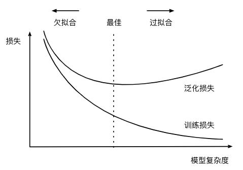

# Chapter4 Multilayer Perceptron
## 4.1 Basic Concepts
### 4.1.1 Hidden Layer 

我们在第三章中描述了仿射变换，它是一种带有偏置项的线性变换。但是，仿射变换中的*线性*是一个很强的假设。线性意味着*单调*假设：任何特征的增大都会导致模型输出的增大（如果对应的权重为正），或者导致模型输出的减小（如果对应的权重为负）。有时这是有道理的，有时也会导致很明显的错误。

我们的数据可能会有一种表示，这种表示会考虑到我们在特征之间的相关交互作用。对于深度神经网络，我们使用观测数据来联合学习隐藏层表示和应用于该表示的线性预测器。我们可以通过在网络中加入一个或多个隐藏层来克服线性模型的限制，使其能处理更普遍的函数关系类型。要做到这一点，最简单的方法是将许多全连接层堆叠在一起。每一层都输出到上面的层，直到生成最后的输出。我们可以把前$L-1$层看作表示，把最后一层看作线性预测器。这种架构通常称为*多层感知机*（multilayer perceptron），通常缩写为*MLP*，下面我们以图的方式描述了多层感知机。

这个多层感知机有4个输入，3个输出，其隐藏层包含5个隐藏单元。输入层不涉及任何计算，因此使用此网络产生输出只需要实现隐藏层和输出层的计算。因此，这个多层感知机中的层数为2。注意，这两个层都是全连接的。每个输入都会影响隐藏层中的每个神经元，而隐藏层中的每个神经元又会影响输出层中的每个神经元。

然而，具有全连接层的多层感知机的参数开销可能会高得令人望而却步，即使在不改变输入或输出大小的情况下，可能在参数节约和模型有效性之间进行权衡。

同之前的章节一样，我们通过矩阵$\mathbf{X} \in \mathbb{R}^{n \times d}$来表示$n$个样本的小批量，其中每个样本具有$d$个输入特征。对于具有$h$个隐藏单元的单隐藏层多层感知机，用$\mathbf{H} \in \mathbb{R}^{n \times h}$表示隐藏层的输出，称为*隐藏表示*（hidden representations）。在数学或代码中，$\mathbf{H}$也被称为*隐藏层变量*（hidden-layer variable）或*隐藏变量*（hidden variable）。因为隐藏层和输出层都是全连接的，所以我们有隐藏层权重$\mathbf{W}^{(1)} \in \mathbb{R}^{d \times h}$和隐藏层偏置$\mathbf{b}^{(1)} \in \mathbb{R}^{1 \times h}$以及输出层权重$\mathbf{W}^{(2)} \in \mathbb{R}^{h \times q}$和输出层偏置$\mathbf{b}^{(2)} \in \mathbb{R}^{1 \times q}$。形式上，我们按如下方式计算单隐藏层多层感知机的输出$\mathbf{O} \in \mathbb{R}^{n \times q}$：

$$
\begin{aligned}
    \mathbf{H} & = \mathbf{X} \mathbf{W}^{(1)} + \mathbf{b}^{(1)}, \\
    \mathbf{O} & = \mathbf{H}\mathbf{W}^{(2)} + \mathbf{b}^{(2)}.
\end{aligned}
$$

注意在添加隐藏层之后，模型现在需要跟踪和更新额外的参数。可我们能从中得到什么好处呢？在上面定义的模型里，我们没有好处！原因很简单：上面的隐藏单元由输入的仿射函数给出，而输出（softmax操作前）只是隐藏单元的仿射函数。仿射函数的仿射函数本身就是仿射函数，但是我们之前的线性模型已经能够表示任何仿射函数。对于这个例子，证明如下：

$$
\mathbf{O} = (\mathbf{X} \mathbf{W}^{(1)} + \mathbf{b}^{(1)})\mathbf{W}^{(2)} + \mathbf{b}^{(2)} = \mathbf{X} \mathbf{W}^{(1)}\mathbf{W}^{(2)} + \mathbf{b}^{(1)} \mathbf{W}^{(2)} + \mathbf{b}^{(2)} = \mathbf{X} \mathbf{W} + \mathbf{b}.
$$

为了发挥多层架构的潜力，我们还需要一个额外的关键要素：在仿射变换之后对每个隐藏单元应用非线性的*激活函数*（activation function）$\sigma$。激活函数的输出（例如，$\sigma(\cdot)$）被称为*活性值*（activations）。一般来说，有了激活函数，就不可能再将我们的多层感知机退化成线性模型：

$$
\begin{aligned}
    \mathbf{H} & = \sigma(\mathbf{X} \mathbf{W}^{(1)} + \mathbf{b}^{(1)}), \\
    \mathbf{O} & = \mathbf{H}\mathbf{W}^{(2)} + \mathbf{b}^{(2)}.\\
\end{aligned}
$$

由于$\mathbf{X}$中的每一行对应于小批量中的一个样本，出于记号习惯的考量，我们定义非线性函数$\sigma$也以按行的方式作用于其输入，即一次计算一个样本。本节应用于隐藏层的激活函数通常不仅按行操作，也按元素操作。这意味着在计算每一层的线性部分之后，我们可以计算每个活性值，而不需要查看其他隐藏单元所取的值，对于大多数激活函数都是这样。

为了构建更通用的多层感知机，我们可以继续堆叠这样的隐藏层，例如$\mathbf{H}^{(1)} = \sigma_1(\mathbf{X} \mathbf{W}^{(1)} + \mathbf{b}^{(1)})$和$\mathbf{H}^{(2)} = \sigma_2(\mathbf{H}^{(1)} \mathbf{W}^{(2)} + \mathbf{b}^{(2)})$，一层叠一层，从而产生更有表达能力的模型。

多层感知机可以通过隐藏神经元，捕捉到输入之间复杂的相互作用，这些神经元依赖于每个输入的值。我们可以很容易地设计隐藏节点来执行任意计算。例如，在一对输入上进行基本逻辑操作，多层感知机是通用近似器。即使是网络只有一个隐藏层，给定足够的神经元和正确的权重，我们可以对任意函数建模，尽管实际中学习该函数是很困难的(通用近似定理)。
虽然一个单隐层网络能学习任何函数，但并不意味着我们应该尝试使用单隐藏层网络来解决所有问题。事实上，通过使用更深（而不是更广）的网络，我们可以更容易地逼近许多函数。我们将在后面的章节中进行更细致的讨论。

### 4.1.2 Activation Function

*激活函数*（activation function）通过计算加权和并加上偏置来确定神经元是否应该被激活，它们将输入信号转换为输出的可微运算。大多数激活函数都是非线性的。激活函数是深度学习的基础，下面介绍一些常见的激活函数。

#### 4.1.2.1 ReLU function

最受欢迎的激活函数是*修正线性单元*（Rectified linear unit，*ReLU*），因为它实现简单，同时在各种预测任务中表现良好。ReLU提供了一种非常简单的非线性变换，给定元素$x$，ReLU函数被定义为该元素与$0$的最大值：

$$\operatorname{ReLU}(x) = \max(x, 0).$$

如图，激活函数是分段线性的。

当输入为负时，ReLU函数的导数为0，而当输入为正时，ReLU函数的导数为1。注意，当输入值精确等于0时，ReLU函数不可导。在此时，我们默认使用左侧的导数，即当输入为0时导数为0。我们可以忽略这种情况，因为输入可能永远都不会是0。正如一句名言所说的，“如果微妙的边界条件很重要，我们很可能是在研究数学而非工程”。ReLU函数的导数图像如下：

使用ReLU的原因是，它求导表现得特别好：要么让参数消失，要么让参数通过。这使得优化表现得更好，并且ReLU减轻了困扰以往神经网络的梯度消失问题（稍后将详细介绍）。

ReLU函数有许多变体，包括*参数化ReLU*（Parameterized ReLU，*pReLU*）函数，该变体为ReLU添加了一个线性项，因此即使参数是负的，某些信息仍然可以通过：

$$\operatorname{pReLU}(x) = \max(0, x) + \alpha \min(0, x).$$

#### 4.1.2.2 Sigmoid function

sigmoid通常称为*挤压函数*（squashing function），因为它将范围（-inf, inf）中的任意输入压缩到区间（0, 1）中的某个值：

$$\operatorname{sigmoid}(x) = \frac{1}{1 + \exp(-x)}.$$

当人们逐渐关注到到基于梯度的学习时，sigmoid函数是一个自然的选择，因为它是一个平滑的、可微的阈值单元近似。当我们想要将输出视作二元分类问题的概率时，sigmoid仍然被广泛用作输出单元上的激活函数（sigmoid可以视为softmax的特例）。然而，sigmoid在隐藏层中已经较少使用，
它在大部分时候被更简单、更容易训练的ReLU所取代。在后面关于循环神经网络的章节中，我们将描述利用sigmoid单元来控制时序信息流的架构。

sigmoid函数图像如下：

sigmoid函数的导数为：

$$\frac{d}{dx} \operatorname{sigmoid}(x) = \frac{\exp(-x)}{(1 + \exp(-x))^2} = \operatorname{sigmoid}(x)\left(1-\operatorname{sigmoid}(x)\right).$$

sigmoid函数的导数图像如下：

#### 4.1.2.3 tanh function

与sigmoid函数类似，tanh(双曲正切)函数能将其输入压缩转换到区间(-1, 1)上。tanh函数的公式如下：

$$\operatorname{tanh}(x) = \frac{1 - \exp(-2x)}{1 + \exp(-2x)}.$$

tanh函数的形状类似于sigmoid函数，不同的是tanh函数关于坐标系原点中心对称。其函数图像如下：

tanh函数的导数是：

$$\frac{d}{dx} \operatorname{tanh}(x) = 1 - \operatorname{tanh}^2(x).$$

tanh函数的导数图像如下：

本节代码如下：

    import matplotlib.pyplot as plt
    import torch
    from d2l import torch as d2l

    #绘制ReLU函数图像
    x=torch.arange(-8,8,0.1,requires_grad=True)
    y=torch.relu(x)
    d2l.plot(x.detach(),y.detach(),'x','relu(x)',figsize=(5,2.5))
    #"detach()" is used to create a new tensor that shares the same data with x but doesn't have a computation graph
    plt.show()

    #绘制ReLU函数的导数图像
    y.backward(torch.ones_like(x),retain_graph=True)
    d2l.plot(x.detach(),x.grad,'x','grad of relu(x)',figsize=(5,2.5))
    #torch.ones_like(x): creates a tensor of the same shape as x but filled with ones. This tensor is used as the gradient of the output y with respect to x during backpropagation
    #retain_graph=True: retains the computational graph after performing the backward pass
    plt.show()

    #绘制sigmoid函数图像
    y=torch.sigmoid(x)
    d2l.plot(x.detach(),y.detach(),'x','sigmoid(x)',figsize=(5,2.5))
    plt.show()

    #绘制sigmoid函数的导数图像
    x.grad.data.zero_()
    y.backward(torch.ones_like(x),retain_graph=True)
    d2l.plot(x.detach(),x.grad,'x','grad of sigmoid(x)',figsize=(5,2.5))
    plt.show()

    #绘制tanh函数图像
    y=torch.tanh(x)
    d2l.plot(x.detach(),y.detach(),'x','tanh(x)',figsize=(5,2.5))
    plt.show()

    #绘制tanh函数的导数图像
    x.grad.data.zero_()
    y.backward(torch.ones_like(x),retain_graph=True)
    d2l.plot(x.detach(),x.grad,'x','grad of tanh(x)',figsize=(5,2.5))
    plt.show()
## 4.2 Implementations of Multilayer-perceptron from Scratch

    import matplotlib.pyplot as plt
    from torch import nn
    import torch
    from d2l import torch as d2l

    #我们将实现一个具有单隐藏层的多层感知机，它包含256个隐藏单元，我们可以将层数和隐藏单元数都视为超参数
    #我们通常选择2的若干次幂作为层的宽度，因为内存在硬件中的分配和寻址方式，这么做往往可以在计算上更高效。
    batch_size = 256
    train_iter, test_iter = d2l.load_data_fashion_mnist(batch_size)
    num_inputs, num_outputs, num_hiddens = 784, 10, 256

    #我们用几个张量来表示我们的参数。注意，对于每一层我们都要记录一个权重矩阵和一个偏置向量。
    W1 = nn.Parameter(torch.randn(
        num_inputs, num_hiddens, requires_grad=True) * 0.01)
    b1 = nn.Parameter(torch.zeros(num_hiddens, requires_grad=True))
    W2 = nn.Parameter(torch.randn(
        num_hiddens, num_outputs, requires_grad=True) * 0.01)
    b2 = nn.Parameter(torch.zeros(num_outputs, requires_grad=True))

    params = [W1, b1, W2, b2]

    #定义激活函数
    def relu(X):
        a = torch.zeros_like(X)
        return torch.max(X, a)

    #实现模型
    def net(X):
        X = X.reshape((-1, num_inputs))
        H = relu(X@W1 + b1)  # '@'代表矩阵乘法
        return (H@W2 + b2)

    #损失函数
    loss = nn.CrossEntropyLoss(reduction='none')

    #训练
    num_epochs, lr = 10, 0.1
    updater = torch.optim.SGD(params, lr=lr)
    d2l.train_ch3(net, train_iter, test_iter, loss, num_epochs, updater)

    #评估
    d2l.predict_ch3(net, test_iter)

    plt.show()
## 4.3 Concise Implementations of Multilayer-perceptron

    import matplotlib.pyplot as plt
    import torch
    from d2l import torch as d2l
    from torch import nn

    #模型
    net=nn.Sequential(nn.Flatten(),nn.Linear(784,256),nn.ReLU(),nn.Linear(256,10))
    def init_weights(m):
        if type(m)==nn.Linear:
            nn.init.normal_(m.weight,std=0.01)

    net.apply(init_weights)

    batch_size, lr, num_epochs = 256, 0.1, 10
    loss = nn.CrossEntropyLoss(reduction='none')
    trainer = torch.optim.SGD(net.parameters(), lr=lr)

    #训练
    train_iter, test_iter = d2l.load_data_fashion_mnist(batch_size)
    d2l.train_ch3(net, train_iter, test_iter, loss, num_epochs, trainer)

    plt.show()
## 4.4 Model Selection

作为机器学习科学家，我们的目标是发现*模式*（pattern）。但是，我们如何才能确定模型是真正发现了一种泛化的模式，而不是简单地记住了数据呢？例如，我们想要在患者的基因数据与痴呆状态之间寻找模式，其中标签是从集合$\{\text{痴呆}, \text{轻度认知障碍}, \text{健康}\}$中提取的，因为基因可以唯一确定每个个体（不考虑双胞胎），所以在这个任务中是有可能记住整个数据集的。我们不想让模型只会做这样的事情：“那是鲍勃！我记得他！他有痴呆症！”。原因很简单：当我们将来部署该模型时，模型需要判断从未见过的患者。只有当模型真正发现了一种泛化模式时，才会作出有效的预测。

更正式地说，我们的目标是发现某些模式，这些模式捕捉到了我们训练集潜在总体的规律。如果成功做到了这点，即使是对以前从未遇到过的个体，模型也可以成功地评估风险。如何发现可以泛化的模式是机器学习的根本问题。

困难在于，当我们训练模型时，我们只能访问数据中的小部分样本。最大的公开图像数据集包含大约一百万张图像。而在大部分时候，我们只能从数千或数万个数据样本中学习。在大型医院系统中，我们可能会访问数十万份医疗记录。当我们使用有限的样本时，可能会遇到这样的问题：当收集到更多的数据时，会发现之前找到的明显关系并不成立。

将模型在训练数据上拟合的比在潜在分布中更接近的现象称为*过拟合*（overfitting），用于对抗过拟合的技术称为*正则化*（regularization）。在前面的章节中，有些读者可能在用Fashion-MNIST数据集做实验时已经观察到了这种过拟合现象。在实验中调整模型架构或超参数时会发现：如果有足够多的神经元、层数和训练迭代周期，模型最终可以在训练集上达到完美的精度，此时测试集的准确性却下降了。

### 4.4.1 Training Error and Generalization Error

*训练误差*（training error）指模型在训练数据集上计算得到的误差。*泛化误差*（generalization error）指模型应用在同样从原始样本的分布中抽取的无限多数据样本时，模型误差的期望。问题是，我们永远不能准确地计算出泛化误差。这是因为无限多的数据样本是一个虚构的对象。在实际中，我们只能通过将模型应用于一个独立的测试集来估计泛化误差，该测试集由随机选取的、未曾在训练集中出现的数据样本构成。

考虑一个简单地使用查表法来回答问题的模型。如果允许的输入集合是离散的并且相当小，那么也许在查看许多训练样本后，该方法将执行得很好。但当这个模型面对从未见过的例子时，它表现的可能比随机猜测好不到哪去。这是因为输入空间太大了，远远不可能记住每一个可能的输入所对应的答案。例如，考虑$28\times28$的灰度图像。如果每个像素可以取$256$个灰度值中的一个，则有$256^{784}$个可能的图像。这意味着指甲大小的低分辨率灰度图像的数量比宇宙中的原子要多得多。即使我们可能遇到这样的数据，我们也不可能存储整个查找表。

最后，考虑对掷硬币的结果（类别0：正面，类别1：反面）进行分类的问题。假设硬币是公平的，无论我们想出什么算法，泛化误差始终是$\frac{1}{2}$。然而，对于大多数算法，我们应该期望训练误差会更低（取决于运气）。考虑数据集{0，1，1，1，0，1}。我们的算法不需要额外的特征，将倾向于总是预测*多数类*，从我们有限的样本来看，它似乎是1占主流。在这种情况下，总是预测类1的模型将产生$\frac{1}{3}$的误差，这比我们的泛化误差要好得多。当我们逐渐增加数据量，正面比例明显偏离$\frac{1}{2}$的可能性将会降低，我们的训练误差将与泛化误差相匹配。

#### 4.4.1.1 I.I.D. Assumption

在我们目前已探讨、并将在之后继续探讨的监督学习情景中，我们假设训练数据和测试数据都是从相同的分布中独立提取的。这通常被称为*独立同分布假设*（i.i.d. assumption），这意味着对数据进行采样的过程没有进行“记忆”。换句话说，抽取的第2个样本和第3个样本的相关性，并不比抽取的第2个样本和第200万个样本的相关性更强。

要成为一名优秀的机器学习科学家需要具备批判性思考能力。假设是存在漏洞的，即很容易找出假设失效的情况。如果我们根据从加州大学旧金山分校医学中心的患者数据训练死亡风险预测模型，并将其应用于马萨诸塞州综合医院的患者数据，结果会怎么样？这两个数据的分布可能不完全一样。此外，抽样过程可能与时间有关。比如当我们对微博的主题进行分类时，新闻周期会使得正在讨论的话题产生时间依赖性，从而违反独立性假设。

有时候我们即使轻微违背独立同分布假设，模型仍将继续运行得非常好。比如，我们有许多有用的工具已经应用于现实，如人脸识别、语音识别和语言翻译。毕竟，几乎所有现实的应用都至少涉及到一些违背独立同分布假设的情况。

有些违背独立同分布假设的行为肯定会带来麻烦。比如，我们试图只用来自大学生的人脸数据来训练一个人脸识别系统，然后想要用它来监测疗养院中的老人。这不太可能有效，因为大学生看起来往往与老年人有很大的不同。

在接下来的章节中，我们将讨论因违背独立同分布假设而引起的问题。目前，即使认为独立同分布假设是理所当然的，理解泛化性也是一个困难的问题。此外，能够解释深层神经网络泛化性能的理论基础，也仍在继续困扰着学习理论领域的学者们。当我们训练模型时，我们试图找到一个能够尽可能拟合训练数据的函数。但是如果它执行地“太好了”，而不能对看不见的数据做到很好泛化，就会导致过拟合。这种情况正是我们想要避免或控制的，深度学习中有许多启发式的技术旨在防止过拟合。

#### 4.4.1.2 Model Complexity

当我们有简单的模型和大量的数据时，我们期望泛化误差与训练误差相近。当我们有更复杂的模型和更少的样本时，我们预计训练误差会下降，但泛化误差会增大。模型复杂性由什么构成是一个复杂的问题。一个模型是否能很好地泛化取决于很多因素。例如，具有更多参数的模型可能被认为更复杂，参数有更大取值范围的模型可能更为复杂。通常对于神经网络，我们认为需要更多训练迭代的模型比较复杂，而需要*早停*（early stopping）的模型（即较少训练迭代周期）就不那么复杂。

本节为了给出一些直观的印象，我们将重点介绍几个倾向于影响模型泛化的因素。

1. 可调整参数的数量。当可调整参数的数量（有时称为*自由度*）很大时，模型往往更容易过拟合。
2. 参数采用的值。当权重的取值范围较大时，模型可能更容易过拟合。
3. 训练样本的数量。即使模型很简单，也很容易过拟合只包含一两个样本的数据集。而过拟合一个有数百万个样本的数据集则需要一个极其灵活的模型。

### 4.4.2 Model Selection

在机器学习中，我们通常在评估几个候选模型后选择最终的模型,这个过程叫做*模型选择*。我们有时需要进行比较的模型在本质上是完全不同的（如决策树与线性模型），有时又需要比较不同的超参数设置下的同一类模型。
#### 4.4.2.1 Validation Dataset

训练多层感知机模型时，我们可能希望比较具有不同数量的隐藏层、不同数量的隐藏单元以及不同的激活函数组合的模型。为了确定候选模型中的最佳模型，我们通常会使用验证集。原则上，在我们确定所有的超参数之前，我们不希望用到测试集。如果我们在模型选择过程中使用测试数据，可能会有过拟合测试数据的风险，那就麻烦大了。如果我们过拟合了训练数据，还可以在测试数据上的评估来判断过拟合。但是如果我们过拟合了测试数据，我们又该怎么知道呢？

因此，我们决不能依靠测试数据进行模型选择。然而，我们也不能仅仅依靠训练数据来选择模型，因为我们无法估计训练数据的泛化误差。在实际应用中，情况变得更加复杂。虽然理想情况下我们只会使用测试数据一次，以评估最好的模型或比较一些模型效果，但现实是测试数据很少在使用一次后被丢弃。我们很少能有充足的数据来对每一轮实验采用全新测试集。
解决此问题的常见做法是将我们的数据分成三份，除了训练和测试数据集之外，还增加一个*验证数据集*（validation dataset），也叫*验证集*（validation set）。但现实是验证数据和测试数据之间的边界模糊得令人担忧。除非另有明确说明，否则在这本书的实验中，我们实际上是在使用应该被正确地称为训练数据和验证数据的数据集，并没有真正的测试数据集。因此，书中每次实验报告的准确度都是验证集准确度，而不是测试集准确度。

#### 4.4.2.2 K-Fold Cross Validation

当训练数据稀缺时，我们甚至可能无法提供足够的数据来构成一个合适的验证集。这个问题的一个流行的解决方案是采用$K$*折交叉验证*。这里，原始训练数据被分成$K$个不重叠的子集。然后执行$K$次模型训练和验证，每次在$K-1$个子集上进行训练，并在剩余的一个子集（在该轮中没有用于训练的子集）上进行验证。最后，通过对$K$次实验的结果取平均来估计训练和验证误差。

### 4.4.3 Underfitting and Overfitting

当我们比较训练和验证误差时，我们要注意两种常见的情况。首先，我们要注意这样的情况：训练误差和验证误差都很严重，但它们之间仅有一点差距。如果模型不能降低训练误差，这可能意味着模型过于简单（即表达能力不足），无法捕获试图学习的模式。此外，由于我们的训练和验证误差之间的*泛化误差*很小，我们有理由相信可以用一个更复杂的模型降低训练误差。这种现象被称为*欠拟合*（underfitting）。

另一方面，当我们的训练误差明显低于验证误差时要小心，这表明严重的*过拟合*（overfitting）。注意，*过拟合*并不总是一件坏事。特别是在深度学习领域，众所周知，最好的预测模型在训练数据上的表现往往比在保留（验证）数据上好得多。最终，我们通常更关心验证误差，而不是训练误差和验证误差之间的差距。

是否过拟合或欠拟合可能取决于模型复杂性和可用训练数据集的大小，这两点将在下面进行讨论。

#### 4.4.3.1 Model Complexity

为了说明一些关于过拟合和模型复杂性的经典直觉，我们给出一个多项式的例子。给定由单个特征$x$和对应实数标签$y$组成的训练数据，我们试图找到下面的$d$阶多项式来估计标签$y$。

$$\hat{y}= \sum_{i=0}^d x^i w_i$$

这只是一个线性回归问题，我们的特征是$x$的幂给出的，模型的权重是$w_i$给出的，偏置是$w_0$给出的（因为对于所有的$x$都有$x^0 = 1$）。由于这只是一个线性回归问题，我们可以使用平方误差作为我们的损失函数。

高阶多项式的参数较多，模型函数的选择范围较广。因此在固定训练数据集的情况下，高阶多项式函数相对于低阶多项式的训练误差应该始终更低（最坏也是相等）。事实上，当数据样本包含了$x$的不同值时，函数阶数等于数据样本数量的多项式函数可以完美拟合训练集。下图直观地描述了多项式的阶数和欠拟合与过拟合之间的关系。

#### 4.4.3.2 Dataset Size

另一个重要因素是数据集的大小。训练数据集中的样本越少，我们就越有可能（且更严重地）过拟合。随着训练数据量的增加，泛化误差通常会减小。一般来说，更多的数据不会有什么坏处。对于固定的任务和数据分布，模型复杂性和数据集大小之间通常存在关系。给出更多的数据，我们可能会尝试拟合一个更复杂的模型。能够拟合更复杂的模型可能是有益的。如果没有足够的数据，简单的模型可能更有用。对于许多任务，深度学习只有在有数千个训练样本时才优于线性模型。从一定程度上来说，深度学习目前的生机要归功于廉价存储、互联设备以及数字化经济带来的海量数据集。

### 4.4.4 Polynomial Regression

给定$x$，我们将使用以下三阶多项式来生成训练和测试数据的标签：

$$y = 5 + 1.2x - 3.4\frac{x^2}{2!} + 5.6 \frac{x^3}{3!} + \epsilon \text{,where }
\epsilon \sim \mathcal{N}(0, 0.1^2).$$

在优化的过程中，我们通常希望避免非常大的梯度值或损失值，这就是我们将特征从$x^i$调整为$\frac{x^i}{i!}$的原因。我们将为训练集和测试集各生成100个样本，具体代码如下：

    import math
    import numpy as np
    import torch
    from torch import nn
    from d2l import torch as d2l
    import matplotlib.pyplot as plt

    max_degree=20 #多项式最大阶数
    n_train,n_test=100,100 #训练集和测试集大小
    true_w=np.zeros(max_degree)
    true_w[0:4]=np.array([5,1.2,-3.4,5.6])

    #generates n_train + n_test random samples from a normal distribution with mean 0 and standard deviation 1
    features=np.random.normal(size=(n_train+n_test,1))
    np.random.shuffle(features)
    #raises each element in the features vector to the power of the corresponding degrees from 0 to max_degree - 1. 
    poly_features=np.power(features,np.arange(max_degree).reshape(1,-1))
    for i in range(max_degree):
        poly_features[:,i]/=math.gamma(i+1) #gamma(n)=(n-1)!
    #labels的维度：(n_train+n_test,)
    labels=np.dot(poly_features,true_w)
    labels+=np.random.normal(scale=0.1,size=labels.shape)#Gaussian noise is added to the labels

    # NumPy ndarray转换为tensor
    true_w, features, poly_features, labels = [torch.tensor(x, dtype=torch.float32) for x in [true_w, features, poly_features, labels]]

    print(features[:2], poly_features[:2, :], labels[:2])

    def evaluate_loss(net, data_iter, loss):  #@save
        """评估给定数据集上模型的损失"""
        metric = d2l.Accumulator(2)  # 损失的总和,样本数量
        for X, y in data_iter:
            out = net(X)
            y = y.reshape(out.shape)
            l = loss(out, y)
            metric.add(l.sum(), l.numel())
        return metric[0] / metric[1]

    #定义训练函数
    def train(train_features, test_features, train_labels, test_labels,num_epochs=400):
        loss = nn.MSELoss(reduction='none')
        input_shape = train_features.shape[-1]
        # 不设置偏置，因为我们已经在多项式中实现了它
        net = nn.Sequential(nn.Linear(input_shape, 1, bias=False))
        batch_size = min(10, train_labels.shape[0])
        train_iter = d2l.load_array((train_features, train_labels.reshape(-1,1)),
                                    batch_size)
        test_iter = d2l.load_array((test_features, test_labels.reshape(-1,1)),
                                batch_size, is_train=False)
        trainer = torch.optim.SGD(net.parameters(), lr=0.01)
        animator = d2l.Animator(xlabel='epoch', ylabel='loss', yscale='log',
                                xlim=[1, num_epochs], ylim=[1e-3, 1e2],
                                legend=['train', 'test'])
        for epoch in range(num_epochs):
            d2l.train_epoch_ch3(net, train_iter, loss, trainer)
            if epoch == 0 or (epoch + 1) % 20 == 0:
                animator.add(epoch + 1, (evaluate_loss(net, train_iter, loss),
                                        evaluate_loss(net, test_iter, loss)))
        print('weight:', net[0].weight.data.numpy())

    #三阶多项式函数拟合(正常,训练出的参数接近真实值)
    # 从多项式特征中选择前4个维度，即1,x,x^2/2!,x^3/3!
    train(poly_features[:n_train, :4], poly_features[n_train:, :4],labels[:n_train], labels[n_train:])
    plt.show()

    #线性函数拟合(欠拟合)
    # 从多项式特征中选择前2个维度，即1和x
    train(poly_features[:n_train, :2], poly_features[n_train:, :2],labels[:n_train], labels[n_train:])
    plt.show()

    #高阶多项式函数拟合(过拟合)
    # 从多项式特征中选取所有维度
    train(poly_features[:n_train, :], poly_features[n_train:, :],labels[:n_train], labels[n_train:], num_epochs=1500)
    plt.show()

## 4.5 Weight Decay
前一节我们描述了过拟合的问题，本节我们将介绍一些正则化模型的技术。我们总是可以通过去收集更多的训练数据来缓解过拟合，但这可能成本很高，耗时颇多，或者完全超出我们的控制，因而在短期内不可能做到。假设我们已经拥有尽可能多的高质量数据，我们便可以将重点放在正则化技术上。

回想一下，在多项式回归的例子中，我们可以通过调整拟合多项式的阶数来限制模型的容量。实际上，限制特征的数量是缓解过拟合的一种常用技术。然而，简单地丢弃特征对这项工作来说可能过于生硬。我们继续思考多项式回归的例子，考虑高维输入可能发生的情况。多项式对多变量数据的自然扩展称为*单项式*（monomials），也可以说是变量幂的乘积。单项式的阶数是幂的和。例如，$x_1^2 x_2$和$x_3 x_5^2$都是3次单项式。

注意，随着阶数$d$的增长，带有阶数$d$的项数迅速增加。 给定$k$个变量，阶数为$d$的项的个数为${k - 1 + d} \choose {k - 1}$，即$C^{k-1}_{k-1+d} = \frac{(k-1+d)!}{(d)!(k-1)!}$。因此即使是阶数上的微小变化，比如从$2$到$3$，也会显著增加我们模型的复杂性。仅仅通过简单的限制特征数量（在多项式回归中体现为限制阶数），可能仍然使模型在过简单和过复杂中徘徊，我们需要一个更细粒度的工具来调整函数的复杂性，使其达到一个合适的平衡位置。
### 4.5.1 Norm and Weight Decay

权重衰减是最广泛使用的正则化的技术之一在训练参数化机器学习模型时，*权重衰减*（weight decay）是最广泛使用的正则化的技术之一，它通常也被称为$L_2$*正则化*。这项技术通过函数与零的距离来衡量函数的复杂度，因为在所有函数$f$中，函数$f = 0$（所有输入都得到值$0$）在某种意义上是最简单的。但是我们应该如何精确地测量一个函数和零之间的距离呢？没有一个准确的答案。
一种简单的方法是通过线性函数$f(\mathbf{x}) = \mathbf{w}^\top \mathbf{x}$中的权重向量的某个范数来度量其复杂性，例如$\| \mathbf{w} \|^2$。要保证权重向量比较小，最常用方法是将其范数作为惩罚项加到最小化损失的问题中。将原来的训练目标*最小化训练标签上的预测损失*，调整为*最小化预测损失和惩罚项之和*。现在，如果我们的权重向量增长的太大，我们的学习算法可能会更集中于最小化权重范数$\| \mathbf{w} \|^2$。这正是我们想要的。3.1节的线性回归例子里，损失由下式给出：

$$L(\mathbf{w}, b) = \frac{1}{n}\sum_{i=1}^n \frac{1}{2}\left(\mathbf{w}^\top \mathbf{x}^{(i)} + b - y^{(i)}\right)^2.$$

为了惩罚权重向量的大小，我们必须以某种方式在损失函数中添加$\| \mathbf{w} \|^2$，但是模型应该如何平衡这个新的额外惩罚的损失？实际上，我们通过*正则化常数*$\lambda$来描述这种权衡，这是一个非负超参数，我们使用验证数据拟合：

$$L(\mathbf{w}, b) + \frac{\lambda}{2} \|\mathbf{w}\|^2,$$

对于$\lambda = 0$，我们恢复了原来的损失函数。对于$\lambda > 0$，我们限制$\| \mathbf{w} \|$的大小。这里我们仍然除以$2$，是因为我们取一个二次函数的导数时，$2$和$1/2$会抵消。通过平方$L_2$范数，我们去掉平方根，留下权重向量每个分量的平方和，这使得惩罚的导数很容易计算。

$L_2$正则化线性模型构成经典的*岭回归*（ridge regression）算法，$L_1$正则化线性回归是统计学中类似的基本模型，通常被称为*套索回归*（lasso regression）。我们通常使用$L_2$范数的一个原因是它对权重向量的大分量施加了巨大的惩罚。这使得我们的学习算法偏向于在大量特征上均匀分布权重的模型。在实践中，这可能使它们对单个变量中的观测误差更为稳定。相比之下，$L_1$惩罚会导致模型将权重集中在一小部分特征上，而将其他权重清除为零。这称为*特征选择*（feature selection），这可能是其他场景下需要的。

$L_2$正则化回归的小批量随机梯度下降更新如下式：

$$
\begin{aligned}
\mathbf{w} & \leftarrow \left(1- \eta\lambda \right) \mathbf{w} - \frac{\eta}{|\mathcal{B}|} \sum_{i \in \mathcal{B}} \mathbf{x}^{(i)} \left(\mathbf{w}^\top \mathbf{x}^{(i)} + b - y^{(i)}\right).
\end{aligned}
$$

根据之前章节所讲的，我们根据估计值与观测值之间的差异来更新$\mathbf{w}$。然而，我们同时也在试图将$\mathbf{w}$的大小缩小到零。这就是为什么这种方法有时被称为*权重衰减*。我们仅考虑惩罚项，优化算法在训练的每一步*衰减*权重。与特征选择相比，权重衰减为我们提供了一种连续的机制来调整函数的复杂度。较小的$\lambda$值对应较少约束的$\mathbf{w}$，而较大的$\lambda$值对$\mathbf{w}$的约束更大。是否对相应的偏置$b^2$进行惩罚在不同的实践中会有所不同，在神经网络的不同层中也会有所不同。通常，网络输出层的偏置项不会被正则化。

### 4.5.2 High Dimensional Linear Regression

我们通过一个简单的例子来演示权重衰减。首先，我们像以前一样生成一些数据，生成公式如下：

$$y = 0.05 + \sum_{i = 1}^d 0.01 x_i + \epsilon \text{ where }
\epsilon \sim \mathcal{N}(0, 0.01^2).$$

我们选择标签是关于输入的线性函数。标签同时被均值为0，标准差为0.01高斯噪声破坏。为了使过拟合的效果更加明显，我们可以将问题的维数增加到$d = 200$，并使用一个只包含20个样本的小训练集。    

    import matplotlib.pyplot as plt
    import torch
    from d2l import torch as d2l
    from torch import nn

    n_train, n_test, num_inputs, batch_size = 20, 100, 200, 5
    true_w, true_b = torch.ones((num_inputs, 1)) * 0.01, 0.05
    train_data = d2l.synthetic_data(true_w, true_b, n_train)
    train_iter = d2l.load_array(train_data, batch_size)
    test_data = d2l.synthetic_data(true_w, true_b, n_test)
    test_iter = d2l.load_array(test_data, batch_size, is_train=False)

    #初始化模型参数
    def init_params():
        w = torch.normal(0, 1, size=(num_inputs, 1), requires_grad=True)
        b = torch.zeros(1, requires_grad=True)
        return [w, b]

    #定义L2范数惩罚
    def l2_penalty(w):
        return torch.sum(w.pow(2)) / 2

    #训练
    def train(lambd):
        w, b = init_params()
        net, loss = lambda X: d2l.linreg(X, w, b), d2l.squared_loss
        num_epochs, lr = 100, 0.003
        animator = d2l.Animator(xlabel='epochs', ylabel='loss', yscale='log',
                                xlim=[5, num_epochs], legend=['train', 'test'])
        for epoch in range(num_epochs):
            for X, y in train_iter:
                # 增加了L2范数惩罚项，
                # 广播机制使l2_penalty(w)成为一个长度为batch_size的向量
                l = loss(net(X), y) + lambd * l2_penalty(w)
                l.sum().backward()
                d2l.sgd([w, b], lr, batch_size)
            if (epoch + 1) % 5 == 0:
                animator.add(epoch + 1, (d2l.evaluate_loss(net, train_iter, loss),
                                        d2l.evaluate_loss(net, test_iter, loss)))
        print('w的L2范数是：', torch.norm(w).item())
        
    #忽略正则化直接训练
    train(lambd=0)
    plt.show()

    #使用正则化后进行训练
    train(lambd=3)
    plt.show()

    #简洁实现
    def train_concise(wd):
        net = nn.Sequential(nn.Linear(num_inputs, 1))
        for param in net.parameters():
            param.data.normal_()
        loss = nn.MSELoss(reduction='none')
        num_epochs, lr = 100, 0.003
        # 偏置参数没有衰减
        trainer = torch.optim.SGD([
            {"params":net[0].weight,'weight_decay': wd},
            {"params":net[0].bias}], lr=lr)
        animator = d2l.Animator(xlabel='epochs', ylabel='loss', yscale='log',
                                xlim=[5, num_epochs], legend=['train', 'test'])
        for epoch in range(num_epochs):
            for X, y in train_iter:
                trainer.zero_grad()
                l = loss(net(X), y)
                l.mean().backward()
                trainer.step()
            if (epoch + 1) % 5 == 0:
                animator.add(epoch + 1,
                            (d2l.evaluate_loss(net, train_iter, loss),
                            d2l.evaluate_loss(net, test_iter, loss)))
        print('w的L2范数：', net[0].weight.norm().item())
        
    train_concise(0)
    train_concise(3)
    plt.show()
无正则化效果(过拟合):
")
正则化效果:

## 4.6 Dropout Regularization

### 4.6.1 Reexamine Overfitting

当面对更多的特征而样本不足时，线性模型往往会过拟合。相反，当给出更多样本而不是特征，通常线性模型不会过拟合。不幸的是，线性模型泛化的可靠性是有代价的，即线性模型没有考虑到特征之间的交互作用。对于每个特征，线性模型必须指定正的或负的权重，而忽略其他特征。

泛化性和灵活性之间的这种基本权衡被描述为*偏差-方差权衡*（bias-variance tradeoff）。线性模型有很高的偏差，然而，这些模型的方差很低，即它们在不同的随机数据样本上可以得出相似的结果。

深度神经网络位于偏差-方差谱的另一端。与线性模型不同，神经网络并不局限于单独查看每个特征，而是学习特征之间的交互。例如，神经网络可能推断“尼日利亚”和“西联汇款”一起出现在电子邮件中表示垃圾邮件，但单独出现则不表示垃圾邮件。

即使我们有比特征多得多的样本，深度神经网络也有可能过拟合。本节中，我们将探究改进深层网络的泛化性的工具。

### 4.6.2 Robustness of Disturbances

经典泛化理论认为，为了缩小训练和测试性能之间的差距，应该以简单的模型为目标。简单性以较小维度的形式展现，参数的范数也代表了一种有用的简单性度量。简单性的另一个角度是平滑性，即函数不应该对其输入的微小变化敏感。例如，当我们对图像进行分类时，我们预计向像素添加一些随机噪声应该是基本无影响的。

在训练过程中，我们可以在计算后续层之前向网络的每一层注入噪声。因为当训练一个有多层的深层网络时，注入噪声只会在输入-输出映射上增强平滑性。这个想法被称为*暂退法*（dropout）。暂退法在前向传播过程中，计算每一内部层的同时注入噪声，这已经成为训练神经网络的常用技术。这种方法之所以被称为*暂退法*，因为我们从表面上看是在训练过程中丢弃一些神经元。在整个训练过程的每一次迭代中，标准暂退法包括在计算下一层之前将当前层中的一些节点置零。
关键的挑战是如何注入这种噪声。一种想法是以一种*无偏向*（unbiased）的方式注入噪声。这样在固定住其他层时，每一层的期望值等于没有噪音时的值。我们可以在每次训练迭代中，从均值为零的分布$\epsilon \sim \mathcal{N}(0,\sigma^2)$采样噪声添加到输入$\mathbf{x}$，从而产生扰动点$\mathbf{x}' = \mathbf{x} + \epsilon$，预期是$E[\mathbf{x}'] = \mathbf{x}$。

在标准暂退法正则化中，通过按保留（未丢弃）的节点的分数进行规范化来消除每一层的偏差，如下所示：

$$
\begin{aligned}
h' =
\begin{cases}
    0 & \text{ 概率为 } p \\
    \frac{h}{1-p} & \text{ 其他情况}
\end{cases}
\end{aligned}
$$

根据此模型的设计，其期望值保持不变，即$E[h'] = h$。

### 4.6.3 Implementation

当我们将暂退法应用到隐藏层，以$p$的概率将隐藏单元置为零时，结果可以看作一个只包含原始神经元子集的网络。比如在下图中，删除了$h_2$和$h_5$，因此输出的计算不再依赖于$h_2$或$h_5$，并且它们各自的梯度在执行反向传播时也会消失。这样，输出层的计算不会过度依赖于$h_1, \ldots, h_5$的任何一个元素。

通常，我们在测试时不用暂退法，然而也有一些例外，比如一些研究人员在测试时使用暂退法，用于估计神经网络预测的“不确定性”：如果通过许多不同的暂退法遮盖后得到的预测结果都是一致的，那么我们可以说网络发挥更稳定。

    import torch
    from torch import nn
    from d2l import torch as d2l
    import matplotlib.pyplot as plt

    #以dropout的概率丢弃X中的元素
    def dropout_layer(X, dropout):
        assert 0 <= dropout <= 1
        # 在本情况中，所有元素都被丢弃
        if dropout == 1:
            return torch.zeros_like(X)
        # 在本情况中，所有元素都被保留
        if dropout == 0:
            return X
        #从均匀分布$U[0, 1]$中抽取样本，使得样本和节点一一对应，然后保留那些对应样本大于p的节点
        mask = (torch.rand(X.shape) > dropout).float()
        return mask * X / (1.0 - dropout)

    #X= torch.arange(16, dtype = torch.float32).reshape((2, 8))
    #print(X)
    #print(dropout_layer(X, 0.))
    #print(dropout_layer(X, 0.5))
    #print(dropout_layer(X, 1.))

    #定义模型
    num_inputs, num_outputs, num_hiddens1, num_hiddens2 = 784, 10, 256, 256
    dropout1, dropout2 = 0.2, 0.5#常见的技巧是在靠近输入层的地方设置较低的暂退概率

    class Net(nn.Module):#indicates that Net is inheriting from the nn.Module class
        def __init__(self, num_inputs, num_outputs, num_hiddens1, num_hiddens2,is_training = True):
            super(Net, self).__init__()
            self.num_inputs = num_inputs
            self.training = is_training
            self.lin1 = nn.Linear(num_inputs, num_hiddens1)
            self.lin2 = nn.Linear(num_hiddens1, num_hiddens2)
            self.lin3 = nn.Linear(num_hiddens2, num_outputs)
            self.relu = nn.ReLU()

        def forward(self, X):
            H1 = self.relu(self.lin1(X.reshape((-1, self.num_inputs))))
            # 只有在训练模型时才使用dropout
            if self.training == True:
                # 在第一个全连接层之后添加一个dropout层
                H1 = dropout_layer(H1, dropout1)
            H2 = self.relu(self.lin2(H1))
            if self.training == True:
                # 在第二个全连接层之后添加一个dropout层
                H2 = dropout_layer(H2, dropout2)
            out = self.lin3(H2)
            return out

    net = Net(num_inputs, num_outputs, num_hiddens1, num_hiddens2)

    #训练和测试
    num_epochs, lr, batch_size = 10, 0.5, 256
    loss = nn.CrossEntropyLoss(reduction='none')
    train_iter, test_iter = d2l.load_data_fashion_mnist(batch_size)
    trainer = torch.optim.SGD(net.parameters(), lr=lr)
    d2l.train_ch3(net, train_iter, test_iter, loss, num_epochs, trainer)
    plt.show()

    #简洁实现
    net = nn.Sequential(nn.Flatten(),
            nn.Linear(784, 256),
            nn.ReLU(),
            # 在第一个全连接层之后添加一个dropout层
            nn.Dropout(dropout1),
            nn.Linear(256, 256),
            nn.ReLU(),
            # 在第二个全连接层之后添加一个dropout层
            nn.Dropout(dropout2),
            nn.Linear(256, 10))

    def init_weights(m):
        if type(m) == nn.Linear:
            nn.init.normal_(m.weight, std=0.01)

    net.apply(init_weights)

    #训练和测试
    trainer = torch.optim.SGD(net.parameters(), lr=lr)
    d2l.train_ch3(net, train_iter, test_iter, loss, num_epochs, trainer)
    plt.show()

## 4.7 Forward/Backward Propagation and Computational Graphs

本节将通过一些基本的数学和计算图，深入探讨*反向传播*的细节。首先，我们将重点放在带权重衰减（$L_2$正则化）的单隐藏层多层感知机上。

### 4.7.1 Forward Propagation

*前向传播*（forward propagation或forward pass）指的是按顺序（从输入层到输出层）计算和存储神经网络中每层的结果。我们将一步步研究单隐藏层神经网络的机制，为了简单起见，我们假设输入样本是 $\mathbf{x}\in \mathbb{R}^d$，并且我们的隐藏层不包括偏置项。这里的中间变量是：

$$\mathbf{z}= \mathbf{W}^{(1)} \mathbf{x},$$

其中$\mathbf{W}^{(1)} \in \mathbb{R}^{h \times d}$是隐藏层的权重参数。将中间变量$\mathbf{z}\in \mathbb{R}^h$通过激活函数$\phi$后，我们得到长度为$h$的隐藏激活向量：

$$\mathbf{h}= \phi (\mathbf{z}).$$

隐藏变量$\mathbf{h}$也是一个中间变量。假设输出层的参数只有权重$\mathbf{W}^{(2)} \in \mathbb{R}^{q \times h}$，我们可以得到输出层变量，它是一个长度为$q$的向量：

$$\mathbf{o}= \mathbf{W}^{(2)} \mathbf{h}.$$

假设损失函数为$l$，样本标签为$y$，我们可以计算单个数据样本的损失项，

$$L = l(\mathbf{o}, y).$$

根据$L_2$正则化的定义，给定超参数$\lambda$，正则化项为

$$s = \frac{\lambda}{2} \left(\|\mathbf{W}^{(1)}\|_F^2 + \|\mathbf{W}^{(2)}\|_F^2\right),$$

$\|\mathbf{X}\|_F$表示矩阵的Frobenius范数：
$$\|\mathbf{X}\|_F = \sqrt{\sum_{i=1}^m \sum_{j=1}^n x_{ij}^2}.$$
最后，模型在给定数据样本上的正则化损失为：

$$J = L + s.$$

在下面的讨论中，我们将$J$称为*目标函数*（objective function）。

下图是与上述简单网络相对应的计算图，其中正方形表示变量，圆圈表示操作符。

### 4.7.2 Backward Propagation

*反向传播*（backward propagation或backpropagation）指的是计算神经网络参数梯度的方法，该方法根据*链式规则*，按相反的顺序从输出层到输入层遍历网络。该算法存储了计算某些参数梯度时所需的任何中间变量（偏导数）。
假设我们有函数$\mathsf{Y}=f(\mathsf{X})$和$\mathsf{Z}=g(\mathsf{Y})$，其中输入和输出$\mathsf{X}, \mathsf{Y}, \mathsf{Z}$是任意形状的张量。利用链式法则，我们可以计算$\mathsf{Z}$关于$\mathsf{X}$的导数：

$$\frac{\partial \mathsf{Z}}{\partial \mathsf{X}} = \text{prod}\left(\frac{\partial \mathsf{Z}}{\partial \mathsf{Y}}, \frac{\partial \mathsf{Y}}{\partial \mathsf{X}}\right).$$

在这里，我们使用$\text{prod}$运算符在执行必要的操（如换位和交换输入位置）后将其参数相乘。对于高维张量，我们使用适当的对应项。

在上面的计算图中单隐藏层简单网络的参数是$\mathbf{W}^{(1)}$和$\mathbf{W}^{(2)}$，反向传播的目的是计算梯度$\partial J/\partial \mathbf{W}^{(1)}$和$\partial J/\partial \mathbf{W}^{(2)}$，计算的顺序与前向传播中执行的顺序相反，具体如下：

$$\frac{\partial J}{\partial L} = 1 \; \text{,} \; \frac{\partial J}{\partial s} = 1.$$

$$
\frac{\partial J}{\partial \mathbf{o}}
= \text{prod}\left(\frac{\partial J}{\partial L}, \frac{\partial L}{\partial \mathbf{o}}\right)
= \frac{\partial L}{\partial \mathbf{o}}
\in \mathbb{R}^q.
$$

$$\frac{\partial s}{\partial \mathbf{W}^{(1)}} = \lambda \mathbf{W}^{(1)}
\; \text{,} \;
\frac{\partial s}{\partial \mathbf{W}^{(2)}} = \lambda \mathbf{W}^{(2)}.$$

$$\frac{\partial J}{\partial \mathbf{W}^{(2)}}= \text{prod}\left(\frac{\partial J}{\partial \mathbf{o}}, \frac{\partial \mathbf{o}}{\partial \mathbf{W}^{(2)}}\right) + \text{prod}\left(\frac{\partial J}{\partial s}, \frac{\partial s}{\partial \mathbf{W}^{(2)}}\right)= \frac{\partial J}{\partial \mathbf{o}} \mathbf{h}^\top + \lambda \mathbf{W}^{(2)}\in \mathbb{R}^{q \times h}.$$

$$
\frac{\partial J}{\partial \mathbf{h}}
= \text{prod}\left(\frac{\partial J}{\partial \mathbf{o}}, \frac{\partial \mathbf{o}}{\partial \mathbf{h}}\right)
= {\mathbf{W}^{(2)}}^\top \frac{\partial J}{\partial \mathbf{o}}\in \mathbb{R}^h.
$$

由于激活函数$\phi$是按元素计算的，计算中间变量$\mathbf{z}$的梯度需要使用按元素乘法运算符，我们用$\odot$表示：

$$
\frac{\partial J}{\partial \mathbf{z}}
= \text{prod}\left(\frac{\partial J}{\partial \mathbf{h}}, \frac{\partial \mathbf{h}}{\partial \mathbf{z}}\right)
= \frac{\partial J}{\partial \mathbf{h}} \odot \phi'\left(\mathbf{z}\right)\in \mathbb{R}^h.
$$

$$
\begin{align*}
\frac{\partial J}{\partial \mathbf{W}^{(1)}}
&= \text{prod}\left(\frac{\partial J}{\partial \mathbf{z}}, \frac{\partial \mathbf{z}}{\partial \mathbf{W}^{(1)}}\right) + \text{prod}\left(\frac{\partial J}{\partial s}, \frac{\partial s}{\partial \mathbf{W}^{(1)}}\right) \\
&= \frac{\partial J}{\partial \mathbf{z}} \mathbf{x}^\top + \lambda \mathbf{W}^{(1)} \\
&= \frac{\partial J}{\partial \mathbf{h}} \odot \phi'\left(\mathbf{z}\right)\mathbf{x}^\top + \lambda \mathbf{W}^{(1)} \\
&= ({\mathbf{W}^{(2)}}^\top \frac{\partial J}{\partial \mathbf{o}})\odot \phi'\left(\mathbf{z}\right)\mathbf{x}^\top + \lambda \mathbf{W}^{(1)}.
\end{align*}
$$

### 4.7.3 Training Neural Networks

在训练神经网络时，前向传播和反向传播相互依赖。以上述简单网络为例：一方面，在前向传播期间计算正则项取决于模型参数$\mathbf{W}^{(1)}$和$\mathbf{W}^{(2)}$的当前值。它们是由优化算法根据最近迭代的反向传播给出的。另一方面，反向传播期间参数的梯度计算，取决于由前向传播给出的隐藏变量$\mathbf{h}$的当前值。

因此，在训练神经网络时，我们交替使用前向传播和反向传播，利用反向传播给出的梯度来更新模型参数。注意，反向传播重复利用前向传播中存储的中间值，以避免重复计算。这带来的影响之一是我们需要保留中间值，直到反向传播完成，这也是训练比单纯的预测需要更多的内存（显存）的原因之一。

## 4.8 Numerical Stability and Model Initialization

### 4.8.1 Gradient Vanishing and Gradient Exploding

考虑一个具有$L$层、输入$\mathbf{x}$和输出$\mathbf{o}$的深层网络。每一层$l$由变换$f_l$定义，该变换的参数为权重$\mathbf{W}^{(l)}$，其隐藏变量是$\mathbf{h}^{(l)}$（令 $\mathbf{h}^{(0)} = \mathbf{x}$）。我们的网络可以表示为：

$$\mathbf{h}^{(l)} = f_l (\mathbf{h}^{(l-1)}) \text{ 因此 } \mathbf{o} = f_L \circ \ldots \circ f_1(\mathbf{x}).$$

如果所有隐藏变量和输入都是向量，我们可以将$\mathbf{o}$关于任何一组参数$\mathbf{W}^{(l)}$的梯度写为下式：

$$\partial_{\mathbf{W}^{(l)}} \mathbf{o} = \underbrace{\partial_{\mathbf{h}^{(L-1)}} \mathbf{h}^{(L)}}_{ \mathbf{M}^{(L)} \stackrel{\mathrm{def}}{=}} \cdot \ldots \cdot \underbrace{\partial_{\mathbf{h}^{(l)}} \mathbf{h}^{(l+1)}}_{ \mathbf{M}^{(l+1)} \stackrel{\mathrm{def}}{=}} \underbrace{\partial_{\mathbf{W}^{(l)}} \mathbf{h}^{(l)}}_{ \mathbf{v}^{(l)} \stackrel{\mathrm{def}}{=}}.$$

换言之，该梯度是$L-l$个矩阵$\mathbf{M}^{(L)} \cdot \ldots \cdot \mathbf{M}^{(l+1)}$与梯度向量 $\mathbf{v}^{(l)}$的乘积。矩阵 $\mathbf{M}^{(l)}$ 可能具有各种各样的特征值。他们可能很小，也可能很大；他们的乘积可能非常大，也可能非常小。

不稳定梯度也威胁到我们优化算法的稳定性。要么是*梯度爆炸*（gradient exploding）问题：参数更新过大，破坏了模型的稳定收敛；要么是*梯度消失*（gradient vanishing）问题：参数更新过小，在每次更新时几乎不会移动，导致模型无法学习。

#### 4.8.1.1 Gradient Vanishing

sigmoid函数$sigmoid(x)=\frac{1}{1 + \exp(-x)}$是导致梯度消失问题的一个常见的原因。

    import matplotlib.pyplot as plt
    import torch
    from d2l import torch as d2l

    #梯度消失
    x = torch.arange(-8.0, 8.0, 0.1, requires_grad=True)
    y = torch.sigmoid(x)
    y.backward(torch.ones_like(x))

    d2l.plot(x.detach().numpy(), [y.detach().numpy(), x.grad.numpy()],
            legend=['sigmoid', 'gradient'], figsize=(4.5, 2.5))
    plt.show()

如上图所示，当sigmoid函数的输入很大或是很小时，它的梯度都会消失。此外，当反向传播通过许多层时，除非sigmoid函数的输入都刚刚好接近于零，否则整个乘积的梯度可能会消失。因此，更稳定的ReLU系列函数已经成为默认选择。
#### 4.8.1.2 Gradient Exploding

    M = torch.normal(0, 1, size=(4,4))
    print('一个矩阵 \n',M)
    for i in range(100):
        M = torch.mm(M,torch.normal(0, 1, size=(4, 4)))

    print('乘以100个矩阵后\n', M)
结果：

    一个矩阵 
    tensor([[-0.4430,  1.8467,  1.2274,  0.2537],
            [ 1.6749, -1.5996,  0.6402,  0.1141],
            [-0.1859, -0.4506,  2.5819, -1.3329],
            [ 2.7346,  0.1642, -0.6078, -0.0507]])
    乘以100个矩阵后
    tensor([[ 6.9875e+23,  5.5570e+23,  7.6843e+23, -1.9781e+23],
            [-6.3054e+23, -5.0146e+23, -6.9342e+23,  1.7850e+23],
            [ 6.4354e+23,  5.1180e+23,  7.0772e+23, -1.8218e+23],
            [-1.1732e+24, -9.3301e+23, -1.2902e+24,  3.3212e+23]])
#### 4.8.1.3 Symmetry

另一个问题是参数化所固有的对称性。假设我们有一个简单的多层感知机，它有一个隐藏层和两个隐藏单元。在这种情况下，我们可以对第一层的权重$\mathbf{W}^{(1)}$进行重排列，并且同样对输出层的权重进行重排列，可以获得相同的函数。第一个隐藏单元与第二个隐藏单元没有什么特别的区别。换句话说，我们在每一层的隐藏单元之间具有排列对称性。

假设输出层将上述两个隐藏单元的多层感知机转换为仅一个输出单元。如果我们将隐藏层的所有参数初始化为$\mathbf{W}^{(1)} = c$，$c$为常量，在前向传播期间，两个隐藏单元采用相同的输入和参数，产生相同的激活，该激活被送到输出单元。在反向传播期间，根据参数$\mathbf{W}^{(1)}$对输出单元进行微分，得到一个梯度，其元素都取相同的值。因此，在基于梯度的迭代（例如小批量随机梯度下降）之后，$\mathbf{W}^{(1)}$的所有元素仍然采用相同的值。这样的迭代永远不会打破对称性，隐藏层的行为就好像只有一个单元，我们可能永远也无法实现网络的表达能力。虽然小批量随机梯度下降不会打破这种对称性，但暂退法正则化可以。

### 4.8.2 Xavier Initialization
解决（或至少减轻）上述问题的一种方法是进行参数初始化，如果我们不指定初始化方法，框架将使用默认的随机初始化方法。
现在深度学习中标准且实用的还有*Xavier初始化*。让我们看看某些*没有非线性*的全连接层输出（例如，隐藏变量）$o_{i}$的尺度分布。对于该层$n_\mathrm{in}$输入$x_j$及其相关权重$w_{ij}$，输出由下式给出

$$o_{i} = \sum_{j=1}^{n_\mathrm{in}} w_{ij} x_j.$$

权重$w_{ij}$都是从同一分布中独立抽取的。此外，让我们假设该分布具有零均值和方差$\sigma^2$（这并不意味着分布必须是高斯的，只是均值和方差需要存在）。
让我们假设层$x_j$的输入也具有零均值和方差$\gamma^2$，并且它们独立于$w_{ij}$并且彼此独立，在这种情况下，我们可以按如下方式计算$o_i$的平均值和方差：

$$
\begin{aligned}
    E[o_i] & = \sum_{j=1}^{n_\mathrm{in}} E[w_{ij} x_j] \\&= \sum_{j=1}^{n_\mathrm{in}} E[w_{ij}] E[x_j] \\&= 0, \\
    \mathrm{Var}[o_i] & = E[o_i^2] - (E[o_i])^2 \\
        & = \sum_{j=1}^{n_\mathrm{in}} E[w^2_{ij} x^2_j] - 0 \\
        & = \sum_{j=1}^{n_\mathrm{in}} E[w^2_{ij}] E[x^2_j] \\
        & = n_\mathrm{in} \sigma^2 \gamma^2.
\end{aligned}
$$

保持方差不变的一种方法是设置$n_\mathrm{in} \sigma^2 = 1$。
现在考虑反向传播过程，我们面临着类似的问题。使用与前向传播相同的推断，我们可以看到，除非$n_\mathrm{out} \sigma^2 = 1$，否则梯度的方差可能会增大，其中$n_\mathrm{out}$是该层的输出的数量。但我们不可能同时满足这两个条件，因此我们只需满足：

$$
\begin{aligned}
\frac{1}{2} (n_\mathrm{in} + n_\mathrm{out}) \sigma^2 = 1 \text{ or }
\sigma = \sqrt{\frac{2}{n_\mathrm{in} + n_\mathrm{out}}}.
\end{aligned}
$$

通常，Xavier初始化从均值为零，方差$\sigma^2 = \frac{2}{n_\mathrm{in} + n_\mathrm{out}}$的高斯分布中采样权重。也可以利用Xavier的直觉来选择从均匀分布中抽取权重时的方差(注意均匀分布$U(-a, a)$的方差为$\frac{a^2}{3}$)，将$\frac{a^2}{3}$代入到$\sigma^2$的条件中，将得到初始化域：

$$U\left(-\sqrt{\frac{6}{n_\mathrm{in} + n_\mathrm{out}}}, \sqrt{\frac{6}{n_\mathrm{in} + n_\mathrm{out}}}\right).$$

尽管在上述数学推理中，“不存在非线性”的假设在神经网络中很容易被违反，但Xavier初始化方法在实践中被证明是有效的。
## 4.9 Environment and Distribution Shift

### 4.9.1 Types of Distribution Shift

在一个经典的情景中，假设训练数据是从某个分布$p_S(\mathbf{x},y)$中采样的，但是测试数据将包含从不同分布$p_T(\mathbf{x},y)$中抽取的未标记样本。如果没有任何关于$p_S$和$p_T$之间相互关系的假设，学习到一个分类器是不可能的。

#### 4.9.1.1 Covariate Shift

在不同分布偏移中，*协变量偏移*（covariate shift）可能是最为广泛研究的。这里我们假设：虽然输入的分布可能随时间而改变，但标签函数（即条件分布$P(y \mid \mathbf{x})$）没有改变。这个问题是由于协变量（特征）分布的变化而产生的。虽然有时我们可以在不引用因果关系的情况下对分布偏移进行推断，但在我们认为$\mathbf{x}$导致$y$的情况下，协变量偏移是一种自然假设。假设在一个与测试集的特征有着本质不同的数据集上进行训练，如果没有方法来适应新的领域，可能会有麻烦。

#### 4.9.1.2 Label Shift

*标签偏移*（label shift）指的是在目标域中的标签分布与源域中的标签分布存在差异的情况。这里我们假设标签边缘概率$P(y)$可以改变，但是类别条件分布$P(\mathbf{x} \mid y)$在不同的领域之间保持不变。当我们认为$y$导致$\mathbf{x}$时，标签偏移是一个合理的假设。
在一些情况下，标签偏移和协变量偏移假设可以同时成立。例如，当标签是确定的，即使$y$导致$\mathbf{x}$，协变量偏移假设也会得到满足。在这些情况下，使用基于标签偏移假设的方法通常是有利的，因为这些方法倾向于包含看起来像标签（通常是低维）的对象，而不是像输入（通常是高维的）对象。

#### 4.9.1.3 Concept Shift

当标签的定义发生变化时，可能会遇到*概念偏移*（concept shift），例如我们要建立一个机器翻译系统，$P(y \mid \mathbf{x})$的分布可能会因我们的位置不同而得到不同的翻译。

### 4.9.2 Distribution Shift Correction

#### 4.9.2.1 Empirical Risk and True Risk

训练数据$\{(\mathbf{x}_1, y_1), \ldots, (\mathbf{x}_n, y_n)\}$的特征和相关的标签经过迭代，在每一个小批量之后更新模型$f$的参数。为了简单起见，我们不考虑正则化，因此极大地降低了训练损失：

$$\mathop{\mathrm{minimize}}_f \frac{1}{n} \sum_{i=1}^n l(f(\mathbf{x}_i), y_i),$$

其中$l$是损失函数，称$\frac{1}{n} \sum_{i=1}^n l(f(\mathbf{x}_i), y_i)$ 为*经验风险*（empirical risk）。经验风险是为了近似 *真实风险*（true risk），即从其真实分布$p(\mathbf{x},y)$中抽取的所有数据的总体损失的期望值：

$$E_{p(\mathbf{x}, y)} [l(f(\mathbf{x}), y)] = \int\int l(f(\mathbf{x}), y) p(\mathbf{x}, y) \;d\mathbf{x}dy.$$

然而在实践中，我们通常无法获得总体数据，因此只需最小化经验风险，希望能近似最小化真实风险。

#### 4.9.2.2 Covariate Shift Correction

假设对于带标签的数据$(\mathbf{x}_i, y_i)$，我们要评估$P(y \mid \mathbf{x})$。然而观测值$\mathbf{x}_i$是从某些*源分布*$q(\mathbf{x})$中得出的，而不是从*目标分布*$p(\mathbf{x})$中得出的。幸运的是，依赖性假设（如独立同分布假设）意味着条件分布保持不变，即：$p(y \mid \mathbf{x}) = q(y \mid \mathbf{x})$。如果源分布$q(\mathbf{x})$是“错误的”，我们可以通过在真实风险的计算中，使用以下恒等式来进行纠正：

$$
\begin{aligned}
\int\int l(f(\mathbf{x}), y) p(y \mid \mathbf{x})p(\mathbf{x}) \;d\mathbf{x}dy =
\int\int l(f(\mathbf{x}), y) q(y \mid \mathbf{x})q(\mathbf{x})\frac{p(\mathbf{x})}{q(\mathbf{x})} \;d\mathbf{x}dy.
\end{aligned}
$$

换句话说，我们需要根据数据来自正确分布与来自错误分布的概率之比来重新衡量每个数据样本的权重：

$$\beta_i \stackrel{\mathrm{def}}{=} \frac{p(\mathbf{x}_i)}{q(\mathbf{x}_i)}.$$

将权重$\beta_i$代入到每个数据样本$(\mathbf{x}_i, y_i)$中，我们可以使用”加权经验风险最小化“来训练模型：

$$\mathop{\mathrm{minimize}}_f \frac{1}{n} \sum_{i=1}^n \beta_i l(f(\mathbf{x}_i), y_i).$$

由于不知道这个比率，我们需要估计它。对于任意一种估计的方法，我们都需要从两个分布中抽取样本：“真实”的分布$p$，通过访问测试数据获取；训练集$q$，通过人工合成的很容易获得。请注意，我们只需要特征$\mathbf{x} \sim p(\mathbf{x})$，不需要访问标签$y \sim p(y)$。在这种情况下，*对数几率回归*（logistic regression）可以得到几乎与原始方法一样好的结果，这是用于二元分类的softmax回归的一个特例。Logistic regression指将线性组合的结果通过sigmoid 函数（也叫logistic函数）映射到一个介于0和1之间的概率值。为了简单起见，假设我们分别从$p(\mathbf{x})$和$q(\mathbf{x})$两个分布中抽取相同数量的样本。现在用$z$标签表示：从$p$抽取的数据为$1$，从$q$抽取的数据为$-1$。混合数据集中的概率由下式给出

$$P(z=1 \mid \mathbf{x}) = \frac{p(\mathbf{x})}{p(\mathbf{x})+q(\mathbf{x})} \text{ and hence } \frac{P(z=1 \mid \mathbf{x})}{P(z=-1 \mid \mathbf{x})} = \frac{p(\mathbf{x})}{q(\mathbf{x})}.$$

因此，如果我们使用logistic regression，其中$P(z=1 \mid \mathbf{x})=\frac{1}{1+\exp(-h(\mathbf{x}))}$（$h$是一个参数化函数），则很自然有：

$$
\beta_i = \frac{1/(1 + \exp(-h(\mathbf{x}_i)))}{\exp(-h(\mathbf{x}_i))/(1 + \exp(-h(\mathbf{x}_i)))} = \exp(h(\mathbf{x}_i)).
$$

总结一下，假设有一个训练集$\{(\mathbf{x}_1, y_1), \ldots, (\mathbf{x}_n, y_n)\}$和一个未标记的测试集$\{\mathbf{u}_1, \ldots, \mathbf{u}_m\}$，对于协变量偏移，假设$1 \leq i \leq n$的$\mathbf{x}_i$来自某个源分布，$\mathbf{u}_i$来自目标分布，以下是纠正协变量偏移的典型算法：

1. 生成一个二元分类训练集：$\{(\mathbf{x}_1, -1), \ldots, (\mathbf{x}_n, -1), (\mathbf{u}_1, 1), \ldots, (\mathbf{u}_m, 1)\}$。
2. 用logistic regression训练二元分类器得到函数$h$。
3. 使用$\beta_i = \exp(h(\mathbf{x}_i))$或更好的$\beta_i = \min(\exp(h(\mathbf{x}_i)), c)$（$c$为常量）对训练数据进行加权。
4. 使用权重$\beta_i$进行对$\{(\mathbf{x}_1, y_1), \ldots, (\mathbf{x}_n, y_n)\}$的训练。

请注意，上述算法依赖于一个重要的假设：需要目标分布(例如，测试分布)中的每个数据样本在训练时出现的概率非零。如果我们找到$p(\mathbf{x}) > 0$但$q(\mathbf{x}) = 0$的点，那么相应的重要性权重会是无穷大。

#### 4.9.2.3 Label Shift Correction

假设我们处理的是$k$个类别的分类任务。使用和上述相同符号，$q$和$p$中分别是源分布（例如训练时的分布）和目标分布（例如测试时的分布）。假设标签的分布随时间变化：$q(y) \neq p(y)$，但类别条件分布保持不变：$q(\mathbf{x} \mid y)=p(\mathbf{x} \mid y)$。如果源分布$q(y)$是“错误的”，
我们可以用下面的恒等式进行修正：

$$
\begin{aligned}
\int\int l(f(\mathbf{x}), y) p(\mathbf{x} \mid y)p(y) \;d\mathbf{x}dy =
\int\int l(f(\mathbf{x}), y) q(\mathbf{x} \mid y)q(y)\frac{p(y)}{q(y)} \;d\mathbf{x}dy.
\end{aligned}
$$

这里，重要性权重将对应于标签似然比率

$$\beta_i \stackrel{\mathrm{def}}{=} \frac{p(y_i)}{q(y_i)}.$$

标签偏移的一个好处是，如果我们在源分布上有一个相当好的模型，那么我们可以得到对这些权重的一致估计，而不需要处理周边的其他维度。在深度学习中，输入往往是高维对象（如图像），而标签通常是低维（如类别）。

为了估计目标标签分布，我们首先采用现成的分类器（通常基于训练数据进行训练），并使用验证集（也来自训练分布）计算其混淆矩阵。混淆矩阵$\mathbf{C}$是一个$k \times k$矩阵，其中每列对应于标签类别，每行对应于模型的预测类别，每个单元格的值$c_{ij}$是验证集中，真实标签为$j$，而我们的模型预测为$i$的样本数量所占的比例。

现在，我们不能直接计算目标数据上的混淆矩阵，因为我们无法看到真实环境下的样本的标签，我们所能做的是将所有模型在测试时的预测取平均数，得到平均模型输出$\mu(\hat{\mathbf{y}}) \in \mathbb{R}^k$，其中第$i$个元素$\mu(\hat{y}_i)$是我们模型预测测试集中$i$的总预测分数。

结果表明，如果我们的分类器一开始就相当准确，并且目标数据只包含我们以前见过的类别，以及如果标签偏移假设成立（这里最强的假设），我们就可以通过求解一个简单的线性系统来估计测试集的标签分布

$$\mathbf{C} p(\mathbf{y}) = \mu(\hat{\mathbf{y}}),$$

因为作为一个估计，$\sum_{j=1}^k c_{ij} p(y_j) = \mu(\hat{y}_i)$对所有$1 \leq i \leq k$成立，其中$p(y_j)$是$k$维标签分布向量$p(\mathbf{y})$的第$j^\mathrm{th}$元素。如果我们的分类器一开始就足够精确，那么混淆矩阵$\mathbf{C}$将是可逆的，进而我们可以得到一个解$p(\mathbf{y}) = \mathbf{C}^{-1} \mu(\hat{\mathbf{y}})$。

因为我们观测源数据上的标签，所以很容易估计分布$q(y)$。那么对于标签为$y_i$的任何训练样本$i$，我们可以使用我们估计的$p(y_i)/q(y_i)$比率来计算权重$\beta_i$，并将其代入加权经验风险最小化中。

#### 4.9.2.4 Concept Shift Correction

概念偏移很难用原则性的方式解决，但通常情况下概念的变化总是缓慢的，我们可以使用新数据更新现有的网络权重，使其适应数据的变化。

### 4.9.3 Classification of Learning Problems
#### 4.9.3.1 Batch Learning

在*批量学习*（batch learning）中，我们可以访问一组训练特征和标签$\{(\mathbf{x}_1, y_1), \ldots, (\mathbf{x}_n, y_n)\}$，并使用这些特性和标签训练$f(\mathbf{x})$，然后部署此模型，对来自同一分布的新数据$(\mathbf{x}, y)$进行评分。例如，我们可以根据猫和狗的大量图片训练猫检测器。

#### 4.9.3.2 Online Learning

首先观测$\mathbf{x}_i$，得出一个估计值$f(\mathbf{x}_i)$，只有当我们做到这一点后，才能观测到$y_i$，然后我们会根据我们的决定得到奖励或损失。例如，我们需要预测明天的股票价格，这样我们就可以根据这个预测进行交易。在一天结束时，我们会评估我们的预测是否盈利。换句话说，在*在线学习*（online learning）中，我们有以下的循环：

$$
\mathrm{model} ~ f_t \longrightarrow
\mathrm{data} ~ \mathbf{x}_t \longrightarrow
\mathrm{estimate} ~ f_t(\mathbf{x}_t) \longrightarrow
\mathrm{observation} ~ y_t \longrightarrow
\mathrm{loss} ~ l(y_t, f_t(\mathbf{x}_t)) \longrightarrow
\mathrm{model} ~ f_{t+1}
$$
#### 4.9.3.3 Reinforcement Learning(略)