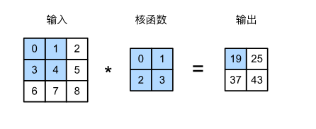
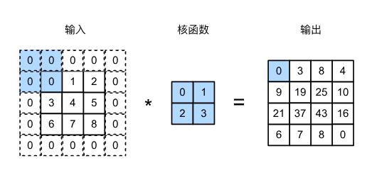
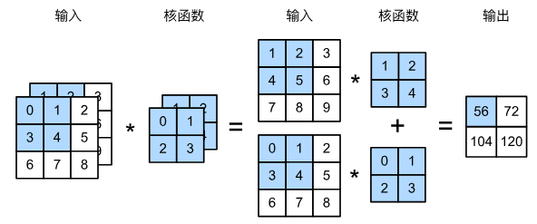
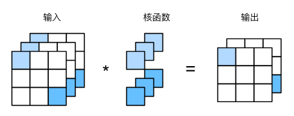
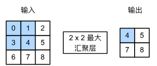
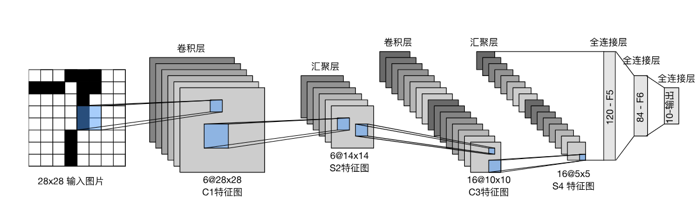
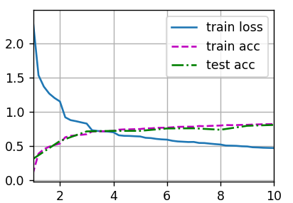

# Chapter6 Convolutional Neural Network(CNN)
## 6.1 Basic Concepts

卷积神经网络将*空间不变性*（spatial invariance）这一概念系统化，并基于这个模型使用较少的参数来学习有用的表示，总结为以下两点：

1. *平移不变性*（translation invariance）：不管检测对象出现在图像中的哪个位置，神经网络的前面几层应该对相同的图像区域具有相似的反应。
2. *局部性*（locality）：神经网络的前面几层应该只探索输入图像中的局部区域，而不过度在意图像中相隔较远区域的关系。最终，可以聚合这些局部特征，以在整个图像级别进行预测。

为了方便理解，我们可以认为无论是输入还是隐藏表示都拥有空间结构。使用$[\mathbf{X}]_{i, j}$和$[\mathbf{H}]_{i, j}$分别表示输入图像和隐藏表示中位置（$i$,$j$）处的像素。为了使每个隐藏神经元都能接收到每个输入像素的信息，我们将参数从权重矩阵替换为四阶权重张量$\mathsf{W}$。假设$\mathbf{U}$包含偏置参数，我们可以将全连接层形式化地表示为

$$\begin{aligned} \left[\mathbf{H}\right]_{i, j} &= [\mathbf{U}]_{i, j} + \sum_k \sum_l[\mathsf{W}]_{i, j, k, l}  [\mathbf{X}]_{k, l}\\ &=  [\mathbf{U}]_{i, j} +
\sum_a \sum_b [\mathsf{V}]_{i, j, a, b}  [\mathbf{X}]_{i+a, j+b}.\end{aligned}$$

其中，实现从$\mathsf{W}$到$\mathsf{V}$的转换只需重新索引下标$(k, l)$，使$k = i+a$、$l = j+b$，$[\mathsf{V}]_{i, j, a, b} = [\mathsf{W}]_{i, j, i+a, j+b}$.

### 6.1.1 Translation Invariance

平移不变性意味着检测对象在输入$\mathbf{X}$中的平移，应该仅导致隐藏表示$\mathbf{H}$中的平移。也就是说，$\mathsf{V}$和$\mathbf{U}$实际上不依赖于$(i, j)$的值，即$[\mathsf{V}]_{i, j, a, b} = [\mathbf{V}]_{a, b}$，并且$\mathbf{U}$是一个常数$u$。因此，我们可以简化$\mathbf{H}$定义为：

$$[\mathbf{H}]_{i, j} = u + \sum_a\sum_b [\mathbf{V}]_{a, b} [\mathbf{X}]_{i+a, j+b}.$$

这就是*卷积*（convolution）。我们是在使用系数$[\mathbf{V}]_{a, b}$对位置$(i, j)$附近的像素$(i+a, j+b)$进行加权得到$[\mathbf{H}]_{i, j}$。
注意，$[\mathbf{V}]_{a, b}$的系数比$[\mathsf{V}]_{i, j, a, b}$少很多。

### 6.1.2 Locality

局部性要求，为了收集用来训练参数$[\mathbf{H}]_{i, j}$的相关信息，我们不应偏离到距$(i, j)$很远的地方。这意味着在$|a|> \Delta$或$|b| > \Delta$的范围之外，我们可以设置$[\mathbf{V}]_{a, b} = 0$。因此，我们可以将$[\mathbf{H}]_{i, j}$重写为

$$[\mathbf{H}]_{i, j} = u + \sum_{a = -\Delta}^{\Delta} \sum_{b = -\Delta}^{\Delta} [\mathbf{V}]_{a, b}  [\mathbf{X}]_{i+a, j+b}.\tag{1}$$

式(1)是一个*卷积层*（convolutional layer），而卷积神经网络是包含卷积层的一类特殊的神经网络。$\mathbf{V}$被称为*卷积核*（convolution kernel）或者*滤波器*（filter），亦或简单地称之为该卷积层的*权重*，通常该权重是可学习的参数。
卷积操作原理如图：

输入大小为$n_h \times n_w$，卷积核大小$k_h \times k_w$，输出大小为$(n_h-k_h+1) \times (n_w-k_w+1).$输出的卷积层有时被称为*特征映射*（feature map），因为它可以被视为一个输入映射到下一层的空间维度的转换器。在卷积神经网络中，对于某一层的任意元素$x$，其*感受野*（receptive field）是指在前向传播期间可能影响$x$计算的所有元素（来自所有先前层），因此感受野可能大于输入的实际大小。
当图像处理的局部区域很小时，卷积神经网络与多层感知机的训练差异可能是巨大的：多层感知机可能需要数十亿个参数来表示网络中的一层，而卷积神经网络通常只需要几百个参数，而且不需要改变输入或隐藏表示的维数。参数大幅减少的代价是，我们的特征现在是平移不变的，并且当确定每个隐藏活性值时，每一层只包含局部的信息。以上所有的权重学习都将依赖于归纳偏置，当这种偏置与现实相符时，我们就能得到样本有效的模型，并且这些模型能很好地泛化到未知数据中，但如果这偏置与现实不符时（比如当图像不满足平移不变），我们的模型可能难以拟合训练数据。

注：在数学中，两个函数（比如$f, g: \mathbb{R}^d \to \mathbb{R}$）之间的“卷积”被定义为

$$(f*g)(\mathbf{x}) = \int f(\mathbf{z}) g(\mathbf{x}-\mathbf{z}) d\mathbf{z}.$$

对于离散对象时，积分就变成求和。例如，对于由索引为$\mathbb{Z}$的、平方可和的、无限维向量集合中抽取的向量，我们有以下定义：

$$(f*g)(i) = \sum_a f(a) g(i-a).$$

对于二维张量，则为：

$$(f*g)(i, j) = \sum_a\sum_b f(a, b) g(i-a, j-b).$$

上式看起来类似于式(1)，但有一个主要区别：这里不是使用$(i+a, j+b)$，而是使用差值。我们在式(1)中其实定义了*互相关*（cross-correlation）而非数学上的卷积，但是两种运算的结果是相同的，在互相关运算中卷积核的元素与(i,j)右下角的元素对应相乘，而卷积中卷积核的元素对应的是(i,j)左上角的元素。为了与深度学习文献中的标准术语保持一致，我们将继续把“互相关运算”称为卷积运算。

### 6.1.3 Channels

我们之前忽略了图像一般包含三个通道/三种原色（红色、绿色和蓝色）。因此，我们将$\mathsf{X}$索引为$[\mathsf{X}]_{i, j, k}$。由此卷积相应地调整为$[\mathsf{V}]_{a,b,c}$，而不是$[\mathbf{V}]_{a,b}$。此外，由于输入图像是三维的，隐藏表示$\mathsf{H}$也最好采用三维张量。换句话说，对于每一个空间位置，我们想要采用一组而不是一个隐藏表示，这样一组隐藏表示可以想象成一些互相堆叠的二维网格，因此我们可以把隐藏表示想象为一系列具有二维张量的*通道*（channel），这些通道有时也被称为*特征映射*（feature maps），因为每个通道都向后续层提供一组空间化的学习特征。直观上可以想象在靠近输入的底层，一些通道专门识别边缘，而一些通道专门识别纹理。

为了支持输入$\mathsf{X}$和隐藏表示$\mathsf{H}$中的多个通道，我们可以在$\mathsf{V}$中添加第四个坐标，即$[\mathsf{V}]_{a, b, c, d}$。综上所述，

$$[\mathsf{H}]_{i,j,d} = \sum_{a = -\Delta}^{\Delta} \sum_{b = -\Delta}^{\Delta} \sum_c [\mathsf{V}]_{a, b, c, d} [\mathsf{X}]_{i+a, j+b, c},$$

其中隐藏表示$\mathsf{H}$中的索引$d$表示输出通道，而随后的输出将继续以三维张量$\mathsf{H}$作为输入进入下一个卷积层。

## 6.2 Image Convolution Operation
### 6.2.1 Convolutional Layer
    import torch
    from torch import nn
    from d2l import torch as d2l

    def corr2d(X, K):  #@save
        """计算二维互相关运算"""
        h, w = K.shape
        Y = torch.zeros((X.shape[0] - h + 1, X.shape[1] - w + 1))
        for i in range(Y.shape[0]):
            for j in range(Y.shape[1]):
                Y[i, j] = (X[i:i + h, j:j + w] * K).sum()
        return Y

    X = torch.tensor([[0.0, 1.0, 2.0], [3.0, 4.0, 5.0], [6.0, 7.0, 8.0]])
    K = torch.tensor([[0.0, 1.0], [2.0, 3.0]])
    print(corr2d(X, K))

    class Conv2D(nn.Module):
        """实现二维卷积层"""
        def __init__(self, kernel_size):
            super().__init__()
            self.weight = nn.Parameter(torch.rand(kernel_size))
            self.bias = nn.Parameter(torch.zeros(1))

        def forward(self, x):
            return corr2d(x, self.weight) + self.bias

    #卷积层的一个简单应用：检测图像中不同颜色的边缘
    X = torch.ones((6, 8))
    X[:, 2:6] = 0
    K = torch.tensor([[1.0, -1.0]])
    Y=corr2d(X, K)
    print(Y)
    print(corr2d(X.t(), K))#卷积核K只可以检测垂直边缘，无法检测水平边缘。

    # 构造一个二维卷积层，它具有1个输出通道、1个输出通道和形状为（1，2）的卷积核
    conv2d = nn.Conv2d(1,1, kernel_size=(1, 2), bias=False)

    # 使用四维输入和输出格式（批量大小、通道、高度、宽度），其中批量大小和通道数都为1
    X = X.reshape((1, 1, 6, 8))
    Y = Y.reshape((1, 1, 6, 7))
    lr = 3e-2  # 学习率

    for i in range(10):
        Y_hat = conv2d(X)
        l = (Y_hat - Y) ** 2
        conv2d.zero_grad()
        l.sum().backward()
        # 迭代卷积核
        conv2d.weight.data[:] -= lr * conv2d.weight.grad
        if (i + 1) % 2 == 0:
            print(f'epoch {i+1}, loss {l.sum():.3f}')

    print(conv2d.weight.data.reshape((1, 2)))#学习到的卷积核非常接近之前定义的卷积核K
### 6.2.2 Padding and Stride
#### 6.2.2.1 Padding

在应用多层卷积时，我们常常丢失边缘像素。解决这个问题的简单方法为*填充*（padding）：在输入图像的边界填充元素（通常填充元素是$0$）。例如，在下图中，我们将$3 \times 3$输入填充到$5 \times 5$，那么它的输出就增加为$4 \times 4$。阴影部分是第一个输出元素以及用于输出计算的输入和核张量元素：$0\times0+0\times1+0\times2+0\times3=0.$

通常，如果我们添加$p_h$行填充（大约顶部一半，底部一半）和$p_w$列填充（大约左侧一半，右侧一半），则输出形状为$$(n_h-k_h+p_h+1)\times(n_w-k_w+p_w+1).$$这意味着输出的高度和宽度将分别增加$p_h$和$p_w$。在许多情况下，我们需要设置$p_h=k_h-1$和$p_w=k_w-1$，使输入和输出具有相同的高度和宽度。假设$k_h$是奇数，我们将在上下两侧填充$p_h/2$行；如果$k_h$是偶数，则一种可能性是在顶部填充$\lceil p_h/2\rceil$行，在底部填充$\lfloor p_h/2\rfloor$行。填充左右两侧同理。

卷积神经网络中卷积核的高度和宽度通常为奇数，好处是保持空间维度的同时，可以在顶部和底部填充相同数量的行，在左侧和右侧填充相同数量的列。此外，使用奇数的核大小和填充大小也提供了书写上的便利。对于任何二维张量$\mathbf{X}$，当满足：1. 卷积核的大小是奇数；2. 所有边的填充行数和列数相同；3. 输出与输入具有相同高度和宽度时，可以得出：输出$\mathbf{Y}[i, j]$是通过以输入$\mathbf{X}[i, j]$为中心与卷积核进行互相关计算得到的。
#### 6.2.2.2 Stride

在计算互相关时，卷积窗口从输入张量的左上角开始，向下、向右滑动。在前面的例子中，我们默认每次滑动一个元素。但是，有时候为了高效计算或是缩减采样次数，卷积窗口可以跳过中间位置，每次滑动多个元素。我们将每次滑动元素的数量称为*步幅*（stride）。通常，当垂直步幅为$s_h$、水平步幅为$s_w$时，输出形状为

$$\lfloor(n_h-k_h+p_h+s_h)/s_h\rfloor \times \lfloor(n_w-k_w+p_w+s_w)/s_w\rfloor.$$

如果设置了$p_h=k_h-1$和$p_w=k_w-1$，则输出形状为$$\lfloor(n_h+s_h-1)/s_h\rfloor \times \lfloor(n_w+s_w-1)/s_w\rfloor.$$更进一步，如果输入的高度和宽度可以被垂直和水平步幅整除，则输出形状为$$(n_h/s_h) \times (n_w/s_w).$$当输入高度和宽度两侧的填充数量分别为$p_h$和$p_w$时，称之为填充$(p_h, p_w)$，当$p_h = p_w = p$时，称填充为$p$。同理，当高度和宽度上的步幅分别为$s_h$和$s_w$时，称之为步幅$(s_h, s_w)$。特别地，当$s_h = s_w = s$时，称步幅为$s$。默认情况下，填充为0，步幅为1。在实践中，通常有$p_h = p_w$和$s_h = s_w$。
本节代码如下：

    import torch
    from torch import nn
    from d2l import torch as d2l

    #以下演示通过调整填充数和卷积核大小来使得输入和输出的宽度高度相同
    def comp_conv2d(conv2d, X):
        # 这里的（1，1）表示批量大小和通道数都是1
        X = X.reshape((1, 1) + X.shape)#在前面添加了两个维度，分别表示批量大小和通道数，使其适应卷积层的输入要求
        Y = conv2d(X)
        # 省略前两个维度：批量大小和通道 
        return Y.reshape(Y.shape[2:])

    # 请注意，总共添加了2行和2列
    conv2d = nn.Conv2d(1, 1, kernel_size=3, padding=1)
    X = torch.rand(size=(8, 8))
    print(comp_conv2d(conv2d, X).shape)

    conv2d = nn.Conv2d(1, 1, kernel_size=(5, 3), padding=(2, 1))
    print(comp_conv2d(conv2d, X).shape)

    conv2d = nn.Conv2d(1, 1, kernel_size=3, padding=1, stride=2)
    print(comp_conv2d(conv2d, X).shape)

    conv2d = nn.Conv2d(1, 1, kernel_size=(3, 5), padding=(0, 1), stride=(3, 4))
    print(comp_conv2d(conv2d, X).shape)

### 6.2.3 Channels
#### 6.2.3.1 Multiple Input Channels
下图演示了一个具有两个输入通道的二维互相关运算的示例。阴影部分是第一个输出元素以及用于计算这个输出的输入和卷积核元素：$(1\times1+2\times2+4\times3+5\times4)+(0\times0+1\times1+3\times2+4\times3)=56.$

    #多输入通道卷积
    def corr2d_multi_in(X, K):
        # 先遍历“X”和“K”的第0个维度（通道维度），再把它们加在一起
        return sum(d2l.corr2d(x, k) for x, k in zip(X, K))

    X = torch.tensor([[[0.0, 1.0, 2.0], [3.0, 4.0, 5.0], [6.0, 7.0, 8.0]],
                [[1.0, 2.0, 3.0], [4.0, 5.0, 6.0], [7.0, 8.0, 9.0]]])
    K = torch.tensor([[[0.0, 1.0], [2.0, 3.0]], [[1.0, 2.0], [3.0, 4.0]]])
    print(corr2d_multi_in(X, K))
#### 6.2.3.2 Multiple Output Channels
用$c_i$和$c_o$分别表示输入和输出通道的数目，并让$k_h$和$k_w$为卷积核的高度和宽度。为了获得多个通道的输出，我们可以为每个输出通道创建一个形状为$c_i\times k_h\times k_w$的卷积核张量，这样卷积核的形状是$c_o\times c_i\times k_h\times k_w$。在互相关运算中，每个输出通道先获取所有输入通道，再以对应该输出通道的卷积核计算出结果。

    def corr2d_multi_in_out(X, K): 
        # 迭代“K”的第0个维度，每次都对输入“X”执行互相关运算,最后将所有结果都叠加在一起
        return torch.stack([corr2d_multi_in(X, k) for k in K], 0)#0是指定的叠加的维度

    K = torch.stack((K, K + 1, K + 2), 0)#接收一个包含三个张量的元组，并在第0个维度上叠加它们，构造一个具有3个输出通道的卷积核
    print(K.shape)
    print(corr2d_multi_in_out(X, K))
#### 6.2.3.3 $1\times 1$ Convolutional Layer
$1\times 1$卷积的唯一计算发生在通道上。下图展示了使用$1\times 1$卷积核与$3$个输入通道和$2$个输出通道的互相关计算，这里输入和输出具有相同的高度和宽度，输出中的每个元素都是从输入图像中同一位置的元素的线性组合。我们可以将$1\times 1$卷积层看成在每个像素位置应用的全连接层，以$c_i$个输入值转换为$c_o$个输出值，同时，$1\times 1$卷积层需要的权重维度为$c_o\times c_i$，再额外加上一个偏置。$1\times 1$卷积通过调整通道数、引入非线性映射和促使特征交互，提供了一种灵活而有效的方式来改进网络的性能。

    #使用全连接层实现1×1卷积
    def corr2d_multi_in_out_1x1(X, K):
        c_i, h, w = X.shape
        c_o = K.shape[0]
        X = X.reshape((c_i, h * w))
        K = K.reshape((c_o, c_i))
        # 全连接层中的矩阵乘法
        Y = torch.matmul(K, X)
        return Y.reshape((c_o, h, w))

    X = torch.normal(0, 1, (3, 3, 3))
    K = torch.normal(0, 1, (2, 3, 1, 1))
    Y1 = corr2d_multi_in_out_1x1(X, K)
    Y2 = corr2d_multi_in_out(X, K)
    assert float(torch.abs(Y1 - Y2).sum()) < 1e-6#此时两者效果相同
### 6.2.4 Pooling
机器学习任务通常跟全局图像的问题有关（例如，“图像是否包含一只猫呢？”），所以最后一层的神经元应该对整个输入的全局敏感。通过逐渐聚合信息，生成越来越粗糙的映射，最终实现学习全局表示的目标，同时将卷积图层的所有优势保留在中间层。

此外，当检测较底层的特征（如边缘）时，我们通常希望这些特征保持某种程度上的平移不变性。例如，如果我们拍摄黑白之间轮廓清晰的图像`X`，并将整个图像向右移动一个像素，即`Z[i, j] = X[i, j + 1]`，则新图像`Z`的输出可能大不相同。而在现实中，随着拍摄角度的移动，任何物体几乎不可能一直出现在在同一像素上。*汇聚*（pooling）具有双重作用：降低卷积层对位置的敏感性，同时降低对空间降采样表示的敏感性（也就是降低空间分辨率的同时尽量保留更多空间信息，避免过度丢失有用的局部特征）。

与卷积层类似，汇聚层运算符由一个固定形状的*汇聚窗口*组成，该窗口根据其步幅大小在输入区域上滑动，为遍历的每个位置计算一个输出。汇聚窗口形状为$p \times q$的汇聚层称为$p \times q$汇聚层，相应的汇聚操作称为$p \times q$汇聚。然而，不同于卷积层中的输入与卷积核之间的互相关计算，汇聚层汇聚运算是确定性的，不包含参数。我们通常计算汇聚窗口中所有元素的最大值或平均值，分别称为*最大汇聚层*（maximum pooling）和*平均汇聚层*（average pooling）。

    def pool2d(X, pool_size, mode='max'):
        """实现汇聚层"""
        p_h, p_w = pool_size
        Y = torch.zeros((X.shape[0] - p_h + 1, X.shape[1] - p_w + 1))
        for i in range(Y.shape[0]):
            for j in range(Y.shape[1]):
                if mode == 'max':
                    Y[i, j] = X[i: i + p_h, j: j + p_w].max()
                elif mode == 'avg':
                    Y[i, j] = X[i: i + p_h, j: j + p_w].mean()
        return Y

    X = torch.tensor([[0.0, 1.0, 2.0], [3.0, 4.0, 5.0], [6.0, 7.0, 8.0]])
    print(pool2d(X, (2, 2)))
    print(pool2d(X, (2, 2), 'avg'))

    X = torch.arange(16, dtype=torch.float32).reshape((1, 1, 4, 4))
    pool2d = nn.MaxPool2d(3)
    #步幅与汇聚窗口的大小默认相同，因此如果使用形状为(3, 3)的汇聚窗口，那么默认步幅为(3, 3)
    print(pool2d(X))

    pool2d = nn.MaxPool2d(3, padding=1, stride=2)
    print(pool2d(X))

    pool2d = nn.MaxPool2d((2, 3), stride=(2, 3), padding=(0, 1))
    print(pool2d(X))

    #在处理多通道输入数据时，汇聚层在每个输入通道上单独运算，而不是像卷积层一样在通道上对输入进行汇总,这意味着汇聚层的输出通道数与输入通道数相同
    X = torch.cat((X, X + 1), 1)
    pool2d = nn.MaxPool2d(3, padding=1, stride=2)
    print(pool2d(X))
## 6.3 LeNet

LeNet模型中每个卷积块中的基本单元是一个卷积层、一个sigmoid激活函数和平均汇聚层。虽然ReLU和最大汇聚层更有效，但它们在20世纪90年代还没有出现。每个卷积层使用$5\times 5$卷积核和一个sigmoid激活函数，这些层将输入映射到多个二维特征输出，通常同时增加通道的数量。第一卷积层有6个输出通道，而第二个卷积层有16个输出通道，每个$2\times2$池操作（步幅2）通过空间下采样将维数减少4倍。为了将卷积块的输出传递给稠密块，我们必须在小批量中展平每个样本。换言之，我们将这个四维输入转换成全连接层所期望的二维输入（第一个维度索引小批量中的样本，第二个维度给出每个样本的平面向量表示）。LeNet的稠密块有三个全连接层，分别有120、84和10个输出。因为我们在执行分类任务，所以输出层的10维对应于最后输出结果的数量。

    import torch
    from torch import nn
    from d2l import torch as d2l
    import matplotlib.pyplot as plt

    net = nn.Sequential(
        nn.Conv2d(1, 6, kernel_size=5, padding=2), nn.Sigmoid(),
        nn.AvgPool2d(kernel_size=2, stride=2),
        nn.Conv2d(6, 16, kernel_size=5), nn.Sigmoid(),
        nn.AvgPool2d(kernel_size=2, stride=2),
        nn.Flatten(),
        nn.Linear(16 * 5 * 5, 120), nn.Sigmoid(),
        nn.Linear(120, 84), nn.Sigmoid(),
        nn.Linear(84, 10))

    X = torch.rand(size=(1, 1, 28, 28), dtype=torch.float32)
    for layer in net:
        X = layer(X)
        print(layer.__class__.__name__,'output shape: \t',X.shape)
        
    batch_size = 256
    train_iter, test_iter = d2l.load_data_fashion_mnist(batch_size=batch_size)

    def evaluate_accuracy_gpu(net, data_iter, device=None): #@save
        """使用GPU计算模型在数据集上的精度"""
        if isinstance(net, nn.Module):
            net.eval()  # 设置为评估模式
            if not device:
                device = next(iter(net.parameters())).device
        metric = d2l.Accumulator(2)#metric[0]:正确预测的数量，metric[1]:总预测的数量。
        with torch.no_grad():
            for X, y in data_iter:
                if isinstance(X, list):
                    X = [x.to(device) for x in X]# BERT微调所需，将输入转移到GPU上（之后将介绍）
                else:
                    X = X.to(device)
                y = y.to(device)
                metric.add(d2l.accuracy(net(X), y), y.numel())
        return metric[0] / metric[1]

    def train_ch6(net, train_iter, test_iter, num_epochs, lr, device):#@save
        """用GPU训练模型"""
        def init_weights(m):
            if type(m) == nn.Linear or type(m) == nn.Conv2d:
                nn.init.xavier_uniform_(m.weight)
        net.apply(init_weights)
        print('training on', device)
        net.to(device)
        optimizer = torch.optim.SGD(net.parameters(), lr=lr)
        loss = nn.CrossEntropyLoss()
        animator = d2l.Animator(xlabel='epoch', xlim=[1, num_epochs],legend=['train loss', 'train acc', 'test acc'])
        timer, num_batches = d2l.Timer(), len(train_iter)
        for epoch in range(num_epochs):
            metric = d2l.Accumulator(3)#metric[i]分别是训练损失之和，训练准确率之和，样本数
            net.train()
            for i, (X, y) in enumerate(train_iter):
                timer.start()
                optimizer.zero_grad()
                X, y = X.to(device), y.to(device)
                y_hat = net(X)
                l = loss(y_hat, y)
                l.backward()
                optimizer.step()
                with torch.no_grad():
                    metric.add(l * X.shape[0], d2l.accuracy(y_hat, y), X.shape[0])
                timer.stop()
                train_l = metric[0] / metric[2]
                train_acc = metric[1] / metric[2]
                if (i + 1) % (num_batches // 5) == 0 or i == num_batches - 1:
                    animator.add(epoch + (i + 1) / num_batches,(train_l, train_acc, None))
            test_acc = evaluate_accuracy_gpu(net, test_iter)
            animator.add(epoch + 1, (None, None, test_acc))
        print(f'loss {train_l:.3f}, train acc {train_acc:.3f}, test acc {test_acc:.3f}')
        print(f'{metric[2] * num_epochs / timer.sum():.1f} examples/sec on {str(device)}')

    lr, num_epochs = 0.9, 10
    train_ch6(net, train_iter, test_iter, num_epochs, lr, d2l.try_gpu())
    plt.show()
训练结果：
