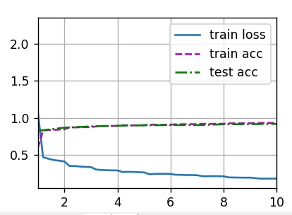
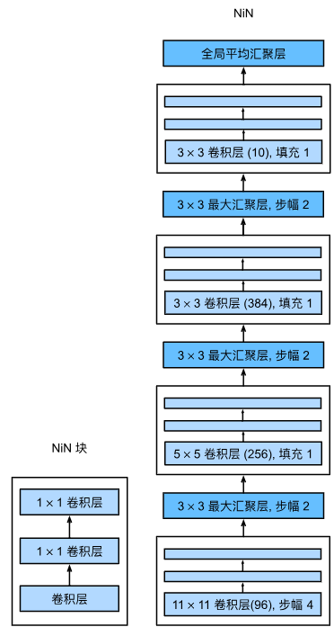
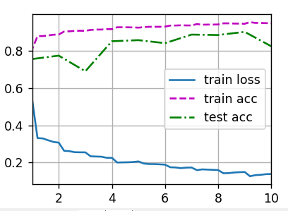

# Chapter7 Modern Convolutional Neural Networks
## 7.1 Deep Convolutional Neural Network: AlexNet

    

    import torch
    from torch import nn
    from d2l import torch as d2l
    import matplotlib.pyplot as plt

    net = nn.Sequential(
        nn.Conv2d(1, 96, kernel_size=11, stride=4, padding=1), nn.ReLU(),
        nn.MaxPool2d(kernel_size=3, stride=2),
        #使用填充为2来使得输入与输出的高和宽一致，且增大输出通道数
        nn.Conv2d(96, 256, kernel_size=5, padding=2), nn.ReLU(),
        nn.MaxPool2d(kernel_size=3, stride=2),
        nn.Conv2d(256, 384, kernel_size=3, padding=1), nn.ReLU(),
        nn.Conv2d(384, 384, kernel_size=3, padding=1), nn.ReLU(),
        nn.Conv2d(384, 256, kernel_size=3, padding=1), nn.ReLU(),
        nn.MaxPool2d(kernel_size=3, stride=2),
        nn.Flatten(),
        nn.Linear(6400, 4096), nn.ReLU(),
        nn.Dropout(p=0.5), # 这里全连接层的输出数量是LeNet中的几倍，所以使用dropout层来减轻过拟合
        nn.Linear(4096, 4096), nn.ReLU(),
        nn.Dropout(p=0.5),
        nn.Linear(4096, 10))#由于这里使用Fashion-MNIST，所以用类别数为10，而非论文中的1000

    X = torch.randn(1, 1, 224, 224)
    for layer in net:
        X=layer(X)
        print(layer.__class__.__name__,'output shape:\t',X.shape)
        
    batch_size = 128
    train_iter, test_iter = d2l.load_data_fashion_mnist(batch_size, resize=224)

    #训练
    lr, num_epochs = 0.01, 10
    d2l.train_ch6(net, train_iter, test_iter, num_epochs, lr, d2l.try_gpu()) 
    plt.show()
训练结果:

## 7.2 Network Using Blocks: VGG

    

    import matplotlib.pyplot as plt
    import torch
    from torch import nn
    from d2l import torch as d2l

    def vgg_block(num_convs, in_channels, out_channels):
        layers = []
        for _ in range(num_convs):
            layers.append(nn.Conv2d(in_channels, out_channels,kernel_size=3, padding=1))
            layers.append(nn.ReLU())
            in_channels = out_channels
        layers.append(nn.MaxPool2d(kernel_size=2,stride=2))
        return nn.Sequential(*layers)#可变参数

    #指定每个vgg块的卷积层个数和输出通道个数
    conv_arch = ((1, 64), (1, 128), (2, 256), (2, 512), (2, 512))

    def vgg(conv_arch):
        conv_blks = []
        in_channels = 1
        # 卷积层部分
        for (num_convs, out_channels) in conv_arch:
            conv_blks.append(vgg_block(num_convs, in_channels, out_channels))
            in_channels = out_channels

        return nn.Sequential(*conv_blks, nn.Flatten(),
            # 全连接层部分
            nn.Linear(out_channels * 7 * 7, 4096), nn.ReLU(), nn.Dropout(0.5),
            #the spatial dimensions of the input tensor after the convolutional blocks are reduced to 7x7
            nn.Linear(4096, 4096), nn.ReLU(), nn.Dropout(0.5),
            nn.Linear(4096, 10))

    net = vgg(conv_arch)
    X = torch.randn(size=(1, 1, 224, 224))
    for blk in net:
        X = blk(X)
        print(blk.__class__.__name__,'output shape:\t',X.shape)

    ratio = 4
    small_conv_arch = [(pair[0], pair[1] // ratio) for pair in conv_arch]#由于VGG-11比AlexNet计算量更大，因此构建一个通道数较少的网络
    net = vgg(small_conv_arch)

    #训练
    lr, num_epochs, batch_size = 0.05, 10, 128
    train_iter, test_iter = d2l.load_data_fashion_mnist(batch_size, resize=224)
    d2l.train_ch6(net, train_iter, test_iter, num_epochs, lr, d2l.try_gpu())
    plt.show()
训练结果:

参考文献:[VGG原始论文](https://arxiv.org/abs/1409.1556)
## 7.3 Network in Networks: NiN

    

NiN的想法是在每个像素位置（针对每个高度和宽度）应用一个全连接层。如果我们将权重连接到每个空间位置，我们可以将其视为$1\times 1$卷积层，或作为在每个像素位置上独立作用的全连接层。从另一个角度看，即将空间维度中的每个像素视为单个样本，将通道维度视为不同特征（feature）。NiN块以一个普通卷积层开始，后面是两个$1 \times 1$的卷积层（充当带有ReLU激活函数的逐像素全连接层）。NiN和AlexNet之间的一个显著区别是NiN完全取消了全连接层而使用NiN块，其输出通道数等于标签类别的数量，且在最后用一个*全局平均汇聚层*（global average pooling layer），生成一个对数几率（logits）。NiN设计的一个优点是显著减少了模型所需参数的数量，然而在实践中，这种设计有时会增加训练模型的时间。

    import torch
    from torch import nn
    from d2l import torch as d2l
    import matplotlib.pyplot as plt

    def nin_block(in_channels, out_channels, kernel_size, strides, padding):
        return nn.Sequential(
            nn.Conv2d(in_channels, out_channels, kernel_size, strides, padding),
            nn.ReLU(),
            nn.Conv2d(out_channels, out_channels, kernel_size=1), nn.ReLU(),
            nn.Conv2d(out_channels, out_channels, kernel_size=1), nn.ReLU())

    net = nn.Sequential(
        nin_block(1, 96, kernel_size=11, strides=4, padding=0),
        nn.MaxPool2d(3, stride=2),
        nin_block(96, 256, kernel_size=5, strides=1, padding=2),
        nn.MaxPool2d(3, stride=2),
        nin_block(256, 384, kernel_size=3, strides=1, padding=1),
        nn.MaxPool2d(3, stride=2),
        nn.Dropout(0.5),
        # 标签类别数是10，设置输出通道为10使得输出通道数等于标签数
        nin_block(384, 10, kernel_size=3, strides=1, padding=1),
        nn.AdaptiveAvgPool2d((1, 1)),
        #全局平均汇聚后每个输出值都代表了对应通道整个输入的平均值，这导致网络更加关注图像中重要的特征，而不关注它们的位置
        nn.Flatten())#将四维的输出转成二维的输出，其形状为(批量大小,10)

    X = torch.rand(size=(1, 1, 224, 224))
    for layer in net:
        X = layer(X)
        print(layer.__class__.__name__,'output shape:\t', X.shape)

    #训练
    lr, num_epochs, batch_size = 0.1, 10, 128
    train_iter, test_iter = d2l.load_data_fashion_mnist(batch_size, resize=224)
    d2l.train_ch6(net, train_iter, test_iter, num_epochs, lr, d2l.try_gpu())
    plt.show()
训练结果:

## 7.4 Networks with Parallel Connections: GoogLeNet

    

在GoogLeNet中，基本的卷积块被称为*Inception块*（Inception block），如下图所示。Inception块由四条并行路径组成，前三条路径使用窗口大小为$1\times 1$、$3\times 3$和$5\times 5$的卷积层，从不同空间大小中提取信息，中间的两条路径先在输入上执行$1\times 1$卷积，以减少通道数，降低模型的复杂性，第四条路径使用$3\times 3$最大汇聚层，然后使用$1\times 1$卷积层来改变通道数，这四条路径都使用合适的填充来使输入与输出的高和宽一致。最后我们将每条线路的输出在通道维度上连结并构成Inception块的输出。在Inception块中，通常调整的超参数是每层输出通道数。

    

    import torch
    from torch import nn
    from torch.nn import functional as F
    from d2l import torch as d2l
    import matplotlib.pyplot as plt

    class Inception(nn.Module):
        # c1--c4是每条路径的输出通道数
        def __init__(self, in_channels, c1, c2, c3, c4, **kwargs):
            super(Inception, self).__init__(**kwargs)
            # 线路1，单1x1卷积层
            self.p1_1 = nn.Conv2d(in_channels, c1, kernel_size=1)
            # 线路2，1x1卷积层后接3x3卷积层
            self.p2_1 = nn.Conv2d(in_channels, c2[0], kernel_size=1)
            self.p2_2 = nn.Conv2d(c2[0], c2[1], kernel_size=3, padding=1)
            # 线路3，1x1卷积层后接5x5卷积层
            self.p3_1 = nn.Conv2d(in_channels, c3[0], kernel_size=1)
            self.p3_2 = nn.Conv2d(c3[0], c3[1], kernel_size=5, padding=2)
            # 线路4，3x3最大汇聚层后接1x1卷积层
            self.p4_1 = nn.MaxPool2d(kernel_size=3, stride=1, padding=1)
            self.p4_2 = nn.Conv2d(in_channels, c4, kernel_size=1)

        def forward(self, x):
            p1 = F.relu(self.p1_1(x))
            p2 = F.relu(self.p2_2(F.relu(self.p2_1(x))))
            p3 = F.relu(self.p3_2(F.relu(self.p3_1(x))))
            p4 = F.relu(self.p4_2(self.p4_1(x)))
            # 在通道维度上连结输出
            return torch.cat((p1, p2, p3, p4), dim=1)

    #实现各个模块    
    b1 = nn.Sequential(nn.Conv2d(1, 64, kernel_size=7, stride=2, padding=3),
                    nn.ReLU(),
                    nn.MaxPool2d(kernel_size=3, stride=2, padding=1))

    b2 = nn.Sequential(nn.Conv2d(64, 64, kernel_size=1),
                    nn.ReLU(),
                    nn.Conv2d(64, 192, kernel_size=3, padding=1),
                    nn.ReLU(),
                    nn.MaxPool2d(kernel_size=3, stride=2, padding=1))

    b3 = nn.Sequential(Inception(192, 64, (96, 128), (16, 32), 32),
                    Inception(256, 128, (128, 192), (32, 96), 64),
                    nn.MaxPool2d(kernel_size=3, stride=2, padding=1))

    b4 = nn.Sequential(Inception(480, 192, (96, 208), (16, 48), 64),
                    Inception(512, 160, (112, 224), (24, 64), 64),
                    Inception(512, 128, (128, 256), (24, 64), 64),
                    Inception(512, 112, (144, 288), (32, 64), 64),
                    Inception(528, 256, (160, 320), (32, 128), 128),
                    nn.MaxPool2d(kernel_size=3, stride=2, padding=1))

    b5 = nn.Sequential(Inception(832, 256, (160, 320), (32, 128), 128),
                    Inception(832, 384, (192, 384), (48, 128), 128),
                    nn.AdaptiveAvgPool2d((1,1)),
                    nn.Flatten())

    net = nn.Sequential(b1, b2, b3, b4, b5, nn.Linear(1024, 10))
    X = torch.rand(size=(1, 1, 96, 96))#为了使Fashion-MNIST上的训练更简洁，将输入的高和宽从224降到96
    for layer in net:
        X = layer(X)
        print(layer.__class__.__name__,'output shape:\t', X.shape)
        
    #训练
    lr, num_epochs, batch_size = 0.1, 10, 128
    train_iter, test_iter = d2l.load_data_fashion_mnist(batch_size, resize=96)
    d2l.train_ch6(net, train_iter, test_iter, num_epochs, lr, d2l.try_gpu())
    plt.show()
训练结果:

## 7.5 Batch Normalization
批量规范化应用于单个可选层（也可以应用到所有层），其原理如下：
在每次训练迭代中，首先规范化输入，即通过减去其均值并除以其标准差（两者均基于当前小批量处理）。接下来应用比例系数和比例偏移。请注意，如果使用大小为1的小批量应用批量规范化，将无法学到任何东西，这是因为在减去均值之后，每个隐藏单元将为0，所以只有使用足够大的小批量，批量规范化才有效且稳定。用$\mathbf{x} \in \mathcal{B}$表示一个来自小批量$\mathcal{B}$的输入，批量规范化$\mathrm{BN}$根据下式转换$\mathbf{x}$：

$$\mathrm{BN}(\mathbf{x}) = \boldsymbol{\gamma} \odot \frac{\mathbf{x} - \hat{\boldsymbol{\mu}}_\mathcal{B}}{\hat{\boldsymbol{\sigma}}_\mathcal{B}} + \boldsymbol{\beta}.$$

在上式中，$\hat{\boldsymbol{\mu}}_\mathcal{B}$是小批量$\mathcal{B}$的样本均值，$\hat{\boldsymbol{\sigma}}_\mathcal{B}$是小批量$\mathcal{B}$的样本标准差。应用标准化后，生成的小批量的平均值为0和方差为1。由于单位方差是一个主观选择的结果，因此通常包含*拉伸参数*（scale）$\boldsymbol{\gamma}$和*偏移参数*（shift）$\boldsymbol{\beta}$，它们的形状与$\mathbf{x}$相同，且是需要与其他模型参数一起学习的参数。

$$\begin{aligned} \hat{\boldsymbol{\mu}}_\mathcal{B} &= \frac{1}{|\mathcal{B}|} \sum_{\mathbf{x} \in \mathcal{B}} \mathbf{x},\\
\hat{\boldsymbol{\sigma}}_\mathcal{B}^2 &= \frac{1}{|\mathcal{B}|} \sum_{\mathbf{x} \in \mathcal{B}} (\mathbf{x} - \hat{\boldsymbol{\mu}}_{\mathcal{B}})^2 + \epsilon.\end{aligned}$$

我们在方差估计值中添加一个小的常量$\epsilon > 0$，以确保永远不会除以零。此外，估计值$\hat{\boldsymbol{\mu}}_\mathcal{B}$和${\hat{\boldsymbol{\sigma}}_\mathcal{B}}$还会通过使用关于平均值和方差的*噪声*（noise）来抵消缩放问题。乍看起来，这种噪声是一个问题，而事实上它是有益的。

### 7.5.1 Batch Normalize Layer

批量规范化层和其他层之间的一个关键区别是：由于批量规范化在完整的小批量上运行，因此我们不能像以前在引入其他层时那样忽略批量大小。我们在下面讨论全连接层和卷积层的批量规范化实现。

#### 7.5.1.1 Fully Connected Layer

我们通常将批量规范化层置于全连接层中的仿射变换和激活函数之间。设全连接层的输入为x，权重参数和偏置参数分别为$\mathbf{W}$和$\mathbf{b}$，激活函数为$\phi$，批量规范化的运算符为$\mathrm{BN}$，那么使用批量规范化的全连接层的输出的计算公式如下：

$$\mathbf{h} = \phi(\mathrm{BN}(\mathbf{W}\mathbf{x} + \mathbf{b}) ).$$

#### 7.5.1.2 Convolutional Layer
对于卷积层，可以在卷积操作之后和非线性激活函数之前应用批量规范化。当卷积有多个输出通道时，我们需要对这些通道的每个输出执行批量规范化。每个通道都有自己的拉伸（scale）和偏移（shift）参数，两者都是标量。假设小批量包含$m$个样本，并且对于每个通道，卷积的输出具有高度$p$和宽度$q$，那么对于卷积层，在每个输出通道的$m \cdot p \cdot q$个元素上同时执行每个批量规范化。因此在计算平均值和方差时，我们会收集所有空间位置的值，然后在给定通道内应用相同的均值和方差，以便在每个空间位置对值进行规范化。

### 7.5.2 Batch Normalization During Prediction

批量规范化在训练模式和预测模式下的行为和结果通常不同。在训练过程中，我们无法得知使用整个数据集来估计平均值和方差，所以只能根据每个小批次的平均值和方差不断训练模型，一种常用的方法是通过移动平均(具体方法在batch_norm()函数中定义)估算整个训练数据集的样本均值和方差，并在预测时使用它们得到确定的输出。而在将训练好的模型用于预测时，我们可以根据整个数据集精确计算批量规范化所需的平均值和方差，不再需要样本均值中的噪声以及在微批次上估计每个小批次产生的样本方差了。

    import torch
    from torch import nn
    from d2l import torch as d2l
    import matplotlib.pyplot as plt

    def batch_norm(X, gamma, beta, moving_mean, moving_var, eps, momentum):
        # 通过is_grad_enabled来判断当前模式是训练模式还是预测模式
        if not torch.is_grad_enabled():
            # 如果是在预测模式下，直接使用传入的移动平均所得的均值和方差
            X_hat = (X - moving_mean) / torch.sqrt(moving_var + eps)
        else:
            assert len(X.shape) in (2, 4)
            if len(X.shape) == 2:
                # 使用全连接层的情况，计算特征维上的均值和方差
                mean = X.mean(dim=0)
                var = ((X - mean) ** 2).mean(dim=0)
            else:
                # 使用二维卷积层的情况，计算通道维上（axis=1）的均值和方差。
                # 这里我们需要保持X的形状以便后面可以做广播运算
                mean = X.mean(dim=(0, 2, 3), keepdim=True)
                var = ((X - mean) ** 2).mean(dim=(0, 2, 3), keepdim=True)
            # 训练模式下，用当前的均值和方差做标准化
            X_hat = (X - mean) / torch.sqrt(var + eps)
            # 更新移动平均的均值和方差
            moving_mean = momentum * moving_mean + (1.0 - momentum) * mean
            moving_var = momentum * moving_var + (1.0 - momentum) * var
        Y = gamma * X_hat + beta  # 缩放和移位
        return Y, moving_mean.data, moving_var.data

    class BatchNorm(nn.Module):
        # num_features：完全连接层的输出数量或卷积层的输出通道数。
        # num_dims：2表示完全连接层，4表示卷积层
        def __init__(self, num_features, num_dims):
            super().__init__()
            if num_dims == 2:
                shape = (1, num_features)
            else:
                shape = (1, num_features, 1, 1)
            #参与求梯度和迭代的拉伸和偏移参数，分别初始化成1和0
            #这些参数是nn.Parameter类型，因此会被PyTorch的优化器所管理，梯度更新是自动进行的
            self.gamma = nn.Parameter(torch.ones(shape))
            self.beta = nn.Parameter(torch.zeros(shape))
            # 非模型参数的变量初始化为0和1
            self.moving_mean = torch.zeros(shape)
            self.moving_var = torch.ones(shape)

        def forward(self, X):
            # 如果X不在内存上，就将moving_mean和moving_var复制到X所在显存上
            if self.moving_mean.device != X.device:
                self.moving_mean = self.moving_mean.to(X.device)
                self.moving_var = self.moving_var.to(X.device)
            # 保存更新过的moving_mean和moving_var
            Y, self.moving_mean, self.moving_var = batch_norm(
                X, self.gamma, self.beta, self.moving_mean,
                self.moving_var, eps=1e-5, momentum=0.9)
            return Y
        
    net = nn.Sequential(
        nn.Conv2d(1, 6, kernel_size=5), BatchNorm(6, num_dims=4), nn.Sigmoid(),
        nn.AvgPool2d(kernel_size=2, stride=2),
        nn.Conv2d(6, 16, kernel_size=5), BatchNorm(16, num_dims=4), nn.Sigmoid(),
        nn.AvgPool2d(kernel_size=2, stride=2), nn.Flatten(),
        nn.Linear(16*4*4, 120), BatchNorm(120, num_dims=2), nn.Sigmoid(),
        nn.Linear(120, 84), BatchNorm(84, num_dims=2), nn.Sigmoid(),
        nn.Linear(84, 10))

    lr, num_epochs, batch_size = 1.0, 10, 256
    train_iter, test_iter = d2l.load_data_fashion_mnist(batch_size)
    d2l.train_ch6(net, train_iter, test_iter, num_epochs, lr, d2l.try_gpu())
    plt.show()

    print(net[1].gamma.reshape((-1,)), net[1].beta.reshape((-1,)))

    #简洁实现
    net = nn.Sequential(
        nn.Conv2d(1, 6, kernel_size=5), nn.BatchNorm2d(6), nn.Sigmoid(),
        nn.AvgPool2d(kernel_size=2, stride=2),
        nn.Conv2d(6, 16, kernel_size=5), nn.BatchNorm2d(16), nn.Sigmoid(),
        nn.AvgPool2d(kernel_size=2, stride=2), nn.Flatten(),
        nn.Linear(256, 120), nn.BatchNorm1d(120), nn.Sigmoid(),
        nn.Linear(120, 84), nn.BatchNorm1d(84), nn.Sigmoid(),
        nn.Linear(84, 10))

    d2l.train_ch6(net, train_iter, test_iter, num_epochs, lr, d2l.try_gpu())
    plt.show()
训练结果：

## 7.6 Residual Networks(ResNet)
随着我们设计越来越深的网络，深刻理解“新添加的层如何提升神经网络的性能”变得至关重要。
### 7.6.1 Function Class

首先，假设有一类特定的神经网络架构$\mathcal{F}$，它包括学习速率和其他超参数设置。对于所有$f \in \mathcal{F}$，存在一些参数集（例如权重和偏置），这些参数可以通过在合适的数据集上进行训练而获得。现在假设$f^*$是我们真正想要找到的函数，如果是$f^* \in \mathcal{F}$，那我们可以轻而易举的训练得到它，但通常我们不会那么幸运。我们将尝试找到一个函数$f^*_\mathcal{F}$，这是我们在$\mathcal{F}$中的最佳选择。例如，给定一个具有$\mathbf{X}$特性和$\mathbf{y}$标签的数据集，我们可以尝试通过解决以下优化问题来找到它：

$$f^*_\mathcal{F} := \mathop{\mathrm{argmin}}_f L(\mathbf{X}, \mathbf{y}, f) \text{ , } f \in \mathcal{F}.$$

为了得到更近似真正$f^*$的函数，唯一合理的可能性是设计一个更强大的架构$\mathcal{F}'$。换句话说，我们预计$f^*_{\mathcal{F}'}$比$f^*_{\mathcal{F}}$“更近似”。然而，如果$\mathcal{F} \not\subseteq \mathcal{F}'$，则无法保证新的体系“更近似”。事实上，$f^*_{\mathcal{F}'}$可能更糟：如下图所示，对于非嵌套函数（non-nested function）类，较复杂的函数类并不总是向“真”函数$f^*$靠拢（复杂度由$\mathcal{F}_1$向$\mathcal{F}_6$递增）。在下图的左边，虽然$\mathcal{F}_3$比$\mathcal{F}_1$更接近$f^*$，但$\mathcal{F}_6$却离的更远了。相反，对于下图右边的嵌套函数（nested function）类$\mathcal{F}_1 \subseteq \ldots \subseteq \mathcal{F}_6$，我们可以避免上述问题。

因此，只有当较复杂的函数类包含较小的函数类时，我们才能确保提高它们的性能。对于深度神经网络，如果我们能将新添加的层训练成*恒等映射*（identity function）$f(\mathbf{x}) = \mathbf{x}$，新模型和原模型将同样有效。同时，由于新模型可能得出更优的解来拟合训练数据集，因此添加层似乎更容易降低训练误差。针对这一问题，何恺明等人提出了*残差网络*（ResNet）。其核心思想是：每个附加层都应该更容易地包含原始函数作为其元素之一。于是，*残差块*（residual blocks）便诞生了，这个设计对如何建立深层神经网络产生了深远的影响。

### 7.6.2 Residual Blocks

如上图所示，假设我们的原始输入为$x$，而希望学出的理想映射为$f(\mathbf{x})$。上图左边是一个正常块，虚线框中的部分需要直接拟合出该映射$f(\mathbf{x})$，而右边是ResNet的基础架构--*残差块*（residual block），虚线框中的部分则需要拟合出残差映射$f(\mathbf{x}) - \mathbf{x}$。残差映射在现实中往往更容易优化。以恒等映射作为理想映射$f(\mathbf{x})$，只需将上图右边虚线框内上方的加权运算（如仿射）的权重和偏置参数设成0，那么$f(\mathbf{x})$即为恒等映射。实际上，当理想映射$f(\mathbf{x})$极接近于恒等映射时，残差映射也易于捕捉恒等映射的细微波动。在残差块中，输入可通过跨层数据线路更快地向前传播，且可以避免某些梯度消失或梯度爆炸的问题。

    

ResNet沿用了VGG完整的$3\times 3$卷积层设计。残差块里首先有2个有相同输出通道数的$3\times 3$卷积层，每个卷积层后接一个批量规范化层和ReLU激活函数，然后我们通过跨层数据通路，跳过这2个卷积运算，将输入直接加在最后的ReLU激活函数前。这样的设计要求2个卷积层的输出与输入形状一样，从而使它们可以相加。如果想改变通道数，就需要引入一个额外的$1\times 1$卷积层来将输入变换成需要的形状后再做相加运算。

    import torch
    from torch import nn
    from torch.nn import functional as F
    from d2l import torch as d2l
    import matplotlib.pyplot as plt

    class Residual(nn.Module):  #@save
        def __init__(self, input_channels,num_channels,use_1x1conv=False, strides=1):
            super().__init__()
            self.conv1 = nn.Conv2d(input_channels, num_channels,kernel_size=3, padding=1, stride=strides)
            self.conv2 = nn.Conv2d(num_channels, num_channels,kernel_size=3, padding=1)
            if use_1x1conv:
                self.conv3 = nn.Conv2d(input_channels, num_channels,kernel_size=1, stride=strides)
            else:
                self.conv3 = None
            self.bn1 = nn.BatchNorm2d(num_channels)
            self.bn2 = nn.BatchNorm2d(num_channels)

        def forward(self, X):
            Y = F.relu(self.bn1(self.conv1(X)))
            Y = self.bn2(self.conv2(Y))
            if self.conv3:
                X = self.conv3(X)
            Y += X
            return F.relu(Y)
    

如下图所示，此代码生成两种类型的网络：当`use_1x1conv=False`时，应用ReLU非线性函数之前，将输入添加到输出；当`use_1x1conv=True`时，使用$1 \times 1$卷积调整通道和分辨率。

    blk = Residual(3,3)#输入和输出形状一致
    X = torch.rand(4, 3, 6, 6)
    Y = blk(X)
    print(Y.shape)

    blk = Residual(3,6, use_1x1conv=True, strides=2)#增加输出通道数的同时，减半输出的高和宽
    print(blk(X).shape)

    #定义ResNet的模块
    #b2-b5各有4个卷积层（不包括恒等映射的1x1卷积层），加上第一个7x7卷积层和最后一个全连接层，共有18层，因此这种模型通常被称为ResNet-18
    b1 = nn.Sequential(nn.Conv2d(1, 64, kernel_size=7, stride=2, padding=3),
                    nn.BatchNorm2d(64), nn.ReLU(),
                    nn.MaxPool2d(kernel_size=3, stride=2, padding=1))

    def resnet_block(input_channels, num_channels, num_residuals,
                    first_block=False):
        blk = []
        for i in range(num_residuals):
            if i == 0 and not first_block:
                blk.append(Residual(input_channels, num_channels,
                                    use_1x1conv=True, strides=2))
            else:
                blk.append(Residual(num_channels, num_channels))
        return blk

    b2 = nn.Sequential(*resnet_block(64, 64, 2, first_block=True))
    b3 = nn.Sequential(*resnet_block(64, 128, 2))
    b4 = nn.Sequential(*resnet_block(128, 256, 2))
    b5 = nn.Sequential(*resnet_block(256, 512, 2))

    net = nn.Sequential(b1, b2, b3, b4, b5,
                        nn.AdaptiveAvgPool2d((1,1)),
                        nn.Flatten(), nn.Linear(512, 10))

    X = torch.rand(size=(1, 1, 224, 224))
    for layer in net:
        X = layer(X)
        print(layer.__class__.__name__,'output shape:\t', X.shape)
        
    lr, num_epochs, batch_size = 0.05, 10, 256
    train_iter, test_iter = d2l.load_data_fashion_mnist(batch_size, resize=96)
    d2l.train_ch6(net, train_iter, test_iter, num_epochs, lr, d2l.try_gpu())
    plt.show()
训练结果：

## 7.7 Densely Connected Networks(DenseNet)
稠密连接网络（DenseNet）在某种程度上是ResNet的逻辑扩展。ResNet将函数展开为$$f(\mathbf{x}) = \mathbf{x} + g(\mathbf{x}).$$也就是说，ResNet将$f$分解为一个简单的线性项和一个复杂的非线性项。如果想将$f$拓展成超过两部分的信息，一种方案便是DenseNet。ResNet和DenseNet的关键区别在于，DenseNe的输出是*连接*（用$[,]$表示），而不是ResNet的简单相加（如下图所示），因此我们可以执行从$\mathbf{x}$到其展开式的映射：

$$\mathbf{x} \to \left[
\mathbf{x},
f_1(\mathbf{x}),
f_2([\mathbf{x}, f_1(\mathbf{x})]), f_3([\mathbf{x}, f_1(\mathbf{x}), f_2([\mathbf{x}, f_1(\mathbf{x})])]), \ldots\right].$$

最后，将这些展开式结合到多层感知机中，再次减少特征的数量。

    

DenseNet这个名字由变量之间的“稠密连接”而得来，稠密连接如下图所示。稠密网络主要由2部分构成：*稠密块*（dense block）和*过渡层*（transition layer）。前者定义如何连接输入和输出，而后者则控制通道数量，使其不会太复杂。

    

    import torch
    from torch import nn
    from d2l import torch as d2l
    import matplotlib.pyplot as plt

    def conv_block(input_channels, num_channels):
        return nn.Sequential(
            nn.BatchNorm2d(input_channels), 
            nn.ReLU(),
            nn.Conv2d(input_channels, num_channels, kernel_size=3, padding=1))
        
    class DenseBlock(nn.Module):
        def __init__(self, num_convs, input_channels, num_channels):
            super(DenseBlock, self).__init__()
            layer = []
            for i in range(num_convs):
                layer.append(conv_block(num_channels * i + input_channels, num_channels))
            self.net = nn.Sequential(*layer)

        def forward(self, X):
            for blk in self.net:
                Y = blk(X)
                # 连接通道维度上每个块的输入和输出
                X = torch.cat((X, Y), dim=1)
            return X

    #在下面的例子中，我们定义一个有2个输出通道数为10的DenseBlock。
    #使用通道数为3的输入时，我们会得到通道数为3+2x10=23的输出。
    #卷积块的通道数控制了输出通道数相对于输入通道数的增长，因此也被称为*增长率*（growth rate）。

    blk = DenseBlock(2, 3, 10)
    X = torch.randn(4, 3, 8, 8)
    Y = blk(X)
    print(Y.shape)

    #由于每个稠密块都会带来通道数的增加，过渡层可以用来控制模型复杂度。
    #过渡层通过1x1卷积层来减小通道数，并使用步幅为2的平均汇聚层减半高和宽，以降低模型复杂度。

    def transition_block(input_channels, num_channels):#过渡层
        return nn.Sequential(
            nn.BatchNorm2d(input_channels), nn.ReLU(),
            nn.Conv2d(input_channels, num_channels, kernel_size=1),
            nn.AvgPool2d(kernel_size=2, stride=2))
    
    blk = transition_block(23, 10)
    print(blk(Y).shape)

    b1 = nn.Sequential(
        nn.Conv2d(1, 64, kernel_size=7, stride=2, padding=3),
        nn.BatchNorm2d(64), nn.ReLU(),
        nn.MaxPool2d(kernel_size=3, stride=2, padding=1))

    #与ResNet类似，我们可以设置每个稠密块使用多少个卷积层。这里我们设成4，从而与ResNet-18保持一致。 
    #稠密块里的卷积层通道数（即增长率）设为32，所以每个稠密块将增加128个通道。
    #num_channels为当前的通道数
    num_channels, growth_rate = 64, 32
    num_convs_in_dense_blocks = [4, 4, 4, 4]#num_convs_in_dense_blocks表示每个稠密块中包含的卷积层的数量。在这里，有4个稠密块，每个稠密块中包含4个卷积层。
    blks = []
    for i, num_convs in enumerate(num_convs_in_dense_blocks):#enumerate()函数用于同时遍历列表元素及其索引
        blks.append(DenseBlock(num_convs, num_channels, growth_rate))
        # 上一个稠密块的输出通道数
        num_channels += num_convs * growth_rate
        # 在稠密块之间添加一个转换层，使通道数量减半
        if i != len(num_convs_in_dense_blocks) - 1:
            blks.append(transition_block(num_channels, num_channels // 2))
            num_channels = num_channels // 2
            
    net = nn.Sequential(
        b1, *blks,
        nn.BatchNorm2d(num_channels), nn.ReLU(),
        nn.AdaptiveAvgPool2d((1, 1)),
        nn.Flatten(),
        nn.Linear(num_channels, 10))

    lr, num_epochs, batch_size = 0.1, 10, 256
    train_iter, test_iter = d2l.load_data_fashion_mnist(batch_size, resize=96)
    d2l.train_ch6(net, train_iter, test_iter, num_epochs, lr, d2l.try_gpu())
    plt.show()

训练结果:
