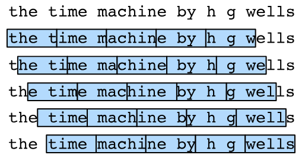

# Chapter8 Recurrent Neural Networks(RNN)
## 8.1 Sequence Models
用$x_t$表示在*时间步*（time step）$t \in \mathbb{Z}^+$时观察到的股票价格$x_t$。注意，$t$对于本文中的序列通常是离散的，并在整数或其子集上变化。假设一个交易员通过以下途径预测$x_t$：

$$x_t \sim P(x_t \mid x_{t-1}, \ldots, x_1).$$

### 8.1.1 Autoregressive Models

为了实现这个预测，交易员可以使用回归模型，但输入数量以及$x_{t-1}, \ldots, x_1$本身因$t$而异，有效估计$P(x_t \mid x_{t-1}, \ldots, x_1)$展开归结为以下两种策略。
第一种策略是，假设在现实情况下相当长的序列$x_{t-1}, \ldots, x_1$可能是不必要的，因此我们只需要满足某个长度为$\tau$的时间跨度，即使用观测序列$x_{t-1}, \ldots, x_{t-\tau}$，好处就是参数的数量总是不变的（至少在$t > \tau$时如此），这种模型被称为*自回归模型*（autoregressive models），因为它们是对自己执行回归。

第二种策略如下图所示，指保留一些对过去观测的总结$h_t$，并同时更新预测$\hat{x}_t$和总结$h_t$。这就产生了基于$\hat{x}_t = P(x_t \mid h_{t})$估计$x_t$，以及公式$h_t = g(h_{t-1}, x_{t-1})$更新的模型。由于$h_t$从未被观测到，这类模型也被称为*隐变量自回归模型*（latent autoregressive models）。

一个常见的假设是虽然特定值$x_t$可能会改变，但是序列本身的动力不会改变。这样的假设是合理的，因为新的动力一定受新的数据影响，而我们不可能用目前所掌握的数据来预测新的动力。称不变的动力学*静止的*（stationary），因此整个序列的估计值都将通过以下的方式获得：

$$P(x_1, \ldots, x_T) = \prod_{t=1}^T P(x_t \mid x_{t-1}, \ldots, x_1).$$

### 8.1.2 Markov Models

当$P(x_t \mid x_{t-1}, \ldots, x_1)=P(x_t \mid x_{t-\tau}, \ldots, x_{t-1})$时，称序列满足*马尔可夫条件*（Markov condition）。特别地，如果$\tau = 1$，得到*一阶马尔可夫模型*（first-order Markov model），
$$P(x_1, \ldots, x_T) = \prod_{t=1}^T P(x_t \mid x_{t-1}) \text{ , } P(x_1 \mid x_0) = P(x_1).$$

当假设$x_t$仅是离散值时，使用动态规划可以沿着马尔可夫链精确地计算结果。例如，利用$P(x_{t+1} \mid x_t, x_{t-1}) = P(x_{t+1} \mid x_t)$可以高效地计算$P(x_{t+1} \mid x_{t-1})$：

$$
\begin{aligned}
P(x_{t+1} \mid x_{t-1})
&= \frac{\sum_{x_t} P(x_{t+1}, x_t, x_{t-1})}{P(x_{t-1})}\\
&= \frac{\sum_{x_t} P(x_{t+1} \mid x_t, x_{t-1}) P(x_t, x_{t-1})}{P(x_{t-1})}\\
&= \sum_{x_t} P(x_{t+1} \mid x_t) P(x_t \mid x_{t-1})
\end{aligned}
$$

原则上，将$P(x_1, \ldots, x_T)$倒序展开也没什么问题，因为基于条件概率公式有：

$$P(x_1, \ldots, x_T) = \prod_{t=T}^1 P(x_t \mid x_{t+1}, \ldots, x_T).$$
然而，在许多情况下，数据在时间上是前进的，显然未来的事件不能影响过去。在某些情况下，对于某些可加性噪声$\epsilon$，我们可以找到$x_{t+1} = f(x_t) + \epsilon$，反之则不行。

    import torch
    from torch import nn
    from d2l import torch as d2l
    import matplotlib.pyplot as plt

    T = 1000  # 总共产生1000个点
    time = torch.arange(1, T + 1, dtype=torch.float32)
    x = torch.sin(0.01 * time) + torch.normal(0, 0.2, (T,))
    d2l.plot(time, [x], 'time', 'x', xlim=[1, 1000], figsize=(6, 3))
    plt.show()

    #将这个序列转换为模型的特征－标签（feature-label）对
    tau = 4
    features = torch.zeros((T - tau, tau))#这比提供的样本少了tau个，因为没有足够的历史记录来描述前tau个样本。
    for i in range(tau):
        features[:, i] = x[i: T - tau + i]
    labels = x[tau:].reshape((-1, 1))

    batch_size, n_train = 16, 600
    # 只有前n_train个样本用于训练
    train_iter = d2l.load_array((features[:n_train], labels[:n_train]),
                                batch_size, is_train=True)

    # 初始化网络权重的函数
    def init_weights(m):
        if type(m) == nn.Linear:
            nn.init.xavier_uniform_(m.weight)

    # 一个简单的多层感知机
    def get_net():
        net = nn.Sequential(nn.Linear(4, 10),
                            nn.ReLU(),
                            nn.Linear(10, 1))
        net.apply(init_weights)
        return net

    # 平方损失。注意：MSELoss计算平方误差时不带系数1/2
    loss = nn.MSELoss(reduction='none')

    def train(net, train_iter, loss, epochs, lr):
        trainer = torch.optim.Adam(net.parameters(), lr)
        for epoch in range(epochs):
            for X, y in train_iter:
                trainer.zero_grad()
                l = loss(net(X), y)
                l.sum().backward()
                trainer.step()
            print(f'epoch {epoch + 1}, '
                f'loss: {d2l.evaluate_loss(net, train_iter, loss):f}')

    net = get_net()
    train(net, train_iter, loss, 5, 0.01)

    #单步预测
    onestep_preds = net(features)
    d2l.plot([time, time[tau:]],
            [x.detach().numpy(), onestep_preds.detach().numpy()], 'time',
            'x', legend=['data', '1-step preds'], xlim=[1, 1000],
            figsize=(6, 3))
    plt.show()

即使预测的时间步超过了$600+4$（n_train + tau），单步预测效果不错，但如果数据观察序列的时间步只到$604$，我们需要一步一步地向前迈进：
$$
\hat{x}_{605} = f(x_{601}, x_{602}, x_{603}, x_{604}), \\
\hat{x}_{606} = f(x_{602}, x_{603}, x_{604}, \hat{x}_{605}), \\
\hat{x}_{607} = f(x_{603}, x_{604}, \hat{x}_{605}, \hat{x}_{606}),\\
\hat{x}_{608} = f(x_{604}, \hat{x}_{605}, \hat{x}_{606}, \hat{x}_{607}),\\
\hat{x}_{609} = f(\hat{x}_{605}, \hat{x}_{606}, \hat{x}_{607}, \hat{x}_{608}),\\
\ldots
$$
通常，对于直到$x_t$的观测序列，其在时间步$t+k$处的预测输出$\hat{x}_{t+k}$称为$k$*步预测*（$k$-step-ahead-prediction）。

    #多步预测
    multistep_preds = torch.zeros(T)
    multistep_preds[: n_train + tau] = x[: n_train + tau]
    for i in range(n_train + tau, T):
        multistep_preds[i] = net(multistep_preds[i - tau:i].reshape((1, -1)))
        
    d2l.plot([time, time[tau:], time[n_train + tau:]],
            [x.detach().numpy(), onestep_preds.detach().numpy(),
            multistep_preds[n_train + tau:].detach().numpy()], 'time',
            'x', legend=['data', '1-step preds', 'multistep preds'],
            xlim=[1, 1000], figsize=(6, 3))
    plt.show()

如上面例子所示，绿线的预测经过几个步骤之后就会衰减到一个常数，原因在于错误的累积：假设在步骤$1$之后，我们积累了一些错误$\epsilon_1 = \bar\epsilon$。于是，步骤$2$的输入被扰动了$\epsilon_1$，结果积累的误差是$\epsilon_2 = \bar\epsilon + c \epsilon_1$（$c$为常数），后面依此类推。基于$k = 1, 4, 16, 64$，通过对整个序列预测的计算，让我们更仔细地看一下$k$步预测的困难。

    max_steps = 64
    features = torch.zeros((T - tau - max_steps + 1, tau + max_steps))
    # 列i（i<tau）是来自x的观测，其时间步从（i）到（i+T-tau-max_steps+1）
    for i in range(tau):
        features[:, i] = x[i: i + T - tau - max_steps + 1]

    # 列i（i>=tau）是来自（i-tau+1）步的预测，其时间步从（i）到（i+T-tau-max_steps+1）
    for i in range(tau, tau + max_steps):
        features[:, i] = net(features[:, i - tau:i]).reshape(-1)
        
    steps = (1, 4, 16, 64)
    d2l.plot([time[tau + i - 1: T - max_steps + i] for i in steps],
            [features[:, tau + i - 1].detach().numpy() for i in steps], 'time', 'x',
            legend=[f'{i}-step preds' for i in steps], xlim=[5, 1000],
            figsize=(6, 3))
    plt.show()

## 8.2 Text Preprocessing
文本的预处理步骤通常包括：
1. 将文本作为字符串加载到内存中；
2. 将字符串拆分为词元（如单词和字符）；
3. 建立一个词表，将拆分的词元映射到数字索引；
4. 将文本转换为数字索引序列，方便模型操作。

代码如下：  

    import collections
    import re
    from d2l import torch as d2l

    #@save
    d2l.DATA_HUB['time_machine'] = (d2l.DATA_URL + 'timemachine.txt',
                                    '090b5e7e70c295757f55df93cb0a180b9691891a')

    def read_time_machine():  #@save
        """将《时间机器》数据集加载到文本行的列表中"""
        with open(d2l.download('time_machine'), 'r') as f:
            lines = f.readlines()
        return [re.sub('[^A-Za-z]+', ' ', line).strip().lower() for line in lines]
        #使用正则表达式 re.sub('[^A-Za-z]+', ' ', line) 将每行中的非字母字符替换为空格，并且多个连续的非字母字符被替换成一个空格
        #使用strip()去除每行开头和结尾的空格
        #使用lower()将字母转换为小写

    lines = read_time_machine()
    print(f'# 文本总行数: {len(lines)}')
    print(lines[0])
    print(lines[10])

    def tokenize(lines, token='word'):  #@save
        """将文本行拆分为单词或字符词元(token)"""
        if token == 'word':
            return [line.split() for line in lines]
        elif token == 'char':
            return [list(line) for line in lines]
        else:
            print('错误：未知词元类型：' + token)

    tokens = tokenize(lines)
    for i in range(11):
        print(tokens[i])

词元的类型是字符串，而模型需要的输入是数字，因此需要构建一个字典，通常称为*词表*（vocabulary），用来将字符串类型的词元映射到从$0$开始的数字索引中。首先将训练集中的所有文档合并在一起，对它们的唯一词元进行统计，得到的统计结果称之为*语料*（corpus），然后根据每个唯一词元的出现频率，为其分配一个数字索引（很少出现的词元通常被移除以降低复杂性）。另外，语料库中不存在或已删除的任何词元都将映射到一个特定的未知词元“&lt;unk&gt;”，还可以增加一个列表，用于保存那些被保留的词元，例如：填充词元（“&lt;pad&gt;”）、序列开始词元（“&lt;bos&gt;”）、序列结束词元（“&lt;eos&gt;”）。

    class Vocab:  #@save
        """文本词表"""
        def __init__(self, tokens=None, min_freq=0, reserved_tokens=None):
            if tokens is None:
                tokens = []
            if reserved_tokens is None:
                reserved_tokens = []
            # 按出现频率排序
            counter = count_corpus(tokens)
            self._token_freqs = sorted(counter.items(), key=lambda x: x[1],
                                    reverse=True)
            # 未知词元的索引为0
            self.idx_to_token = ['<unk>'] + reserved_tokens
            self.token_to_idx = {token: idx
                                for idx, token in enumerate(self.idx_to_token)}
            for token, freq in self._token_freqs:
                if freq < min_freq:
                    break
                if token not in self.token_to_idx:
                    self.idx_to_token.append(token)
                    self.token_to_idx[token] = len(self.idx_to_token) - 1

        def __len__(self):
            return len(self.idx_to_token)

        def __getitem__(self, tokens):
            if not isinstance(tokens, (list, tuple)):
                return self.token_to_idx.get(tokens, self.unk)
            return [self.__getitem__(token) for token in tokens]

        def to_tokens(self, indices):
            if not isinstance(indices, (list, tuple)):
                return self.idx_to_token[indices]
            return [self.idx_to_token[index] for index in indices]

        @property   #@property用于将类的方法转换为类的属性
        def unk(self):  # 未知词元的索引为0
            return 0

        @property
        def token_freqs(self):
            return self._token_freqs

    def count_corpus(tokens):  #@save
        """统计词元的频率"""
        # 这里的tokens是1D列表或2D列表
        if len(tokens) == 0 or isinstance(tokens[0], list):
            # 将词元列表展平成一个列表
            tokens = [token for line in tokens for token in line]
        return collections.Counter(tokens)

    vocab = Vocab(tokens)
    #print(len(vocab))
    print(list(vocab.token_to_idx.items())[:10])

    for i in [0, 10]:
        print('文本:', tokens[i])
        print('索引:', vocab[tokens[i]])
        
    def load_corpus_time_machine(max_tokens=-1):  #@save
        """返回时光机器数据集的词元索引列表和词表"""
        lines = read_time_machine()
        tokens = tokenize(lines, 'char')#为了简化后面章节中的训练，我们使用字符（而不是单词）实现文本词元化
        vocab = Vocab(tokens)
        # 因为时光机器数据集中的每个文本行不一定是一个句子或一个段落，所以将所有文本行展平到一个列表中
        corpus = [vocab[token] for line in tokens for token in line]
        if max_tokens > 0:
            corpus = corpus[:max_tokens]
        return corpus, vocab

    corpus, vocab = load_corpus_time_machine()
    print(len(corpus), len(vocab))

## 8.3 Language Models and the Dataset

假设长度为$T$的文本序列中的词元依次为$x_1, x_2, \ldots, x_T$。于是，$x_t$（$1 \leq t \leq T$）可以被认为是文本序列在时间步$t$处的观测或标签。在给定这样的文本序列时，*语言模型*（language model）的目标是估计序列的联合概率$$P(x_1, x_2, \ldots, x_T).$$例如，只需要一次抽取一个词元$x_t \sim P(x_t \mid x_{t-1}, \ldots, x_1)$，一个理想的语言模型就能够基于模型本身生成自然文本。

### 8.3.1 Learning a Language Model

假设在单词级别对文本数据进行词元化，包含了四个单词的一个文本序列的概率是：

$$P(\text{deep}, \text{learning}, \text{is}, \text{fun}) =  P(\text{deep}) P(\text{learning}  \mid  \text{deep}) P(\text{is}  \mid  \text{deep}, \text{learning}) P(\text{fun}  \mid  \text{deep}, \text{learning}, \text{is}).$$

为了训练语言模型，我们需要计算单词的概率，以及给定前面几个单词后出现某个单词的条件概率，这些概率本质上就是语言模型的参数。假设训练集是一个大型的文本语料库，训练集中词的概率可以根据给定词的相对词频来计算，比如可以将估计值$\hat{P}(\text{deep})$计算为任何以单词“deep”开头的句子的概率。一种（稍稍不太精确的）方法是统计单词“deep”在数据集中的出现次数，然后将其除以整个语料库中的单词总数（不太精确指的是：单个词的出现概率可能会受到其周围上下文的影响；“稀有词”可能会导致参数估计不准确，因为在训练集中可能无法捕获到这些词在其他文本中的真实分布情况；某个词在语料库中出现的次数可能会受到文本主题、文体等因素的影响）。接下来，我们可以尝试估计

$$\hat{P}(\text{learning} \mid \text{deep}) = \frac{n(\text{deep, learning})}{n(\text{deep})},$$

其中$n(x)$和$n(x, x')$分别是单个单词和连续单词对的出现次数。不幸的是，由于连续单词对“deep learning”的出现频率要低得多，所以估计这类单词正确的概率要困难得多。除非我们提供某种解决方案，来将这些单词组合指定为非零计数，否则将无法在语言模型中使用它们。一种常见的策略是执行某种形式的*拉普拉斯平滑*（Laplace smoothing），具体方法是在所有计数中添加一个小常量。用$n$表示训练集中的单词总数，用$m$表示唯一单词的数量，如下式所示：

$$
\begin{aligned}
    \hat{P}(x) & = \frac{n(x) + \epsilon_1/m}{n + \epsilon_1}, \\
    \hat{P}(x' \mid x) & = \frac{n(x, x') + \epsilon_2 \hat{P}(x')}{n(x) + \epsilon_2}, \\
    \hat{P}(x'' \mid x,x') & = \frac{n(x, x',x'') + \epsilon_3 \hat{P}(x'')}{n(x, x') + \epsilon_3}.
\end{aligned}
$$

其中，$\epsilon_1、epsilon_2$和$\epsilon_3$是超参数。以$\epsilon_1$为例：当$\epsilon_1 = 0$时，不应用平滑；当$\epsilon_1$接近正无穷大时，$\hat{P}(x)$接近均匀概率分布$1/m$。
然而，这样的模型很容易变得无效，原因如下：首先，我们需要存储所有的计数；其次，模型完全忽略了单词的意思；最后，长单词序列大部分是没出现过的，因此一个模型如果只是简单地统计先前“看到”的单词序列频率，面对这种问题时肯定表现不佳。

如果$P(x_{t+1} \mid x_t, \ldots, x_1) = P(x_{t+1} \mid x_t)$，则序列上的分布满足一阶马尔可夫性质。阶数越高，对应的依赖关系就越长。这种性质推导出了许多可以应用于序列建模的近似公式：
$$
\begin{aligned}
P(x_1, x_2, x_3, x_4) &=  P(x_1) P(x_2) P(x_3) P(x_4)\\
P(x_1, x_2, x_3, x_4) &=  P(x_1) P(x_2  \mid  x_1) P(x_3  \mid  x_2) P(x_4  \mid  x_3) \\
P(x_1, x_2, x_3, x_4) &=  P(x_1) P(x_2  \mid  x_1) P(x_3  \mid  x_1, x_2) P(x_4  \mid  x_2, x_3) 
\end{aligned}
$$
通常，涉及一个、两个和三个变量的概率公式分别被称为*一元语法*（unigram）、*二元语法*（bigram）和*三元语法*（trigram）模型。也就是说，一元语法假设文本中的每个词都是相互独立的，即某个词的出现概率只依赖不依赖于其他词，一元语法模型将整个文本的概率表示为每个单词出现的概率的乘积。二元语法考虑了相邻两个词之间的关系，假设某个词的出现概率仅依赖于它前面一个词，三元语法同理。
### 8.3.2 Natural Language SStatistics

    import random
    import torch
    from d2l import torch as d2l
    import matplotlib.pyplot as plt

    tokens = d2l.tokenize(d2l.read_time_machine())
    # 因为每个文本行不一定是一个句子或一个段落，因此我们把所有文本行拼接到一起
    corpus = [token for line in tokens for token in line]
    vocab = d2l.Vocab(corpus)
    print(vocab.token_freqs[:10])

    freqs = [freq for token, freq in vocab.token_freqs]
    d2l.plot(freqs, xlabel='token: x', ylabel='frequency: n(x)',
            xscale='log', yscale='log')
    plt.show()
词频图：

最流行的词看起来很无聊，被称为停用词（stop words），因此可以被过滤掉，但它们本身仍然是有意义的。此外，还有个明显的现象是词频衰减的速度相当快。通过此图我们可以发现：词频以一种明确的方式迅速衰减。将前几个单词作为例外消除后，剩余的所有单词大致遵循双对数坐标图(xscale='log', yscale='log')上的一条直线，这意味着单词的频率满足*齐普夫定律*（Zipf's law），即第$i$个最常用单词的频率$n_i$满足：

$$\log n_i = -\alpha \log i + c$$

其中$\alpha$是刻画分布的指数，$c$是常数。上式等价于

$$n_i \propto \frac{1}{i^\alpha}$$
这告诉我们想要通过计数统计和平滑来建模单词是不可行的，因为这样建模的结果会大大高估尾部单词的频率，也就是所谓的不常用单词。换句话说，齐普夫定律告诉我们，自然语言中的单词分布呈现出一种“长尾”现象，即少数单词的出现频率非常高，而大多数单词的出现频率则相对较低，呈现出尾部单词的大量分布。

    #bigram
    bigram_tokens = [pair for pair in zip(corpus[:-1], corpus[1:])]
    bigram_vocab = d2l.Vocab(bigram_tokens)
    print(bigram_vocab.token_freqs[:10])

    #trigram
    trigram_tokens = [triple for triple in zip(corpus[:-2], corpus[1:-1], corpus[2:])]
    trigram_vocab = d2l.Vocab(trigram_tokens)
    print(trigram_vocab.token_freqs[:10])

    bigram_freqs = [freq for token, freq in bigram_vocab.token_freqs]
    trigram_freqs = [freq for token, freq in trigram_vocab.token_freqs]
    d2l.plot([freqs, bigram_freqs, trigram_freqs], xlabel='token: x',
            ylabel='frequency: n(x)', xscale='log', yscale='log',
            legend=['unigram', 'bigram', 'trigram'])
    plt.show()
一元、二元和三元词频图：

从上图可看出：
1. 除了一元语法词，单词序列也遵循齐普夫定律，尽管公式指数$\alpha$更小；
2. 词表中$n$元组的数量并没有那么大，这说明语言中存在相当多的结构（即词元序列组合很丰富）；
3. 很多$n$元组很少出现，这使得拉普拉斯平滑非常不适合语言建模，因此我们将使用基于深度学习的模型。

### 8.3.3 Reading Long Sequence Data

当序列变得太长而不能被模型一次性全部处理时，我们可能希望拆分这样的序列方便模型读取。假设我们将使用神经网络来训练语言模型，模型中的网络一次处理具有预定义长度（例如$n$个时间步）的一个小批量序列。首先，由于文本序列可以是任意长的，于是任意长的序列可以被我们划分为具有相同时间步数的子序列。当训练我们的神经网络时，这样的小批量子序列将被输入到模型中。假设网络一次只处理具有$n$个时间步的子序列。下图画出了从原始文本序列获得子序列的所有不同的方式，其中$n=5$，并且每个时间步的词元对应于一个字符。

事实上，上图中不同的取法都一样好，然而如果只选择一个偏移量，那么用于训练网络的、所有可能的子序列的覆盖范围将是有限的。因此，我们可以从随机偏移量开始划分序列，以同时获得*覆盖性*（coverage）和*随机性*（randomness）。

    def seq_data_iter_random(corpus, batch_size, num_steps):  #@save
        """使用随机抽样生成一个小批量子序列"""
        #从随机偏移量开始对序列进行分区，随机范围为[0,num_steps-1]
        corpus = corpus[random.randint(0, num_steps - 1):]
        num_subseqs = (len(corpus) - 1) // num_steps 
        #将输入序列中的每个词作为训练数据的特征，而将对应的下一个词作为标签，减去1是为了确保每个子序列都有对应的标签
        #initial_indices为长度为num_steps的子序列的起始索引
        initial_indices = list(range(0, num_subseqs * num_steps, num_steps))
        #打乱处理后，在随机抽样的迭代过程中，来自两个相邻的、随机的、小批量中的子序列不一定在原始序列上相邻
        random.shuffle(initial_indices)

        def data(pos):
            #返回从pos位置开始的长度为num_steps的序列
            return corpus[pos: pos + num_steps]

        num_batches = num_subseqs // batch_size#batch_size指定每个小批量中子序列样本的数目
        for i in range(0, batch_size * num_batches, batch_size):
            initial_indices_per_batch = initial_indices[i: i + batch_size]
            #initial_indices包含子序列的随机起始索引
            #X是模型的输入序列，Y是对应于X中每个样本的下一个词的目标序列(标签)
            X = [data(j) for j in initial_indices_per_batch]
            Y = [data(j + 1) for j in initial_indices_per_batch]
            yield torch.tensor(X), torch.tensor(Y)
            
    my_seq = list(range(35))
    for X, Y in seq_data_iter_random(my_seq, batch_size=2, num_steps=5):
        print('X: ', X, '\nY:', Y)
        
    def seq_data_iter_sequential(corpus, batch_size, num_steps):#@save
        """使用顺序分区生成一个小批量子序列"""
        # 从随机偏移量开始划分序列
        offset = random.randint(0, num_steps)
        num_tokens = ((len(corpus) - offset - 1) // batch_size) * batch_size
        Xs = torch.tensor(corpus[offset: offset + num_tokens])
        Ys = torch.tensor(corpus[offset + 1: offset + 1 + num_tokens])
        print(Xs,Ys)
        Xs, Ys = Xs.reshape(batch_size, -1), Ys.reshape(batch_size, -1)
        print(Xs,Ys)
        num_batches = Xs.shape[1] // num_steps
        for i in range(0, num_steps * num_batches, num_steps):
            X = Xs[:, i: i + num_steps]
            Y = Ys[:, i: i + num_steps]
            yield X, Y

    for X, Y in seq_data_iter_sequential(my_seq, batch_size=2, num_steps=5):
        print('X: ', X, '\nY:', Y)
        
    class SeqDataLoader:  #@save
        """加载序列数据的迭代器"""
        def __init__(self, batch_size, num_steps, use_random_iter, max_tokens):
            if use_random_iter:
                self.data_iter_fn = d2l.seq_data_iter_random
            else:
                self.data_iter_fn = d2l.seq_data_iter_sequential
            self.corpus, self.vocab = d2l.load_corpus_time_machine(max_tokens)
            self.batch_size, self.num_steps = batch_size, num_steps

        def __iter__(self):
            return self.data_iter_fn(self.corpus, self.batch_size, self.num_steps)
        
    def load_data_time_machine(batch_size, num_steps,  #@save
                            use_random_iter=False, max_tokens=10000):
        """返回时光机器数据集的迭代器和词表"""
        data_iter = SeqDataLoader(
            batch_size, num_steps, use_random_iter, max_tokens)
        return data_iter, data_iter.vocab

## 8.4 Recurrent Neural Networks
对$n$元语法模型，单词$x_t$在时间步$t$的条件概率仅取决于前面$n-1$个单词。对于时间步$t-(n-1)$之前的单词，如果我们想将其可能产生的影响合并到$x_t$上，需要增加$n$，然而模型参数的数量也会随之呈指数增长，因为词表$\mathcal{V}$需要存储$|\mathcal{V}|^n$个数字（每个可能的序列对应一个概率值），因此不如使用隐变量模型：
 
$$P(x_t \mid x_{t-1}, \ldots, x_1) \approx P(x_t \mid h_{t-1}),$$

其中$h_{t-1}$是*隐状态*（hidden state），也称为*隐藏变量*（hidden variable），它存储了到时间步$t-1$的序列信息。通常，我们可以基于当前输入$x_{t}$和先前隐状态$h_{t-1}$来计算时间步$t$处的任何时间的隐状态：

$$h_t = f(x_{t}, h_{t-1}).$$

对于上式中的函数$f$，隐变量模型可以不是近似值，因为$h_t$可以存储到目前为止观察到的所有数据，然而这样的操作可能会使计算和存储的代价都变得昂贵。值得注意的是，隐藏层和隐状态是两个不同的概念，隐藏层是在从输入到输出的路径上（以观测角度来理解）的隐藏的层，而隐状态则是在给定步骤所做的任何事情（以技术角度来定义）的*输入*，并且这些状态只能通过先前时间步的数据来计算。

### 8.4.1 Neural Networks without Hidden States

对只有单隐藏层的多层感知机，设隐藏层的激活函数为$\phi$，给定一个小批量样本$\mathbf{X} \in \mathbb{R}^{n \times d}$，其中批量大小为$n$，输入维度为$d$，则隐藏层的输出$\mathbf{H} \in \mathbb{R}^{n \times h}$通过下式计算：

$$\mathbf{H} = \phi(\mathbf{X} \mathbf{W}_{xh} + \mathbf{b}_h).$$

输出层由下式给出：

$$\mathbf{O} = \mathbf{H} \mathbf{W}_{hq} + \mathbf{b}_q,$$

### 8.4.2 RNN with Hidden States

假设我们在时间步$t$有小批量输入$\mathbf{X}_t \in \mathbb{R}^{n \times d}$，换言之，对于$n$个序列样本的小批量，$\mathbf{X}_t$的每一行对应于来自该序列的时间步$t$处的一个样本。用$\mathbf{H}_t  \in \mathbb{R}^{n \times h}$表示时间步$t$的隐藏变量，计算公式如下：

$$\mathbf{H}_t = \phi(\mathbf{X}_t \mathbf{W}_{xh} + \mathbf{H}_{t-1} \mathbf{W}_{hh}  + \mathbf{b}_h).\tag{1}$$

由于在当前时间步中，隐状态使用的定义与前一个时间步中使用的定义相同，因此称式(1)的计算是*循环的*（recurrent），基于循环计算的隐状态神经网络称为*循环神经网络*（recurrent neural network），在循环神经网络中执行循环计算的层称为*循环层*（recurrent layer）。对于时间步$t$，输出层的输出类似于多层感知机中的计算：

$$\mathbf{O}_t = \mathbf{H}_t \mathbf{W}_{hq} + \mathbf{b}_q.$$
循环神经网络的参数包括隐藏层的权重$\mathbf{W}_{xh} \in \mathbb{R}^{d \times h}, \mathbf{W}_{hh} \in \mathbb{R}^{h \times h}$和偏置$\mathbf{b}_h \in \mathbb{R}^{1 \times h}$，以及输出层的权重$\mathbf{W}_{hq} \in \mathbb{R}^{h \times q}$和偏置$\mathbf{b}_q \in \mathbb{R}^{1 \times q}$。值得一提的是，即使在不同的时间步，循环神经网络也总是使用这些模型参数，因此循环神经网络的参数开销不会随着时间步的增加而增加。

下图展示了循环神经网络在三个相邻时间步的计算逻辑。

    import torch
    from d2l import torch as d2l
    
    #循环计算（部分）的两种计算方法
    X, W_xh = torch.normal(0, 1, (3, 1)), torch.normal(0, 1, (1, 4))
    H, W_hh = torch.normal(0, 1, (3, 4)), torch.normal(0, 1, (4, 4))
    torch.matmul(X, W_xh) + torch.matmul(H, W_hh)
    torch.matmul(torch.cat((X, H), 1), torch.cat((W_xh, W_hh), 0))

### 8.4.3 Character-Level Language Models Based on RNN
接下来介绍如何使用循环神经网络来构建语言模型。设小批量大小为1，批量中的文本序列为"machine"。为了简化后续部分的训练，考虑使用*字符级语言模型*（character-level language model），将文本词元化为字符而不是单词。下图演示了如何通过基于字符级语言建模的循环神经网络，使用当前的和先前的字符预测下一个字符。

在实践中，我们使用的批量大小为$n>1$，每个词元都由一个$d$维向量表示。因此，在时间步$t$输入$\mathbf X_t$将是一个$n\times d$矩阵。

### 8.4.4 Perplexity
我们可以通过计算序列的似然概率来度量模型的质量，然而这难以理解、难以比较，因为较短的序列比较长的序列更有可能出现。为了解决这个问题，我们可以运用信息论。如果想要压缩文本，我们可以根据当前词元集预测的下一个词元。一个更好的语言模型应该能让我们更准确地预测下一个词元，即它应该允许我们在压缩序列时花费更少的比特，所以我们可以通过一个序列中所有的$n$个词元的交叉熵损失的平均值来衡量模型的质量：

$$\frac{1}{n} \sum_{t=1}^n -\log P(x_t \mid x_{t-1}, \ldots, x_1)$$

其中$P$由语言模型给出，$x_t$是在时间步$t$从该序列中观察到的实际词元。这使得不同长度的文档的性能具有了可比性。*困惑度*（perplexity）是上式的指数：

$$\exp\left(-\frac{1}{n} \sum_{t=1}^n \log P(x_t \mid x_{t-1}, \ldots, x_1)\right).$$

困惑度的最好的理解是“下一个词元的实际选择数的调和平均数”。

* 在最好的情况下，模型总是完美地估计标签词元的概率为1。在这种情况下，模型的困惑度为1。
* 在最坏的情况下，模型总是预测标签词元的概率为0。在这种情况下，困惑度是正无穷大。
* 在基线上，该模型的预测是词表的所有可用词元上的均匀分布。在这种情况下，困惑度等于词表中唯一词元的数量。事实上，如果我们在没有任何压缩的情况下存储序列，这将是我们能做的最好的编码方式。因此，这种方式提供了一个重要的上限，而任何实际模型都必须超越这个上限。
## 8.5 Implementation of RNN from Scratch
### 8.5.1 Model Defining
    import math
    import torch
    from torch import nn
    from torch.nn import functional as F
    from d2l import torch as d2l
    import matplotlib.pyplot as plt

    batch_size, num_steps = 32, 35
    train_iter, vocab = d2l.load_data_time_machine(batch_size, num_steps)

    #每个词元都表示为一个数字索引，但将这些索引直接输入神经网络可能会使学习变得困难。
    #最简单的表示称为独热编码（one-hot encoding），即将每个索引映射为相互不同的单位向量：
    #假设词表中不同词元的数目为N（即len(vocab)），词元索引的范围为0到N-1。
    #如果词元的索引是整数i，那么我们将创建一个长度为N的全0向量，并将第i处的元素设置为1。
    F.one_hot(torch.tensor([0, 2]), len(vocab))#索引为0和2的独热向量

    X = torch.arange(10).reshape((2, 5))
    print(F.one_hot(X.T, 28).shape)#形状为（时间步数，批量大小，词表大小）

    def get_params(vocab_size, num_hiddens, device):
        num_inputs = num_outputs = vocab_size

        def normal(shape):
            return torch.randn(size=shape, device=device) * 0.01

        # 隐藏层参数
        W_xh = normal((num_inputs, num_hiddens))
        W_hh = normal((num_hiddens, num_hiddens))
        b_h = torch.zeros(num_hiddens, device=device)
        # 输出层参数
        W_hq = normal((num_hiddens, num_outputs))
        b_q = torch.zeros(num_outputs, device=device)
        # 附加梯度
        params = [W_xh, W_hh, b_h, W_hq, b_q]
        for param in params:
            param.requires_grad_(True)
        return params

    def init_rnn_state(batch_size, num_hiddens, device):
        return (torch.zeros((batch_size, num_hiddens), device=device), )

    def rnn(inputs, state, params):
        # inputs的形状：(时间步数量，批量大小，词表大小)
        W_xh, W_hh, b_h, W_hq, b_q = params
        H, = state
        outputs = []
        # X的形状：(批量大小，词表大小)
        for X in inputs:
            H = torch.tanh(torch.mm(X, W_xh) + torch.mm(H, W_hh) + b_h)
            Y = torch.mm(H, W_hq) + b_q
            outputs.append(Y)
        return torch.cat(outputs, dim=0), (H,)

    class RNNModelScratch: #@save
        """从零开始实现的循环神经网络模型"""
        def __init__(self, vocab_size, num_hiddens, device,
                    get_params, init_state, forward_fn):
            self.vocab_size, self.num_hiddens = vocab_size, num_hiddens
            self.params = get_params(vocab_size, num_hiddens, device)
            self.init_state, self.forward_fn = init_state, forward_fn

        def __call__(self, X, state):
            X = F.one_hot(X.T, self.vocab_size).type(torch.float32)
            return self.forward_fn(X, state, self.params)

        def begin_state(self, batch_size, device):
            return self.init_state(batch_size, self.num_hiddens, device)
        
    num_hiddens = 512
    net = RNNModelScratch(len(vocab), num_hiddens, d2l.try_gpu(), get_params,
                        init_rnn_state, rnn)
    state = net.begin_state(X.shape[0], d2l.try_gpu())
    Y, new_state = net(X.to(d2l.try_gpu()), state)
    print(Y.shape, len(new_state), new_state[0].shape)#隐状态形状不变，仍为(批量大小，隐藏单元数)

    def predict_ch8(prefix, num_preds, net, vocab, device):  #@save
        """在prefix后面生成新字符"""
        state = net.begin_state(batch_size=1, device=device)
        outputs = [vocab[prefix[0]]]
        get_input = lambda: torch.tensor([outputs[-1]], device=device).reshape((1, 1))
        #get_input()将outputs列表中的最后一个字符的整数标识输入网络
        for y in prefix[1:]:  # 预热期
            _, state = net(get_input(), state)
            outputs.append(vocab[y])
        for _ in range(num_preds):  # 预测num_preds步
            y, state = net(get_input(), state)
            outputs.append(int(y.argmax(dim=1).reshape(1)))
        return ''.join([vocab.idx_to_token[i] for i in outputs])

    predict_ch8('time traveller ', 10, net, vocab, d2l.try_gpu())#由于还没有训练网络，会生成荒谬的预测结果
### 8.5.2 Gradient Clipping

对于长度为$T$的序列，在迭代中计算这$T$个时间步上的梯度，将会在反向传播过程中产生长度为$\mathcal{O}(T)$的矩阵乘法链。当$T$较大时，它可能导致数值不稳定，例如可能导致梯度爆炸或梯度消失。假定在向量形式的$\mathbf{x}$中，或者在小批量数据的负梯度$\mathbf{g}$方向上，使用$\eta > 0$作为学习率时，在一次迭代中，我们将$\mathbf{x}$更新为$\mathbf{x} - \eta \mathbf{g}$。如果我们进一步假设目标函数$f$表现良好，即函数$f$在常数$L$下*利普希茨连续*（Lipschitz continuous），也就是说，对于任意$\mathbf{x}$和$\mathbf{y}$我们有：

$$|f(\mathbf{x}) - f(\mathbf{y})| \leq L \|\mathbf{x} - \mathbf{y}\|.$$

在这种情况下，我们可以安全地假设：如果我们通过$\eta \mathbf{g}$更新参数向量，则

$$|f(\mathbf{x}) - f(\mathbf{x} - \eta\mathbf{g})| \leq L \eta\|\mathbf{g}\|,$$

这意味着变化不会超过$L \eta \|\mathbf{g}\|$的，坏的方面是限制了取得进展的速度；好的方面是限制了事情变糟的程度。有时梯度可能很大，使得优化算法可能无法收敛，我们可以通过降低$\eta$的学习率来解决这个问题。但是如果很少得到大的梯度，一个替代方案是通过将梯度$\mathbf{g}$投影回给定半径（例如$\theta$）的球来截断梯度$\mathbf{g}$，如下式：

$$\mathbf{g} \leftarrow \min\left(1, \frac{\theta}{\|\mathbf{g}\|}\right) \mathbf{g}.$$

上式使得梯度范数永远不会超过$\theta$，并且更新后的梯度完全与$\mathbf{g}$的原始方向对齐。它还有一个作用，即限制任何给定的小批量数据（以及其中任何给定的样本）对参数向量的影响，这赋予了模型一定程度的稳定性。

    def grad_clipping(net, theta):  #@save
        """截断梯度"""
        if isinstance(net, nn.Module):
            params = [p for p in net.parameters() if p.requires_grad]
        else:
            params = net.params
        norm = torch.sqrt(sum(torch.sum((p.grad ** 2)) for p in params))
        if norm > theta:
            for param in params:
                param.grad[:] *= theta / norm
### 8.5.3 Training               
下面训练模型的方式与3.6有三个不同之处：

1. 序列数据的不同采样方法（随机采样和顺序分区）将导致隐状态初始化的差异。
   使用顺序分区时，只在每个迭代周期的开始位置初始化隐状态，由于下一个小批量数据中的第$i$个子序列样本与当前第$i$个子序列样本相邻，因此当前小批量数据最后一个样本的隐状态将用于初始化下一个小批量数据第一个样本的隐状态。这样，存储在隐状态中的序列的历史信息可以在一个迭代周期内流经相邻的子序列，然而在任何一点隐状态的计算，都依赖于同一迭代周期中前面所有的小批量数据，这使得梯度计算变得复杂。为了降低计算量，在处理任何一个小批量数据之前，我们先分离梯度，使得隐状态的梯度计算总是限制在一个小批量数据的时间步内。当使用随机抽样时，需要为每个迭代周期重新初始化隐状态因为每个样本都是在一个随机位置抽样的。
2. 在更新模型参数之前截断梯度，目的是使得即使训练过程中某个点上发生了梯度爆炸，也能保证模型收敛。
3. 用困惑度来评价模型，确保了不同长度的序列具有可比性。
   
代码如下：

    def train_epoch_ch8(net, train_iter, loss, updater, device, use_random_iter):#@save
        """训练网络一个迭代周期"""
        state, timer = None, d2l.Timer()
        metric = d2l.Accumulator(2)  # 训练损失之和,词元数量
        for X, Y in train_iter:
            if state is None or use_random_iter:
                # 在第一次迭代或使用随机抽样时初始化state
                state = net.begin_state(batch_size=X.shape[0], device=device)
            else:
                if isinstance(net, nn.Module) and not isinstance(state, tuple):
                    # state对于nn.GRU是个张量
                    state.detach_()
                else:
                    # state对于nn.LSTM或对于我们从零开始实现的模型是个张量
                    for s in state:
                        s.detach_()
            y = Y.T.reshape(-1)
            X, y = X.to(device), y.to(device)
            y_hat, state = net(X, state)
            l = loss(y_hat, y.long()).mean()
            if isinstance(updater, torch.optim.Optimizer):
                updater.zero_grad()
                l.backward()
                grad_clipping(net, 1)
                updater.step()
            else:
                l.backward()
                grad_clipping(net, 1)
                # 因为已经调用了mean函数
                updater(batch_size=1)
            metric.add(l * y.numel(), y.numel())#y.numel()返回y中元素的数量
        return math.exp(metric[0] / metric[1]), metric[1] / timer.stop()

    def train_ch8(net, train_iter, vocab, lr, num_epochs, device,use_random_iter=False):#@save
        """训练模型"""
        loss = nn.CrossEntropyLoss()
        animator = d2l.Animator(xlabel='epoch', ylabel='perplexity',
                                legend=['train'], xlim=[10, num_epochs])
        # 初始化
        if isinstance(net, nn.Module):
            updater = torch.optim.SGD(net.parameters(), lr)
        else:
            updater = lambda batch_size: d2l.sgd(net.params, lr, batch_size)
        predict = lambda prefix: predict_ch8(prefix, 50, net, vocab, device)
        # 训练和预测
        for epoch in range(num_epochs):
            ppl, speed = train_epoch_ch8(net, train_iter, loss, updater, device, use_random_iter)
            if (epoch + 1) % 10 == 0:
                print(predict('time traveller'))
                animator.add(epoch + 1, [ppl])
        print(f'困惑度 {ppl:.1f}, {speed:.1f} 词元/秒 {str(device)}')
        print(predict('time traveller'))
        print(predict('traveller'))
        
    num_epochs, lr = 500, 1

    #使用顺序分区
    train_ch8(net, train_iter, vocab, lr, num_epochs, d2l.try_gpu())
    #使用随机抽样
    net = RNNModelScratch(len(vocab), num_hiddens, d2l.try_gpu(), get_params,init_rnn_state, rnn)
    train_ch8(net, train_iter, vocab, lr, num_epochs, d2l.try_gpu(),use_random_iter=True)
    plt.show()

顺序分区训练结果:

随机抽样训练结果:

## 8.6 Concise Implementation of RNN

    import torch
    from torch import nn
    from torch.nn import functional as F
    from d2l import torch as d2l
    import matplotlib.pyplot as plt

    batch_size, num_steps = 32, 35
    train_iter, vocab = d2l.load_data_time_machine(batch_size, num_steps)

    num_hiddens = 256
    rnn_layer = nn.RNN(len(vocab), num_hiddens)

    state = torch.zeros((1, batch_size, num_hiddens))
    print(state.shape)

    X = torch.rand(size=(num_steps, batch_size, len(vocab)))
    Y, state_new = rnn_layer(X, state)#Y不涉及输出层的计算
    print(Y.shape, state_new.shape)

    class RNNModel(nn.Module):#@save
        """循环神经网络模型"""
        def __init__(self, rnn_layer, vocab_size, **kwargs):
            super(RNNModel, self).__init__(**kwargs)
            self.rnn = rnn_layer
            self.vocab_size = vocab_size
            self.num_hiddens = self.rnn.hidden_size
            # 如果RNN是双向的（之后将介绍），num_directions应该是2，否则应该是1
            if not self.rnn.bidirectional:
                self.num_directions = 1
                self.linear = nn.Linear(self.num_hiddens, self.vocab_size)
            else:
                self.num_directions = 2
                self.linear = nn.Linear(self.num_hiddens * 2, self.vocab_size)

        def forward(self, inputs, state):
            X = F.one_hot(inputs.T.long(), self.vocab_size)
            X = X.to(torch.float32)
            Y, state = self.rnn(X, state)
            # 全连接层首先将Y的形状改为(时间步数*批量大小,隐藏单元数)，它的输出形状是(时间步数*批量大小,词表大小)。
            output = self.linear(Y.reshape((-1, Y.shape[-1])))
            return output, state

        def begin_state(self, device, batch_size=1):
            if not isinstance(self.rnn, nn.LSTM):
                #nn.GRU以张量作为隐状态
                #GRU为门控循环单元(Gated Recurrent Unit)，是一种流行的循环神经网络变体。
                #GRU使用了一组门控机制来控制信息的流动，包括更新门(update gate)和重置门(reset gate)，以更好地捕捉长期依赖关系
                return  torch.zeros((self.num_directions * self.rnn.num_layers,
                                    batch_size, self.num_hiddens),
                                    device=device)
            else:
                #nn.LSTM以元组作为隐状态
                #LSTM代表长短期记忆网络(Long Short-Term Memory)，是另一种常用的循环神经网络类型。
                #相比于简单的循环神经网络，LSTM引入了三个门控单元：输入门(input gate)、遗忘门(forget gate)和输出门(output gate)，以及一个记忆单元(cell state)，可以更有效地处理长期依赖性。
                return (torch.zeros((
                    self.num_directions * self.rnn.num_layers,
                    batch_size, self.num_hiddens), device=device),
                        torch.zeros((
                            self.num_directions * self.rnn.num_layers,
                            batch_size, self.num_hiddens), device=device))
                
    device = d2l.try_gpu()
    net = RNNModel(rnn_layer, vocab_size=len(vocab))
    net = net.to(device)
    d2l.predict_ch8('time traveller', 10, net, vocab, device)

    num_epochs, lr = 500, 1
    d2l.train_ch8(net, train_iter, vocab, lr, num_epochs, device)
    plt.show()
训练结果:

与上一节相比，由于pytorch的高级API对代码进行了更多的优化，该模型在较短的时间内达到了较低的困惑度。
## 8.7 Backpropagation Through Time

*通过时间反向传播*（backpropagation through time，BPTT）是循环神经网络中反向传播技术的一个特定应用，它要求我们将循环神经网络的计算图一次展开一个时间步，以获得模型变量和参数之间的依赖关系，然后，基于链式法则，应用反向传播来计算和存储梯度。由于序列可能相当长，因此依赖关系也可能相当长，在下文中，我们将阐明计算过程会发生什么以及如何在实践中解决它们。

### 8.7.1 RNN's Gradient Analysis

我们从一个描述循环神经网络工作原理的简化模型开始，此模型忽略了隐状态的特性及其更新方式的细节，且其数学表示没有明确地区分标量、向量和矩阵。在这个简化模型中，我们将时间步$t$的隐状态表示为$h_t$，输入表示为$x_t$，输出表示为$o_t$，分别使用$w_h$和$w_o$来表示隐藏层和输出层的权重。每个时间步的隐状态和输出可以写为：

$$\begin{aligned}h_t &= f(x_t, h_{t-1}, w_h),\\o_t &= g(h_t, w_o),\end{aligned}\tag{2}$$

其中$f$和$g$分别是隐藏层和输出层的变换。因此，我们有一个链$\{\ldots, (x_{t-1}, h_{t-1}, o_{t-1}), (x_{t}, h_{t}, o_t), \ldots\}$，它们通过循环计算彼此依赖。前向传播相当简单，一次一个时间步的遍历三元组$(x_t, h_t, o_t)$，然后通过一个目标函数在所有$T$个时间步内评估输出$o_t$和对应的标签$y_t$之间的差异：

$$L(x_1, \ldots, x_T, y_1, \ldots, y_T, w_h, w_o) = \frac{1}{T}\sum_{t=1}^T l(y_t, o_t).$$

对于反向传播，按照链式法则：

$$\begin{aligned}\frac{\partial L}{\partial w_h}  & = \frac{1}{T}\sum_{t=1}^T \frac{\partial l(y_t, o_t)}{\partial w_h}  \\& = \frac{1}{T}\sum_{t=1}^T \frac{\partial l(y_t, o_t)}{\partial o_t} \frac{\partial g(h_t, w_o)}{\partial h_t}  \frac{\partial h_t}{\partial w_h}.\end{aligned}$$

在上式乘积的第一项和第二项很容易计算，而第三项比较棘手，因为我们需要循环地计算参数$w_h$对$h_t$的影响。根据式(2)，$h_t$既依赖于$h_{t-1}$又依赖于$w_h$，其中$h_{t-1}$的计算也依赖于$w_h$。因此，使用链式法则产生：

$$\frac{\partial h_t}{\partial w_h}= \frac{\partial f(x_{t},h_{t-1},w_h)}{\partial w_h} +\frac{\partial f(x_{t},h_{t-1},w_h)}{\partial h_{t-1}} \frac{\partial h_{t-1}}{\partial w_h}.\tag{3}$$

为了导出上述梯度，假设我们有三个序列$\{a_{t}\},\{b_{t}\},\{c_{t}\}$，当$t=1,2,\ldots$时，序列满足$a_{0}=0$且$a_{t}=b_{t}+c_{t}a_{t-1}$。对于$t\geq 1$，就很容易得出：

$$a_{t}=b_{t}+\sum_{i=1}^{t-1}\left(\prod_{j=i+1}^{t}c_{j}\right)b_{i}.\tag{4}$$

基于下列公式替换$a_t$、$b_t$和$c_t$：

$$\begin{aligned}a_t &= \frac{\partial h_t}{\partial w_h},\\
b_t &= \frac{\partial f(x_{t},h_{t-1},w_h)}{\partial w_h}, \\
c_t &= \frac{\partial f(x_{t},h_{t-1},w_h)}{\partial h_{t-1}},\end{aligned}$$

则：

$$\frac{\partial h_t}{\partial w_h}=\frac{\partial f(x_{t},h_{t-1},w_h)}{\partial w_h}+\sum_{i=1}^{t-1}\left(\prod_{j=i+1}^{t} \frac{\partial f(x_{j},h_{j-1},w_h)}{\partial h_{j-1}} \right) \frac{\partial f(x_{i},h_{i-1},w_h)}{\partial w_h}.\tag{5}$$

虽然我们可以使用链式法则递归地计算$\partial h_t/\partial w_h$，但当$t$很大时这个链就会变得很长，在实践中是不可取的。

#### 8.7.1.1 Cutting Off Time Steps 

我们也可以在$\tau$步后截断式(5)中的求和计算，即将求和终止为$\partial h_{t-\tau}/\partial w_h$，这种截断是通过在给定数量的时间步之后分离梯度来实现的。这样做导致该模型主要侧重于短期影响，而不是长期影响，在现实中是可取的。

#### 8.7.1.2 Randomly Truncating

我们也可以用一个随机变量替换$\partial h_t/\partial w_h$，这个随机变量通过序列$\xi_t$实现。序列预定义了$0 \leq \pi_t \leq 1$，其中$P(\xi_t = 0) = 1-\pi_t$且$P(\xi_t = \pi_t^{-1}) = \pi_t$，因此$E[\xi_t] = 1$。使用$z_t$来替换式(3)中的梯度$\partial h_t/\partial w_h$得到：

$$z_t= \frac{\partial f(x_{t},h_{t-1},w_h)}{\partial w_h} +\xi_t \frac{\partial f(x_{t},h_{t-1},w_h)}{\partial h_{t-1}} \frac{\partial h_{t-1}}{\partial w_h}.$$

从$\xi_t$的定义中推导出来$E[z_t] = \partial h_t/\partial w_h$，当$\xi_t = 0$时，递归计算终止在这个$t$时间步。这导致了不同长度序列的加权和，其中长序列出现的很少，所以需要适当地加大权重。

上图说明了当基于循环神经网络使用通过时间反向传播分析数据集的三种策略：

* 第一行采用随机截断，方法是将文本划分为不同长度的片断；
* 第二行采用常规截断，方法是将文本分解为相同长度的子序列；
* 第三行采用通过时间的完全反向传播，结果是产生了在计算上不可行的表达式。

虽然随机截断在理论上具有吸引力，但由于多种因素在实践中并不总比常规截断更好。首先，在对过去若干个时间步经过反向传播后，观测结果足以捕获实际的依赖关系。其次，增加的方差抵消了时间步数越多梯度越精确的事实。第三，模型可能需要经过一定程度的正则化，以防止过拟合。通过常规截断方法，时间反向传播会引入一定程度的正则化效果，有助于控制模型的复杂度，并提高其泛化能力。

### 8.7.2 Details of BPTT
下面将展示如何计算目标函数相对于所有模型参数的梯度。简单起见，我们考虑一个没有偏置参数的RNN，其在隐藏层中的激活函数使用恒等映射（$\phi(x)=x$）。对于时间步$t$，设单个样本的输入及其对应的标签分别为$\mathbf{x}_t \in \mathbb{R}^d$和$y_t$。计算隐状态$\mathbf{h}_t \in \mathbb{R}^h$和输出$\mathbf{o}_t \in \mathbb{R}^q$的方式为：

$$\begin{aligned}\mathbf{h}_t &= \mathbf{W}_{hx} \mathbf{x}_t + \mathbf{W}_{hh} \mathbf{h}_{t-1},\\
\mathbf{o}_t &= \mathbf{W}_{qh} \mathbf{h}_{t},\end{aligned}$$

用$l(\mathbf{o}_t, y_t)$表示时间步$t$处的损失函数，则目标函数的总体损失是：

$$L = \frac{1}{T} \sum_{t=1}^T l(\mathbf{o}_t, y_t).$$

模型绘制一个计算图如下所示。

上图中的模型参数是$\mathbf{W}_{hx}$、$\mathbf{W}_{hh}$和$\mathbf{W}_{qh}$。通常，训练该模型需要分别计算：$\partial L/\partial \mathbf{W}_{hx}$、$\partial L/\partial \mathbf{W}_{hh}$和$\partial L/\partial \mathbf{W}_{qh}$。根据上图中的依赖关系，我们可以沿箭头的相反方向遍历计算图，依次计算和存储梯度。为了灵活地表示链式法则中不同形状的矩阵、向量和标量的乘法，我们继续使用4.7中所述的$\text{prod}$运算符。

首先有：

$$\frac{\partial L}{\partial \mathbf{o}_t} =  \frac{\partial l (\mathbf{o}_t, y_t)}{T \cdot \partial \mathbf{o}_t} \in \mathbb{R}^q.\tag{6}$$

接着得到：

$$
\frac{\partial L}{\partial \mathbf{W}_{qh}}
= \sum_{t=1}^T \text{prod}\left(\frac{\partial L}{\partial \mathbf{o}_t}, \frac{\partial \mathbf{o}_t}{\partial \mathbf{W}_{qh}}\right)
= \sum_{t=1}^T \frac{\partial L}{\partial \mathbf{o}_t} \mathbf{h}_t^\top\in \mathbb{R}^{q \times h}
$$

其中$\partial L/\partial \mathbf{o}_t$是由式(6)给出的。

接下来，如上图所示，在最后的时间步$T$，目标函数$L$仅通过$\mathbf{o}_T$依赖于隐状态$\mathbf{h}_T$。因此，我们通过使用链式法可以很容易地得到梯度$\partial L/\partial \mathbf{h}_T ：

$$\frac{\partial L}{\partial \mathbf{h}_T} = \text{prod}\left(\frac{\partial L}{\partial \mathbf{o}_T}, \frac{\partial \mathbf{o}_T}{\partial \mathbf{h}_T} \right) = \mathbf{W}_{qh}^\top \frac{\partial L}{\partial \mathbf{o}_T}\in \mathbb{R}^h.\tag{7}$$

隐状态的梯度$\partial L/\partial \mathbf{h}_t \in \mathbb{R}^h$在任何$t < T$时都可以递归地计算为：

$$\frac{\partial L}{\partial \mathbf{h}_t} = \text{prod}\left(\frac{\partial L}{\partial \mathbf{h}_{t+1}}, \frac{\partial \mathbf{h}_{t+1}}{\partial \mathbf{h}_t} \right) + \text{prod}\left(\frac{\partial L}{\partial \mathbf{o}_t}, \frac{\partial \mathbf{o}_t}{\partial \mathbf{h}_t} \right) = \mathbf{W}_{hh}^\top \frac{\partial L}{\partial \mathbf{h}_{t+1}} + \mathbf{W}_{qh}^\top \frac{\partial L}{\partial \mathbf{o}_t}.\tag{8}$$

对于任何时间步$1 \leq t \leq T$展开递归计算得：

$$\frac{\partial L}{\partial \mathbf{h}_t}= \sum_{i=t}^T {\left(\mathbf{W}_{hh}^\top\right)}^{T-i} \mathbf{W}_{qh}^\top \frac{\partial L}{\partial \mathbf{o}_{T+t-i}}.\tag{9}$$

我们可以从式(9)中看到，这个简单的线性例子已经陷入到$\mathbf{W}_{hh}^\top$的潜在的非常大的幂。在这个幂中，小于1的特征值将会消失，大于1的特征值将会发散。这在数值上是不稳定的，表现形式为梯度消失或梯度爆炸，解决此问题的一种方法如8.7.1中所述。

最后，应用链式规则得：

$$
\begin{aligned}
\frac{\partial L}{\partial \mathbf{W}_{hx}}
&= \sum_{t=1}^T \text{prod}\left(\frac{\partial L}{\partial \mathbf{h}_t}, \frac{\partial \mathbf{h}_t}{\partial \mathbf{W}_{hx}}\right)
= \sum_{t=1}^T \frac{\partial L}{\partial \mathbf{h}_t} \mathbf{x}_t^\top\in \mathbb{R}^{h \times d},\\
\frac{\partial L}{\partial \mathbf{W}_{hh}}
&= \sum_{t=1}^T \text{prod}\left(\frac{\partial L}{\partial \mathbf{h}_t}, \frac{\partial \mathbf{h}_t}{\partial \mathbf{W}_{hh}}\right)
= \sum_{t=1}^T \frac{\partial L}{\partial \mathbf{h}_t} \mathbf{h}_{t-1}^\top\in \mathbb{R}^{h \times d},
\end{aligned}
$$

其中$\partial L/\partial \mathbf{h}_t$由式(7)和式(8)递归计算得到，是影响数值稳定性的关键量。在训练过程中一些中间值会被存储，以避免重复计算，例如存储$\partial L/\partial \mathbf{h}_t$，以便在计算$\partial L / \partial \mathbf{W}_{hx}$和$\partial L / \partial \mathbf{W}_{hh}$时使用。